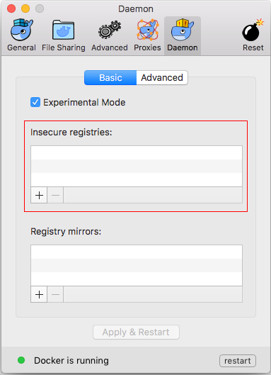
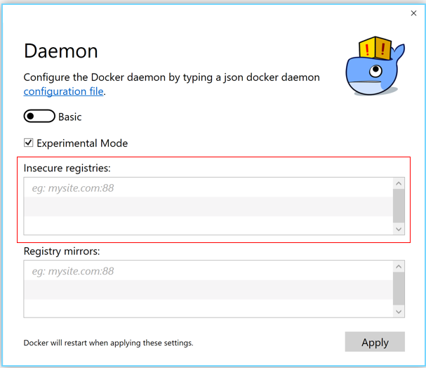

# Connecting to Private Container Registry<a name="cce_01_0209"></a>

Before pushing container images, ensure that your local Docker client can access your private container registry.

## Prerequisites<a name="s1848983050744cfd9a01ce778bc94052"></a>

-   You have registered an account to the management console.
-   An image repository has been created. For details, see  [Creating an Image Repository](creating-an-image-repository.md).
-   A VM is available, on which Docker 1.11.2, 1.12.0, 1.12.1, or 1.12.6 is installed.

    You can download Docker at  [https://www.docker.com/](https://www.docker.com/)  and install it by following the instructions provided at  [https://docs.docker.com/engine/installation/](https://docs.docker.com/engine/installation/).

    This machine will be used to generate the  **dockercfg**  file.


## Procedure<a name="section101721838995"></a>

1.  <a name="l90ddb6fb28304a4c8c8b656192258be7"></a>Log in to the CCE console. In the navigation pane, choose  **Image Repository**. Click any image repository name to go to the details page. On the  **Pull/Push Guide**  tab page, obtain the image address from  **Step 1. Obtain the image repository address**.

    > **NOTICE:**   
    >If you are uploading an image from an internal network, obtain the internal image address. If you are uploading an image from an external network, obtain the external image address.  

2.  Log in to your Docker client as the root user.
3.  Authorize the Docker client to access the private container registry.

    > **NOTE:**   
    >Settings of Docker parameters vary with Docker version and OS. For more information on how to configure Docker parameters, visit  [https://docs.docker.com/datacenter/dtr/2.0/configure/config-security/](https://docs.docker.com/datacenter/dtr/2.0/configure/config-security/).  

    -   Ubuntu 14.04:

        Run the following command to add the container registry address obtained in  [1](#l90ddb6fb28304a4c8c8b656192258be7)  to the end of the DOCKER\_OPTS="--insecure-registry" line:

        **vi /etc/default/docker**

        Expected settings:

        ```
        # Use DOCKER_OPTS to modify the daemon startup options.
        DOCKER_OPTS="--insecure-registry {container_registry_address}"
        ```

        Run the following command to restart Docker:

        **service docker restart**

    -   Ubuntu 16.04:

        Add the container registry address obtained in  [1](#l90ddb6fb28304a4c8c8b656192258be7)  as the value of the  **insecure-registries**  parameter in the  **/etc/docker/daemon.json**  file.

        ```
        {
        "insecure-registries": ["{container_registry_address}"]
        }
        ```

        Run the following commands to restart Docker:

        **systemctl daemon-reload**

        **service docker restart**

    -   OSX:

        On the  **Daemon**  tab page of the Docker GUI, add the container registry address obtained in  [1](#l90ddb6fb28304a4c8c8b656192258be7)  to the  **Insecure registries**  list. Then restart Docker.

        

    -   Windows 10:

        On the  **Daemon**  tab page of the Docker GUI, add the container registry address obtained in  [1](#l90ddb6fb28304a4c8c8b656192258be7)  to the  **Insecure registries**  list. Then restart Docker.

        

    -   OS Yosemite 10.10.2 or earlier; Windows 7 or earlier:

        1.  Run the  **docker-machine ssh**  or  **boot2docker ssh**  command to log in to your Docker client.
        2.  Add the container registry address obtained in  [1](#l90ddb6fb28304a4c8c8b656192258be7)  to the configuration option  **EXTRA\_ARGS**  in the  **/var/lib/boot2docker/profile**  file of your Docker client.

        ```
        EXTRA_ARGS='
        --label provider=virtualbox
        --insecure-registry {container_registry_address}
        '
        CACERT=/var/lib/boot2docker/ca.pem
        DOCKER_HOST='-H tcp://10.0.0.0:2376'
        DOCKER_STORAGE=aufs
        DOCKER_TLS=auto
        SERVERKEY=/var/lib/boot2docker/server-key.pem
        SERVERCERT=/var/lib/boot2docker/server.pem
        ```

        Run the following command to restart Docker:

        **service docker restart**


