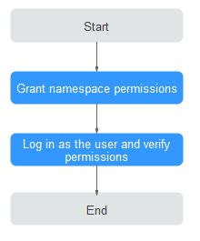
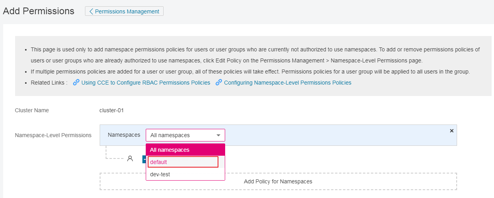
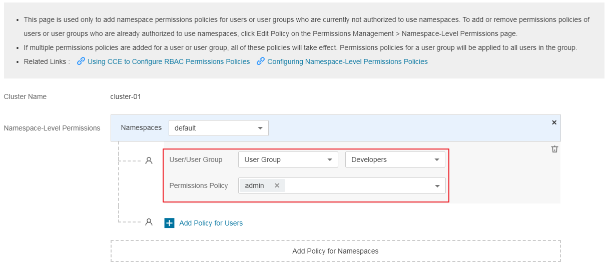
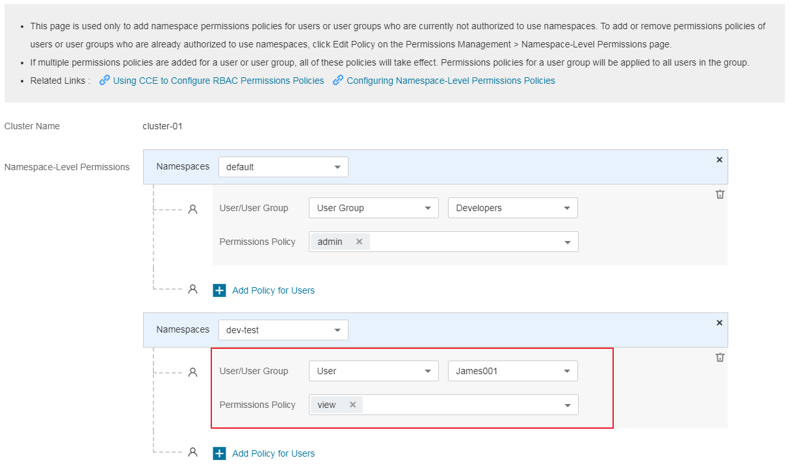

# Granting Namespace-Level Permissions \(Kubernetes RBAC Authorization\)

This section describes how to grant CCE users and user groups the permissions to various namespaced resources. Namespace-level authorization is more fine-grained than cluster-level authorization. Users and user groups with both a cluster-wide role \(CCE Admin or CCE Viewer\) and a namespace-wide role can not only perform operations on a cluster but also on specified namespaces in the cluster.  [Process Flow](#section41056841)  shows the process for granting permissions.

## Configuration

-   You need a public cloud account that has created one or more user groups and IAM users.
-   By way of example, both a user group and a user are granted permissions to access namespaced resources. You have the choice to grant permissions to either users or user groups.
-   The process flow is used only to add namespace permissions policies for users or user groups who never have such policies. To edit permissions policies of users or user groups, click  **Edit**  on the  **Permissions Management**  \>  **Namespace-Level Permissions**  page.
-   If multiple permissions are granted to a user or user group, all of these permissions will take effect at the same time. The permissions granted to a user group are applicable to all users in the user group.

## Constraints

Kubernetes RBAC authorization can be used for CCE clusters of v1.13.

Only CCE clusters of v1.11.7-r2 and later support Kubernetes RBAC authorization. By default, Kubernetes RBAC authorization is enabled in container clusters of v1.11.7-r2. For details on cluster version upgrade, see  [Upgrading a Cluster](upgrading-a-cluster.md).

**Table  1**  User permissions comparison

<table><thead align="left"><tr id="row14863201719502"><th class="cellrowborder" valign="top" width="33.33333333333333%" id="mcps1.2.4.1.1">
User Type

</th>
<th class="cellrowborder" valign="top" width="33.33333333333333%" id="mcps1.2.4.1.2">
Cluster Version Earlier Than v1.11.7-r2

</th>
<th class="cellrowborder" valign="top" width="33.33333333333333%" id="mcps1.2.4.1.3">
Cluster Version of v1.11.7-r2 or Later

</th>
</tr>
</thead>
<tbody><tr id="row138631617185012"><td class="cellrowborder" valign="top" width="33.33333333333333%" headers="mcps1.2.4.1.1 ">
Account

</td>
<td class="cellrowborder" valign="top" width="33.33333333333333%" headers="mcps1.2.4.1.2 ">
All permissions

</td>
<td class="cellrowborder" valign="top" width="33.33333333333333%" headers="mcps1.2.4.1.3 ">
All permissions

</td>
</tr>
<tr id="row138631317205019"><td class="cellrowborder" valign="top" width="33.33333333333333%" headers="mcps1.2.4.1.1 ">
IAM user with the CCE Administrator role

</td>
<td class="cellrowborder" valign="top" width="33.33333333333333%" headers="mcps1.2.4.1.2 ">
All permissions

</td>
<td class="cellrowborder" valign="top" width="33.33333333333333%" headers="mcps1.2.4.1.3 ">
All permissions

</td>
</tr>
<tr id="row1386412176506"><td class="cellrowborder" valign="top" width="33.33333333333333%" headers="mcps1.2.4.1.1 ">
IAM user with the CCE Admin or CCE Viewer role

</td>
<td class="cellrowborder" valign="top" width="33.33333333333333%" headers="mcps1.2.4.1.2 ">
All permissions

</td>
<td class="cellrowborder" valign="top" width="33.33333333333333%" headers="mcps1.2.4.1.3 ">
Namespace permissions configured on the <strong id="b86254183359">Permissions Management</strong> page

</td>
</tr>
<tr id="row141962030123614"><td class="cellrowborder" valign="top" width="33.33333333333333%" headers="mcps1.2.4.1.1 ">
IAM user who is granted the Tenant Guest role and belongs to an account for which fine-grained access control is disabled

</td>
<td class="cellrowborder" valign="top" width="33.33333333333333%" headers="mcps1.2.4.1.2 ">
Read-only permission

</td>
<td class="cellrowborder" valign="top" width="33.33333333333333%" headers="mcps1.2.4.1.3 ">
Read-only permission

</td>
</tr>
<tr id="row28641117145019"><td class="cellrowborder" valign="top" width="33.33333333333333%" headers="mcps1.2.4.1.1 ">
IAM user who is granted the Tenant Guest role and belongs to an account for which fine-grained access control is enabled

</td>
<td class="cellrowborder" valign="top" width="33.33333333333333%" headers="mcps1.2.4.1.2 ">
All permissions

 NOTE: 

Enabling fine-grained access control will change read-on permissions to all permissions.

</td>
<td class="cellrowborder" valign="top" width="33.33333333333333%" headers="mcps1.2.4.1.3 ">
Namespace permissions configured on the <strong id="b1487817843920">Permissions Management</strong> page

</td>
</tr>
</tbody>
</table>

## Process Flow

A namespace is an abstract collection of resources and objects. It enables resources to be organized into non-overlapping groups. Multiple namespaces can be created in a cluster. Data is isolated between namespaces so namespaces can share the same cluster service while not affecting each other. An important role of namespace is to act as a virtual cluster.

This section describes how to grant namespace-level permissions to the IAM user James001 and the user group Developers created in  [Granting IAM Users the Permissions to Access CCE](granting-iam-users-the-permissions-to-access-cce.md).

**Figure  1**  Process for granting namespace permissions  

## Step 1: Grant Namespace Permissions to an IAM User or User Group

In this step, the IAM user James001 and user group Developers will be granted permissions to operate on resources in a cluster's namespace.

1.  Log in to the CCE console. In the navigation pane, choose  **Permissions Management**.
2.  Click the  **Namespace-Level Permissions**  tab. In the upper right corner of the namespace permissions list, select the cluster that contains the namespace whose access will be managed, and click  **Add Permissions**.

    **Figure  2**  Adding namespace permissions  
    

3.  On the  **Add Permissions**  page, confirm the cluster name, select a namespace whose access will be managed. By way of example, namespace  **default**  is selected.

    **Figure  3**  Selecting a namespace  
    

4.  Click  **Add Policy for Users**, add the  **admin**  permissions policy for the user group  **Developers**.

    -   **User/User Group**: Select  **User Group**  from the drop-down list and then select  **Developers**  from the user group list.
    -   **Permissions Policy**: Select  **admin**.

    **Figure  4**  Adding permissions for the user group  
    

5.  Click  **Add Policy for Namespaces**. Click  **Add Policy for Users**, and add the  **dev-test**  permissions policy for the user James001.

    -   **Namespaces**: Select  **dev-test**.
    -   **User/User Group**: Select  **User**  from the drop-down list and then select  **James001**  from the user list.
    -   **Permissions Policy**: Select  **view**.

    **Figure  5**  Granting namespace permissions  
    

6.  Click  **Create**. The namespace permissions granted to the user group and user appear in the permissions list.

    **Figure  6**  Namespace permissions list  
    

    > **NOTE:**   
    >To sum up, the Kubernetes RBAC authorization result is as follows:  
    >-   The user group Developers has  **admin**  access to the namespace  **default**. This  **admin**  access also applies to the IAM user James001 in the user group Developers.  
    >-   The IAM user James001 has  **view**  access to the namespace  **dev-test**.  

## Step 2: Log In and Verify Permissions

Use the username James001 and identity credential to log in to the CCE console, and verify that the IAM user James001 has the namespace permissions.

1.  On the public cloud login page, enter the account name, username, and password, and click  **Log In**.

    -   The account name is the name of the public cloud account that created the IAM user.
    -   The username and password are those set by the account when creating the IAM user James001. You will be prompted to change the initial password at initial login.

    If the login fails, contact the entity owning the account to verify the username and password. Alternatively, you can reset the password.

2.  After successful login, switch to a region where the user has been granted permissions on the management console. The default region is eu-de.
3.  Choose  **Service List**  \>  **Computing \> Cloud Container Engine**  to launch the CCE console. Then verify James001's namespace permissions.

