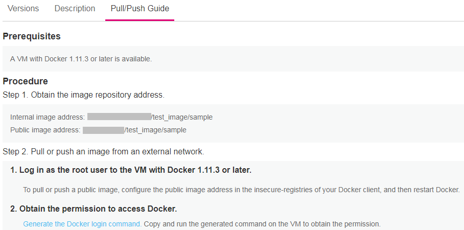

# Pushing a Private Image from the Internet<a name="cce_01_0210"></a>

This section uses the nginx:1.10 image as an example to describe how to push a private image from the Internet to the CCE image repository. Images will be displayed in the image repository after being pushed.

> **NOTE:**   
>If the network becomes unavailable or the image repository is restarted unexpectedly when you push an image from a Docker client, the Docker client will not continue to send the image push request to the image repository and will fail to respond. In this case, you can restart the Docker daemon.  

## Prerequisites<a name="s6974aee92cff45cab8102170ab01700d"></a>

-   A VM is available, on which Docker 1.11.2, 1.12.0, 1.12.1, or 1.12.6 is installed.
-   The Docker client has been configured. For details, see section  [Connecting to Private Container Registry](connecting-to-private-container-registry.md).
-   An image has been prepared.

## Procedure<a name="section1995216591012"></a>

1.  Log in to the VM running Docker as the  **root**  user.
2.  Log in to the node, and run the following command to query the Docker version:

    **docker version**

    Information similar to the following is displayed.

    ```
    Client:
    Version: 1.11.2
    UnicornVersion:1.11.2.4
    ...
    ```

    In the preceding information,  **Version**  indicates the version number of the Docker.

3.  Connect to CCE.
    1.  Click the name of the image repository to be pushed to go to the details page.
    2.  On the  **Pull/Push Guide**  tab page, click  **Generate the Docker login command**, as shown in  [Figure 1](#fig24291930172116).

        **Figure  1**  Generating a Docker login command<a name="fig24291930172116"></a>  
        

    3.  In the displayed Docker login command, click    to copy the command.

4.  Log in to the server where Docker is installed. Then, run the Docker login command copied in the previous step.

    After you successfully log in to the Docker client, "login succeeded" is displayed.

5.  Run the following command to tag the nginx:1.10 image:

    **docker tag** _imagename:tag \{_Public image address\}:tag__

    Example command:

    **docker** **tag** _nginx:1.10 \{__Public_ _image address\}:1.10_

    To obtain the  **Public image address**, on the  **Pull/Push Guide**  tab page, find the  **External address**  below  **Step 1. Obtain the image repository address**.

6.  Run the following command to push the image to the image repository:

    **docker push** _\{__Public_ _image address\}:1.10_

    If the image has been successfully pushed, the following information is displayed:

    ```
    6d6b9812c8ae: Pushed 
    695da0025de6: Pushed 
    fe4c16cbf7a4: Pushed 
    1.10: digest: sha256:eb7e3bbd8e3040efa71d9c2cacfa12a8e39c6b2ccd15eac12bdc49e0b66cee63 size: 948
    ```

    On the CCE console, refresh the  **Image** **Repository**  \>  **_imagename_**  page of the image repository. The pushed image is displayed in the list.


