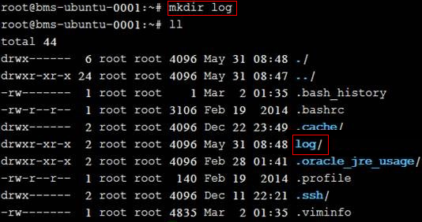
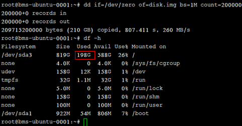
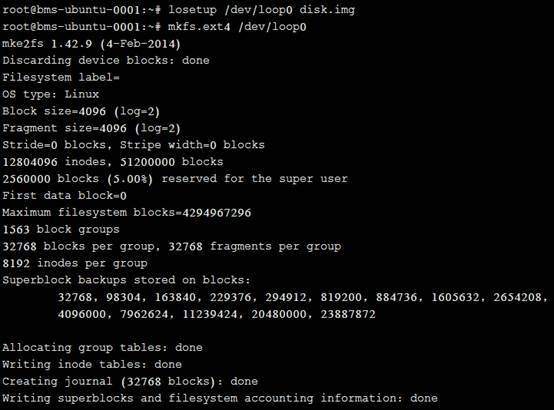
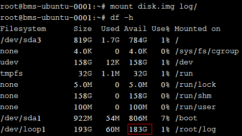
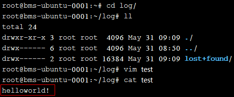
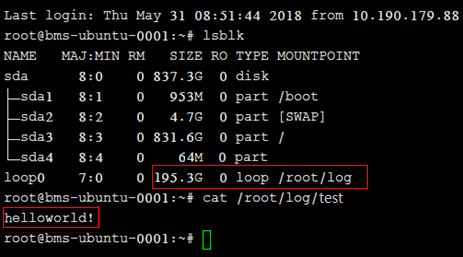

# How Do I Reserve Log Space If the Root Partition Automatically Expands Disks?

## Scenarios

In the scenario where the root partition automatically expands disks, the initial root partition may occupy all space of the system disk. This section describes how to reserve log space.

## Procedure

1.  Run the  **lsblk**  command. The following command output indicates that the initial root partition has occupied all space of the system disk.

    

2.  Run the following command to create a directory for storing logs:

    **mkdir log**

    

3.  Run the following command to create a 200 GB image file for storing logs.

    **dd if=/dev/zero of=disk.img bs=1M count=200000**

    

4.  Run the following commands to virtualize the generated file into a block device and format it:

    **losetup /dev/loop0 disk.img**

    **mkfs.ext4 /dev/loop0**

    

5.  Run the following command to mount the image file to the log directory:

    **mount disk.img log**

    

6.  Create a file in the log directory.

    

7.  Run the following command to add the mount command to  **/etc/rc.local**:

    **mount /root/disk.img /root/log**

    

8.  Run the following command to restart the OS:

    **reboot**

    

9.  Run the  **lsblk**  command. The command output indicates that the image file has been mounted.

    

