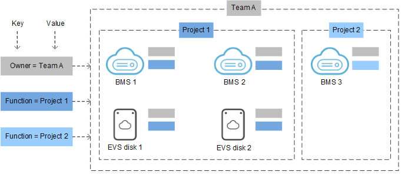

# Overview

To facilitate your management of instances, disks, images, and other cloud resources, you can add a tag to each resource to allocate your own metadata to the resource. Tag Management Service \(TMS\) is a visualized service for fast and unified cross-region tagging and categorization of cloud services.

## Basics of Tags

Tags are used to identify cloud resources. When you have many cloud resources of the same type, you can use tags to classify cloud resources by dimension \(for example, use, owner, or environment\).

**Figure  1**  Example tags  

[Figure 1](#fig81911042564)  shows how tags work. In this example, you assign two tags to each cloud resource. Each tag contains a key and a value that you define. The key of one tag is  **Owner**, and the key of another tag is  **Use**. Each tag has a value.

You can quickly search for and filter specific cloud resources based on the tags added to them. For example, you can define a set of tags for cloud resources in an account to track the owner and usage of each cloud resource, making resource management easier.

## Tag Usage

-   BMS-related services that support tags include ECS, IMS, and EVS.
-   Each tag consists of a key and a value.
-   A BMS can have a maximum of nine tags.
-   For each resource, each tag key must be unique and can have only one tag value.
-   [Table 1](#table124931582713)  provides the tag key and value requirements.

    **Table  1**  Tag key and value requirements

    
    <table><thead align="left"><tr id="row192501915172717"><th class="cellrowborder" valign="top" width="18.54%" id="mcps1.2.4.1.1">
Parameter

    </th>
    <th class="cellrowborder" valign="top" width="53.39%" id="mcps1.2.4.1.2">
Requirement

    </th>
    <th class="cellrowborder" valign="top" width="28.07%" id="mcps1.2.4.1.3">
Example Value

    </th>
    </tr>
    </thead>
    <tbody><tr id="row18250171518273"><td class="cellrowborder" valign="top" width="18.54%" headers="mcps1.2.4.1.1 ">
Tag key

    </td>
    <td class="cellrowborder" valign="top" width="53.39%" headers="mcps1.2.4.1.2 "><ul id="ul16250615172717"><li>Cannot be left blank.</li><li>Can only contain letters, digits, underscores (_), and hyphens (-).</li><li>Contains a maximum of 36 characters.</li></ul>
    </td>
    <td class="cellrowborder" valign="top" width="28.07%" headers="mcps1.2.4.1.3 ">
Organization

    </td>
    </tr>
    <tr id="row325041520276"><td class="cellrowborder" valign="top" width="18.54%" headers="mcps1.2.4.1.1 ">
Tag value

    </td>
    <td class="cellrowborder" valign="top" width="53.39%" headers="mcps1.2.4.1.2 "><ul id="ul1625061572714"><li>Cannot be left blank.</li><li>Can only contain letters, digits, underscores (_), periods (.), and hyphens (-).</li><li>Contains a maximum of 43 characters.</li></ul>
    </td>
    <td class="cellrowborder" valign="top" width="28.07%" headers="mcps1.2.4.1.3 ">
Apache

    </td>
    </tr>
    </tbody>
    </table>

