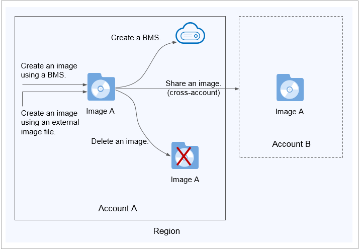

# Private Image Overview

A private image is an image available only to the user who created it. It contains an OS, preinstalled public applications, and a user's private applications. You can create a private image in the following ways:

-   [Creating a Private Image from a BMS](creating-a-private-image-from-a-bms.md)

    > **NOTE:**   
    >Currently, only a BMS that supports quick provisioning \(the OS is installed on an EVS disk\) can be used to create a private image.  

-   [Creating a Private Image from an External Image File](creating-a-private-image-from-an-external-image-file.md)

    You can upload external image files to the cloud platform and register them as your private images. Supported external image formats include VMDK, VHD, QCOW2, RAW, VHDX, QED, VDI, QCOW, ZVHD2, and ZVHD.

    > **NOTE:**   
    >Images of other formats must be  [converted using the image conversion tool](convert-image-file-formats.md)  before they can be used on BMSs.  

After a private image is created successfully, the image status becomes  **Normal**. You can use the image to create BMSs or share the image with other tenants. The following figure shows how to use private images.

**Figure  1**  Using private images  

