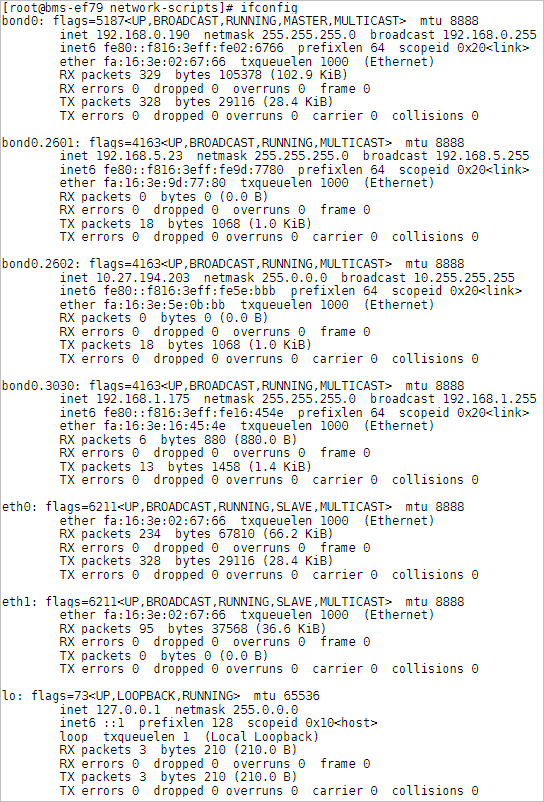
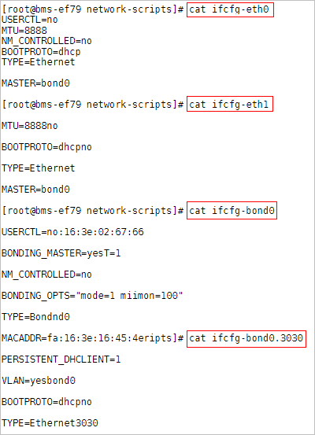

# Overview

## VPC

A VPC provides a logically isolated network environment for BMSs. You can configure EIPs, security groups, and VPNs in a VPC and use the VPC for communication between ECSs and BMSs.

## View VPC NICs

You can view the network interfaces of the VPC on the  **NICs**  tab page of the BMS details page. For Linux images, you can also locate the VLAN sub-interface or bond interface in the OS based on the allocated IP address.

Take CentOS 7.4 64-bit as an example. Log in to the OS and view the NIC configuration files  **ifcfg-eth0**,  **ifcfg-eth1**,  **ifcfg-bond0**,  **ifcfg-bond0.3030**,  **ifcfg-bond0.2601**, and  **ifcfg-bond0.2602**  in the  **/etc/sysconfig/network-scripts**  directory. You need to use IP mapping to match the network.

Run the  **ifconfig**  command. The private IP address and MAC address of VPC NIC 1 is 192.168.0.190 and fa:16:3e:02:67:66. The private IP address and MAC address of VPC NIC 2 are 192.168.1.175 and fa:16:3e:16:45:4e. eth0 and eth1 automatically form bond0, and they have the same MAC address. In addition, it can be determined that  **ifcfg-eth0**,  **ifcfg-eth1**,  **ifcfg-bond0**, and  **ifcfg-bond0.3030**  are VPC NIC configuration files.

The following figures show the NIC and bond configuration information.

