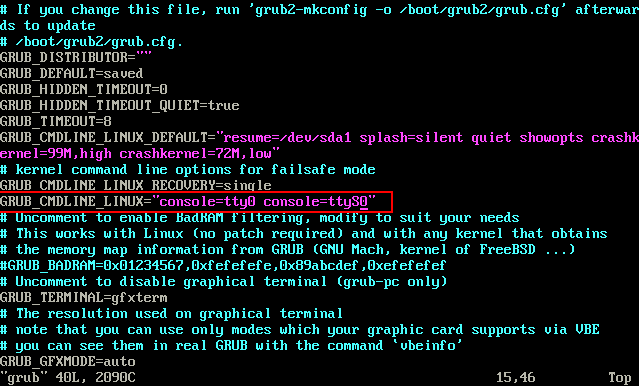
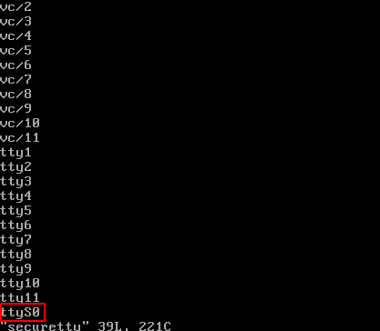

# What Can I Do If the Login Page Does Not Respond?

## Symptom

On the page for remotely logging in to a BMS, after you press  **Enter**, the page does not respond.

## Possible Causes

The BMS OS configuration does not allow remote login to the BMS.

## Solution

Use a key pair to log in to the BMS and configure the OS as required. The configuration varies depending on the OS. The following part provides configurations of some OSs as examples. For details, see "Configuring Remote Login to a BMS" in  _Bare Metal Server Private Image Creation Guide_.

1.  Modify the configuration file.
    -   For SUSE Linux Enterprise Server 12 SP2, SUSE Linux Enterprise Server 12 SP1, Ubuntu 16.04 Server, CentOS Linux 7.3, and EulerOS 2.2, use the vi editor to open the  **/etc/default/grub**  file and add  **console=tty0 console=ttyS0**  after  **GRUB\_CMDLINE\_LINUX**.

        **Figure  1**  Example  
        

    -   For Oracle Linux 7.3 and Red Hat Enterprise Linux 7.3, use the vi editor to open the  **/etc/sysconfig/grub**  file and add  **console=tty0 console=ttyS0**  after  **GRUB\_CMDLINE\_LINUX**.

        **Figure  2**  Example  
        

2.  Update the configuration.
    -   For SUSE Linux Enterprise Server 12 SP2, Oracle Linux 7.3, Red Hat Enterprise Linux 7.3, CentOS Linux 7.3, and EulerOS 2.2, run the following commands to update the configuration:

        **stty -F /dev/ttyS0 speed 115200**

        **grub2-mkconfig -o /boot/grub2/grub.cfg**

        **systemctl enable serial-getty@ttyS0**

    -   For Ubuntu 16.04 Server, run the following commands to update the configuration:

        **stty -F /dev/ttyS0 speed 115200**

        **grub-mkconfig -o /boot/grub/grub.cfg**

        **systemctl enable serial-getty@ttyS0**

3.  \(Optional\) Modify the security configuration file.

    If you log in to the BMS through the serial port as user  **root**, you need to modify the security configuration file. Add the following information to the end of  **/etc/securetty**:

    **Figure  3**  Example  
    

4.  Run the  **reboot**  command to restart the OS.

After configuring the BMS OS, check whether you can log in to the BMS remotely.

