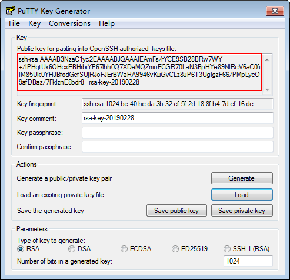

# What Should I Do If a Key Pair Created Using PuTTYgen Cannot Be Imported to the Management Console?

## Symptom

When a key pair created using PuTTYgen was imported to the management console, the system displayed a message indicating that importing the public key failed.

## Possible Causes

The format of the public key content does not meet system requirements.

Storing a public key by clicking  **Save public key**  of PuTTYgen will change the format of the public key content. Such a key cannot be imported to the management console.

## Solution

Use the locally stored private key and  **PuTTY Key Generator**  to restore the format of the public key content. Then, import the public key to the management console.

1.  Double-click  **puttygen.exe**. The  **PuTTY Key Generator**  window is displayed.

    **Figure  1**  PuTTY Key Generator  
    

2.  Click  **Load**  and select the private key.

    The system automatically loads the private key and restores the format of the public key content in  **PuTTY Key Generator**. The content in the red box in  [Figure 2](#fig184661439153519)  is the public key with the format meeting system requirements.

    **Figure  2**  Restoring the format of the public key content  
    

3.  Copy the public key content to a .txt file and save the file in a local directory.
4.  Import the public key to the management console.
    1.  Log in to the management console.
    2.  Under  **Computing**, click  **Bare Metal Server**.
    3.  In the navigation tree, choose  **Key Pair**.
    4.  On the right side of the page, click  **Import Key Pair**.
    5.  Copy the public key content in the .txt file to  **Public Key Content**  and click  **OK**.

