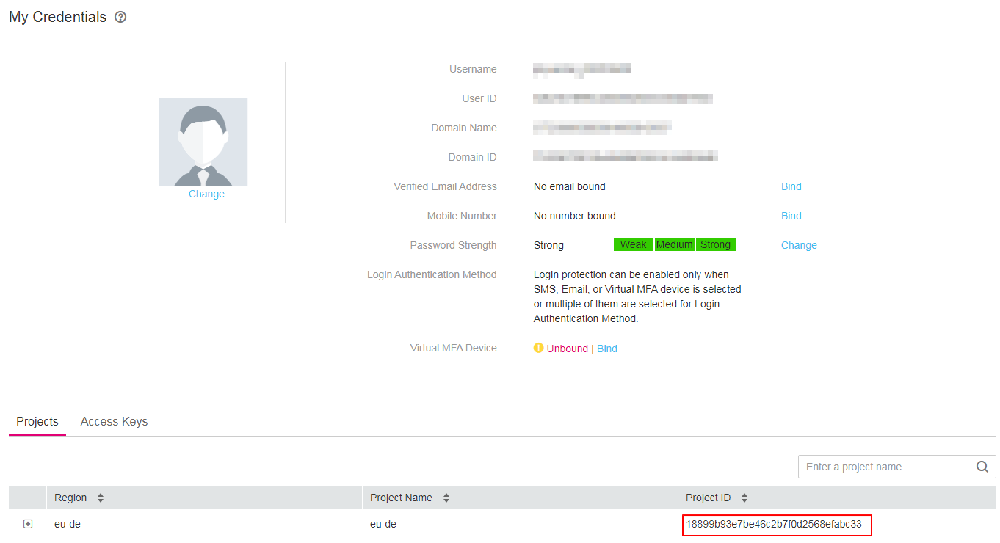

# How to Obtain Parameters in the API URI

## project\_id

1.  Log in to the CCE console, click the username in the upper right corner, and select  **My Credential**.
2.  On the  **Project List**  tab page, obtain the project ID of the corresponding region.

    **Figure  1**  Viewing project IDs  
    

## cluster\_id

1.  Log in to the CCE console, and choose  **Resource Management**  \>  **Clusters**  from the navigation pane.
2.  Click the name of the created cluster. The cluster details page is displayed. Obtain the cluster ID.

## node\_id

1.  Log in to the CCE console, and choose  **Resource Management**  \>  **Nodes**  from the navigation pane.
2.  Click the node name to go to the node details page and obtain the node ID.

## job\_id

1.  Log in to the CCE console, and choose  **Resource Management**  \>  **Clusters**  or choose  **Resource Management**  \>  **Nodes**  from the navigation pane.
2.  For example, on the  **Clusters**  page, click the status of the cluster that is being created. The cluster creation job details page is displayed.
3.  Obtain the job ID.

    If you are using Google Chrome, press  **F12**. On the pane displayed on the right, click the  **Network**  tab. Enter  **jobs**  in the  **Filter**  text box to filter the job list. Select a job from the list on the left and click  **Preview**. The UID field indicates the UID of the job.

    **Figure  2**  Obtaining the job ID  
    

