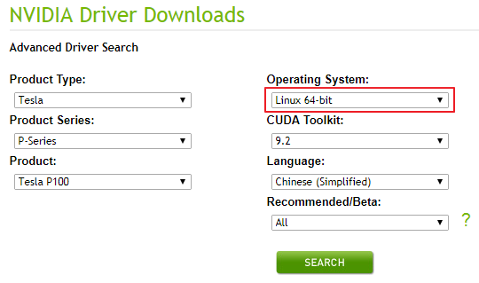
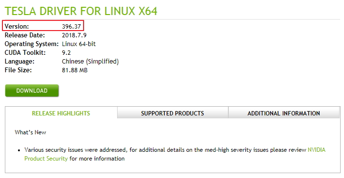
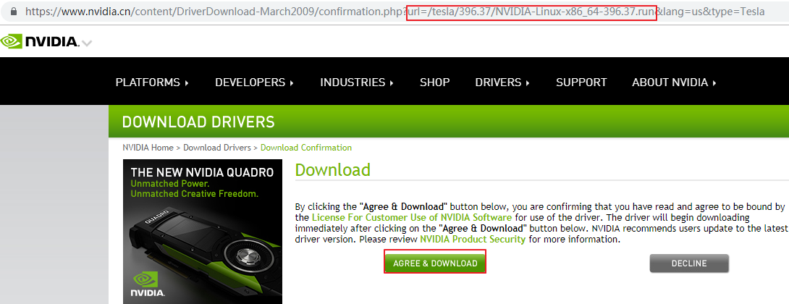

# gpu-beta

## Introduction

gpu-beta is a device management add-on that supports GPUs in containers. It supports only NVIDIA drivers.

## Constraints

-   The cluster where the gpu-beta add-on is installed must contain GPU nodes.
-   The driver to be downloaded must be a  **.run**  file.

> **NOTICE:**   
>-   If the download link is a public network address, for example, NVIDIA official website, bind an EIP to each GPU node.  
>-   If the download link is an OBS URL, you do not need to bind an EIP to GPU nodes.  
>-   The latest version of the NVIDIA driver supported by the gpu-beta add-on is 396.37. You are not advised to install a driver of a later version.  
>-   After the driver version is changed, restart the node for the change to take effect.  

## Obtaining the Driver Link

1.  Log in to  _[https://www.nvidia.cn/Download/Find.aspx?lang=en](https://www.nvidia.cn/Download/Find.aspx?lang=en)_.
2.  Select the driver information on the  **NVIDIA Driver Downloads**  page, as shown in  [Figure 1](#fig11696366517).  **Operating System**  must be  **Linux 64-bit**.

    **Figure  1**  Setting parameters  
    

3.  After confirming the driver information, click  **SEARCH**. A page is displayed, showing the driver information, as shown in  [Figure 2](#fig7873421145213). Click  **DOWNLOAD**.

    **Figure  2**  Driver information  
    

4.  Obtain the driver link in either of the following ways:
    -   Method 1: As shown in  [Figure 3](#fig5901194614534), find  _url=/tesla/396.37/NVIDIA-Linux-x86\_64-396.37.run_  in the browser address box. Then, supplement it to obtain the driver link  [https://us.download.nvidia.com/tesla/396.37/NVIDIA-Linux-x86\_64-396.37.run](https://us.download.nvidia.com/tesla/396.37/NVIDIA-Linux-x86_64-396.37.run). By using this method, you must bind an EIP to each GPU node.
    -   Method 2: As shown in  [Figure 3](#fig5901194614534), click  **AGREE & DOWNLOAD**  to download the driver. Then, upload the driver to OBS and record the OBS URL. By using this method, you do not need to bind an EIP to GPU nodes.

        **Figure  3**  Obtaining the link  
        

## Installing the Add-on

1.  Log in to the CCE console. In the navigation pane, choose  **Add-ons**. On the  **Add-on Marketplace**  tab page, click  **Install Add-on**  under  **gpu-beta**.
2.  On the  **Install Add-on**  page, select the cluster and the add-on version, and click  **Next**.
3.  In the  **Configure Specifications**  step, configure the link to download the NVIDIA driver. For details about how to obtain the link, see  [Obtaining the Driver Link](#section95451728192112).

    For example, the NVIDIA 396.37 driver can be downloaded at  _https://us.download.nvidia.com/tesla/396.37/NVIDIA-Linux-x86\_64-396.37.run_.

4.  Click  **Install**.

    When the installation is complete, an instance of the add-on is installed on each GPU node in the cluster.

## Uninstalling the Add-on

1.  Log in to the CCE console. In the navigation pane, choose  **Add-ons**. On the  **Add-on Instance**  tab page, select the cluster and click  **Uninstall**  under  **gpu-beta**.
2.  In the dialog box that is displayed, click  **Yes**  to uninstall the add-on.

    You can restart the GPU nodes to stop the NVIDIA kernel modules completely.

