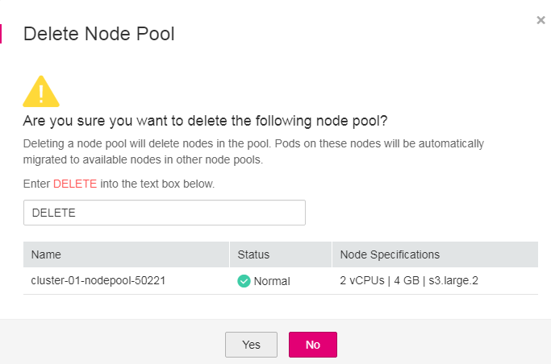

# Managing a Node Pool

## Editing a Node Pool

1.  Log in to the CCE console. In the navigation pane, choose  **Resource Management**  \>  **Node Pool**.
2.  In the upper right corner of the displayed page, select a cluster to filter node pools by cluster.
3.  Click  **Edit**  next to the name of the node pool you will edit. In the  **Edit Node Pool**  dialog box, edit the following parameters:

    **Table  1**  Editing node pool parameters

    
    <table><thead align="left"><tr id="row173212251235"><th class="cellrowborder" valign="top" width="28.000000000000004%" id="mcps1.2.3.1.1">
Parameter

    </th>
    <th class="cellrowborder" valign="top" width="72%" id="mcps1.2.3.1.2">
Description

    </th>
    </tr>
    </thead>
    <tbody><tr id="row163229255313"><td class="cellrowborder" valign="top" width="28.000000000000004%" headers="mcps1.2.3.1.1 ">
Name

    </td>
    <td class="cellrowborder" valign="top" width="72%" headers="mcps1.2.3.1.2 ">
Name of the node pool.

    </td>
    </tr>
    <tr id="row6334727910"><td class="cellrowborder" valign="top" width="28.000000000000004%" headers="mcps1.2.3.1.1 ">
Nodes

    </td>
    <td class="cellrowborder" valign="top" width="72%" headers="mcps1.2.3.1.2 ">
Modify the number of nodes based on service requirements.

    </td>
    </tr>
    <tr id="row111551253912"><td class="cellrowborder" valign="top" width="28.000000000000004%" headers="mcps1.2.3.1.1 ">
Autoscaler

    </td>
    <td class="cellrowborder" valign="top" width="72%" headers="mcps1.2.3.1.2 ">
By default, autoscaler is disabled.

    
After you click  to enable autoscaler, nodes in the node pool will be automatically created or deleted to match the changeable cluster load. You can set <strong id="b10691164321810">Maximum Nodes</strong> and <strong id="b1169234371818">Minimum Nodes</strong> to ensure that the number of nodes will always fall within a specified range.

    
If the <strong id="b18191718101819">Autoscaler</strong> field is set to on, install the <a href="autoscaler.md">autoscaler add-on</a> to use the autoscaler feature.

    </td>
    </tr>
    </tbody>
    </table>

4.  After the configuration is complete, click  **Save**.

    In the node pool list, the node pool status is  **Scaling**. After the status changes to  **Complete**, the node pool parameters are edited successfully.

## Deleting a Node Pool

Deleting a node pool will delete nodes in the pool. Pods on these nodes will be automatically migrated to available nodes in other node pools. If pods in the node pool have a specific node selector and none of the other nodes in the cluster satisfies the node selector, the pods will become unschedulable.

1.  Log in to the CCE console. In the navigation pane, choose  **Resource Management**  \>  **Node Pool**.
2.  In the upper right corner of the displayed page, select a cluster to filter node pools by cluster.
3.  Choose  **Delete**  next to a node pool name to delete the node pool.
4.  Read the precautions in the  **Delete Node Pool**  dialog box.
5.  Enter  **DELETE**  in the text box and click  **Yes**  to confirm that you want to continue the deletion.

    **Figure  1**  Deleting a Node Pool  
    

