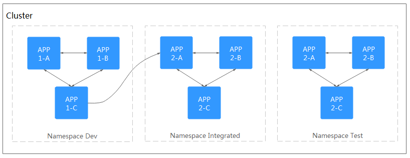
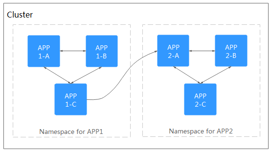

# Namespace

A  namespace  is a collection of resources and objects. Multiple namespaces can be created in a single cluster, but they are isolated from each other. This enables namespaces to share the services of the same cluster without affecting each other.

For example, you can deploy workloads in a development environment into one namespace, and deploy workloads in a test environment into another namespace.

## Prerequisites

At least one cluster is created. For details, see  [Creating a VM Cluster](creating-a-vm-cluster.md).

## Constraints

A maximum of 6,000 services can be created in each namespace. The services mentioned here indicate the Kubernetes service resources added for workloads.

## Namespace Types

Namespaces can be created automatically or manually.

-   Namespaces created automatically: When a cluster is up, the  **default**,  **kube-public**, and  **kube-system**  namespaces are created by default.
    -   **default**: used if no namespace is specified.
    -   **kube-public**: used for deploying public add-ons and container templates.
    -   **kube-system**: used for deploying Kubernetes system components.

-   Namespaces created manually: You can create namespaces to serve separate purposes. For example, you can create three namespaces, one for a development environment, one for joint debugging environment, and one for test environment. You can also create one namespace for login services and one for game services.

## Creating a Namespace

1.  Log in to the CCE console. In the navigation pane, choose  **Resource Management**  \>  **Namespaces**, and click  **Create Namespace**.
2.  Set the parameters listed in  [Table 1](#table5523151617575). The parameters marked with an asterisk \(\*\) are mandatory.

    **Table  1**  Parameters for creating a namespace

    
    <table><thead align="left"><tr id="row145240162572"><th class="cellrowborder" valign="top" width="28.000000000000004%" id="mcps1.2.3.1.1">
Parameter

    </th>
    <th class="cellrowborder" valign="top" width="72%" id="mcps1.2.3.1.2">
Description

    </th>
    </tr>
    </thead>
    <tbody><tr id="row835519426223"><td class="cellrowborder" valign="top" width="28.000000000000004%" headers="mcps1.2.3.1.1 ">
* Namespace

    </td>
    <td class="cellrowborder" valign="top" width="72%" headers="mcps1.2.3.1.2 ">
Name of the namespace, which must be unique in a cluster.

    </td>
    </tr>
    <tr id="row1326175714265"><td class="cellrowborder" valign="top" width="28.000000000000004%" headers="mcps1.2.3.1.1 ">
* Cluster

    </td>
    <td class="cellrowborder" valign="top" width="72%" headers="mcps1.2.3.1.2 ">
Cluster to which the namespace belongs.

    </td>
    </tr>
    <tr id="row16199155910240"><td class="cellrowborder" valign="top" width="28.000000000000004%" headers="mcps1.2.3.1.1 ">
Pod NodeSelector

    </td>
    <td class="cellrowborder" valign="top" width="72%" headers="mcps1.2.3.1.2 ">
If this parameter is set to on, workloads in the current namespace will be scheduled only to nodes with specified labels. To add labels to a node, choose <strong id="b1436514381806">Resource Management</strong> &gt; <strong id="b12667124114010">Nodes</strong> &gt; <strong id="b1050324410016">Manage Labels</strong>.

    
This parameter is displayed only for clusters of v1.13.10-r0 and later.

    </td>
    </tr>
    <tr id="row75251516185711"><td class="cellrowborder" valign="top" width="28.000000000000004%" headers="mcps1.2.3.1.1 ">
Description

    </td>
    <td class="cellrowborder" valign="top" width="72%" headers="mcps1.2.3.1.2 ">
Description of the namespace.

    </td>
    </tr>
    <tr id="row18506114684111"><td class="cellrowborder" valign="top" width="28.000000000000004%" headers="mcps1.2.3.1.1 ">
Set Resource Quotas

    </td>
    <td class="cellrowborder" valign="top" width="72%" headers="mcps1.2.3.1.2 ">
Set resource quotas to limit resource usage in the namespace, thereby organizing resources into different namespaces.

    
 NOTICE: 

It is recommended to assign a pod quota to each namespace. Without a pod quota, clusters or nodes may soon run out of system resources and exhibit unexpected behavior when too many pods are created. The pod quotas of all namespaces in a cluster must not exceed 110 (maximum pods per node) multiplied by the quantity of nodes in a cluster. For example, in a cluster of 50 nodes, a maximum of 5,500 (110 * 50) pods can be created. This means that pod quotas of all namespaces in the cluster should not exceed 5,500.

    

    </td>
    </tr>
    </tbody>
    </table>

3.  Click  **OK**.

## Using Namespaces

1.  When you create a workload, select a namespace for it.
2.  When you query workloads, select a namespace to view all workloads in the namespace.

## Namespace Application Scenarios

-   **Dividing workloads into namespaces by environment type**

    Before being released, a workload generally goes through the phases of development, joint debugging, testing, and production. In this process, the workloads of different environments are logically defined but are basically the same. There are two methods:

    -   Creating clusters for different environments:

        Resources cannot be shared among different clusters. A load balancer is required in order to enable mutual access between services in different environments.

    -   Creating namespaces in the same cluster for different environments:

        Workloads in the same namespace access each other using service names, while workloads in different namespaces access each other using service names and namespace names.

        [Figure 1](#fig12452122215312)  shows namespaces respectively created for the development, joint debugging, and testing environments.

        **Figure  1**  Dividing workloads into namespaces by environment types  
        

-   **Dividing workloads into namespaces by application**

    You are advised to use this method if a large number of workloads are deployed in the same environment. As shown in the following figure, different namespaces are created for App 1 and App 2. Workloads in a namespace are managed as a workload group. Workloads in the same namespace access each other using service names, while workloads in different namespaces access each other using service names and namespace names.

    **Figure  2**  Dividing workloads into namespaces by workload type  
    

## Configuring a Namespace-level Network Policy

You can configure a namespace-level network policy by enabling network isolation.

By default,  **Network Isolation**  is disabled for  namespaces. For example, if network isolation is off for namespace  **default**,  **all pods in the current cluster**  can access the  **pods in namespace default**.

To prevent other pods from accessing the pods in namespace  **default**, perform the following steps:

1.  Log in to the CCE console. In the navigation pane, choose  **Resource Management**  \>  **Namespaces**.
2.  In the same row as the namespace \(for example,  **default**\) for which you will create a network policy, enable network isolation.

    After network isolation is enabled, pods in namespace  **default**  can access each other but they cannot be accessed by pods in other namespaces.

    > **NOTE:**   
    >After a network isolated namespace is whitelisted \(see  [Creating a Network Policy](network-policy.md#section19894131402011)\) network isolation may be broken down.  

    **Figure  3**  Namespace-level network policy  
    

## Configuring Namespace-level Resource Quotas

Namespace-level resource quotas limit the total numbers of resources that can be used when multiple teams or users share cluster resources. The quotas include the total number of a type of objects and the total amount of compute resources \(CPU and memory\) consumed by the objects.

> **NOTE:**   
>This function is supported only when the cluster version is 1.9 or later.  

1.  Log in to the CCE console. In the navigation pane, choose  **Resource Management**  \>  **Namespaces**.
2.  In the  **Operation**  column of a namespace, click  **Manage Quota**.

    This operation cannot be performed on system namespaces  **kube-system**  and  **kube-public**.

3.  Set the following resource quotas and click  **OK**:

    -   **CPU \(cores\)**: maximum number of CPU cores that can be allocated to workload pods in the namespace.
    -   **Memory \(MiB\)**: maximum amount of memory that can be allocated to workload pods in the namespace.
    -   **StatefulSet**: maximum number of StatefuSets that can be created in the namespace.
    -   **Deployment**: maximum number of deployments that can be created under the namespace.
    -   **Job**: maximum number of one-off jobs that can be created under the namespace.
    -   **CronJob**: maximum number of Cron jobs that can be created under the namespace.
    -   **Pod**: maximum number of instances that can be created under the namespace.
    -   **Service**: maximum number of services that can be created under the namespace.

    > **NOTICE:**   
    >-   After setting CPU and memory quotas for a namespace, you must specify the request and limit values of CPU and memory resources when creating a workload. Otherwise, the workload cannot be created. If the quota of a resource is set to  **0**, no limit is posed on the resource.  
    >-   Accumulated quota usage includes the default resources created by CCE, such as the kubernetes service \(view this service using the kubectl tool\) created under the  **default**  namespace. Therefore, you are advised to set a resource quota greater than what you expect.  

## Deleting Namespaces

If a namespace is deleted, all resources \(such as workloads, jobs, and ConfigMaps\) in this namespace will be also deleted. Exercise caution when deleting a namespace.

1.  Log in to the CCE console. In the navigation pane, choose  **Resource Management**  \>  **Namespaces**.
2.  In the  **Clusters**  drop-down list, select the cluster where the namespace to be deleted is located.
3.  Select the namespace to be deleted and click  **Delete**.

    Follow the prompts to delete it. The built-in namespaces of the system cannot be deleted.

