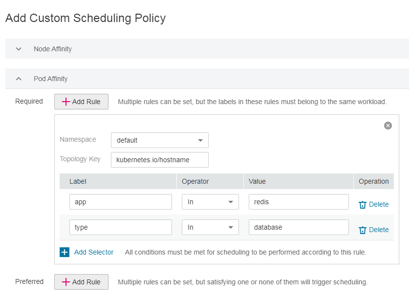

# Pod Affinity<a name="cce_01_0233"></a>

## Using the CCE Console<a name="section085916413596"></a>

Pod affinity determines the pods as which the target workload will be deployed in the same topology domain.

1.  Log in to the CCE console. In the navigation pane, choose  **Workloads**  \>  **Deployments**  or  **Workload**  \>  **StatefulSets**.
2.  Click a workload name in the Deployment or StatefulSet list. On the displayed workload details page, click the  **Scheduling Policies**  tab and then click  **Add Custom Scheduling Policy**.
3.  In the  **Pod Affinity**  area, set the namespace, topology key, and the label requirements to be met.

    > **NOTE:**   
    >There are two types of pod affinity rules: Required \(hard rule\) and Preferred \(soft rule\), and the label operators include In, NotIn, Exists, and DoesNotExist.  
    >-   **Required**: This is a hard rule that must be met for a pod to be scheduled onto a node. The rule is expressed in the format of  **requiredDuringSchedulingIgnoredDuringExecution**. A pod can have multiple hard rules. Each rule requires a namespace and topology key.  
    >-   **Preferred**: This is a soft rule specifying preferences that the scheduler will try to enforce but will not guarantee. It corresponds to  **preferredDuringSchedulingIgnoredDuringExecution**  in Kubernetes. Multiple required rules can be set, and scheduling will be performed even if only one or none of them are met. You can set the weight for a preferred rule. A higher weight indicates a higher priority.  
    >-   **Namespace**: By default, the namespace of the current pod is used. You can also use another namespace.  
    >-   **Topology Key**: Key of the node label that the system uses to denote a topology domain in which scheduling can be performed. Default and custom node labels can be used.  
    >-   **Selector**: This corresponds to  **matchExpressions**  in Kubernetes. Multiple selectors can be set for a scheduling rule, and all of them need to be met for the rule to take effect.  
    >-   **Label**: Pod label. You can use the default label  **app**  or custom labels.  
    >-   **Operator**: Four operators are provided for you to configure label matching relationships: In, NotIn, Exists, and DoesNotExist. Operators In and NotIn allow one or more label values. Values are separated with colons \(;\). Operators Exists and DoesNotExist are used to determine whether a label exists, and do not require a label value.  

    **Figure  1**  Pod affinity scheduling policy<a name="fig18642839164"></a>  
    


## Using kubectl<a name="section69149192383"></a>

This section uses Nginx as an example to describe how to configure pod affinity. The dialog box for configuring pod affinity is shown in  [Figure 1](#fig18642839164).

**Prerequisites**

A workload that uses the nginx container image has been deployed on a node.

**Procedure**

Set  **Namespace**  to  **default**  and  **Topology Key**  to the built-in node label  **kubernetes.io/hostname**, which means that the scheduling scope is a node. Set labels  **app**  and  **type**  and their value to  **redis**  and  **database**, respectively. Set  **Operator**  to  **In**  and click  **OK**.

The YAML of the workload with pod affinity is as follows:

```
apiVersion: extensions/v1beta1
kind: Deployment
metadata:
  name: nginx
  namespace: default
spec:
  replicas: 2
  selector:
    matchLabels:
      app: nginx
  template:
    metadata:
      labels:
        app: nginx
    spec:
      imagePullSecrets:
        - name: default-secret
      affinity:
        podAffinity:
          requiredDuringSchedulingIgnoredDuringExecution:
            - labelSelector:
                matchExpressions:
                  - key: app
                    operator: In
                    values:
                      - redis
                      - key: type
                    operator: In
                    values:
                      - database
                    namespaces:
                      - default
              topologyKey: kubernetes.io/hostname
```

> **NOTICE:**   
>In this example, only when a candidate workload \(for example, workload A\) with both labels  **app=redis**  and  **type=database**  is found can the workload Nginx be successfully scheduled to the node of the candidate workload.  

