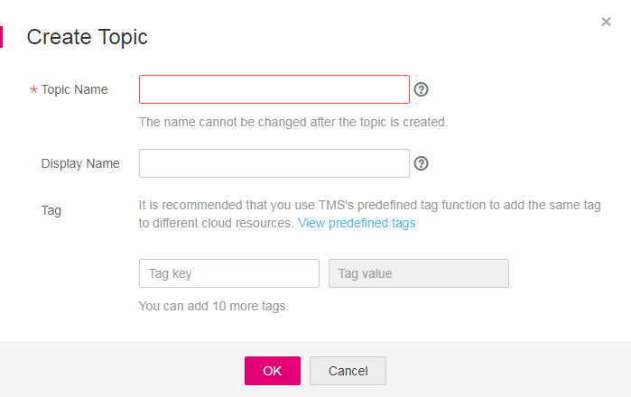

# Creating a Topic

## Scenarios

A topic is a specific type of event in which messages are published and to which end users subscribe for notifications. It serves as a message sending channel, where publishers and subscribers can interact with each other.

In this topic, you can create a topic that belongs to you.

## Creating a Topic

1.  Log in to the management console.
2.  In the upper left corner, select a region and a project.
3.  Under  **Application**, select  **Simple Message Notification**.

    The SMN console is displayed.

4.  In the navigation pane, choose  **Topics**.

    The  **Topics**  page is displayed.

5.  Click  **Create Topic**.

    The  **Create Topic**  dialog box is displayed.

    **Figure  1**  Create Topic  
    

6.  Enter a topic name and display name \(topic description\).

    **Table  1**  Parameters required for creating a topic

    
    <table><thead align="left"><tr id="row11780182617204"><th class="cellrowborder" valign="top" width="21%" id="mcps1.2.3.1.1">
<strong id="en-us_topic_0043394871_b4942326616041">Parameter</strong>

    </th>
    <th class="cellrowborder" valign="top" width="79%" id="mcps1.2.3.1.2">
<strong id="en-us_topic_0043394871_b4386163916041">Description</strong>

    </th>
    </tr>
    </thead>
    <tbody><tr id="row10787102682020"><td class="cellrowborder" valign="top" width="21%" headers="mcps1.2.3.1.1 ">
Topic Name

    </td>
    <td class="cellrowborder" valign="top" width="79%" headers="mcps1.2.3.1.2 ">
Specifies the topic name, which

    <ul id="ul177876268209"><li>Contains only upper or lower case letters, digits, hyphens (-), and underscores (_) and must start with a letter or a digit.</li><li>Is a string of 1 to 255 characters.</li><li>Must be unique and cannot be modified once the topic is created.</li></ul>
    </td>
    </tr>
    <tr id="row207882266206"><td class="cellrowborder" valign="top" width="21%" headers="mcps1.2.3.1.1 ">
Display Name

    </td>
    <td class="cellrowborder" valign="top" width="79%" headers="mcps1.2.3.1.2 ">
Specifies the message sender name, which must be less than 192 bytes.

    
 NOTE: 

After you specify a display name, the sender in email messages will be presented as <em id="i1573597911">Display name</em><strong id="b791130249">&lt;username@example.com&gt;</strong>. Otherwise, the sender will be <strong id="b4249103">username@example.com</strong>.

    

    </td>
    </tr>
    <tr id="row1078920269206"><td class="cellrowborder" valign="top" width="21%" headers="mcps1.2.3.1.1 ">
Tag

    </td>
    <td class="cellrowborder" valign="top" width="79%" headers="mcps1.2.3.1.2 ">
Tags identify cloud resources so that they can be categorized easily and searched quickly.

    <ul id="ul6790126172016"><li>You can enter a maximum of 36 and 43 characters for <strong id="b29249928818232">Key</strong> and <strong id="b84235270618241">Value</strong>, respectively. Both <strong id="b84235270618049">Key</strong> and <strong id="b8423527061838">Value</strong> cannot start or end with a space and cannot contain any of the following characters: is equal to (=), asterisk (*), is less than (&lt;), is greater than (&gt;), backslash (\), comma (,), delimiter (|), and slash (/).</li><li>Each topic supports up to 10 tags.</li></ul>
    </td>
    </tr>
    </tbody>
    </table>

7.  Click  **OK.**

    The topic you created is displayed in the topic list.

    After a topic is created, the system generates a topic uniform resource name \(URN\), which uniquely identifies the topic and cannot be changed.

8.  Click a topic name to view the topic details and the total number of topic subscriptions.

## Follow-up Operations

After creating a topic, you need to  [add subscriptions](adding-subscriptions.md). After the subscriptions have been confirmed, alarm notifications can be sent to the subscribers via SMS messages or emails.

