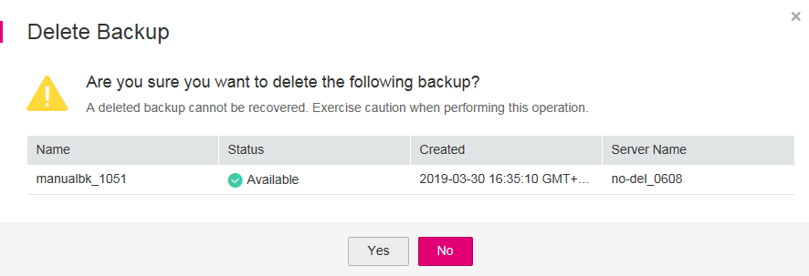

# Deleting a Backup

Users can delete useless backups to reduce space usage and costs.

## Context

CSBS supports manual deletion of backups and automatic deletion of expired backups. The latter deletion method is implemented using the backup retention rule in the backup policy. For details, see  [Creating a Backup Policy](creating-a-backup-policy.md).

## Prerequisites

-   At least one backup exists in CSBS.
-   The backups are in the  **Available**  or  **Error**  state.

## Procedure

1.  Log in to the CSBS management console.
    1.  Log in to the management console.
    2.  Click    in the upper left corner of the management console and select a region and a project.
    3.  Click  . Under  **Storage**, click  **Cloud Server Backup Service**.

2.  Click the  **Backups**  tab. Locate the backup for the ECS. For details, see  [Viewing a Backup](viewing-a-backup.md).
3.  In the row of the backup, click  **More**  \>  **Delete**, as shown in  [Figure 1](#fig10341833105744). Alternatively, select the backups you want to delete and click  **Delete**  in the upper left corner to delete them in a batch.

    **Figure  1**  Deleting a backup  
    

4.  Click  **OK**.

