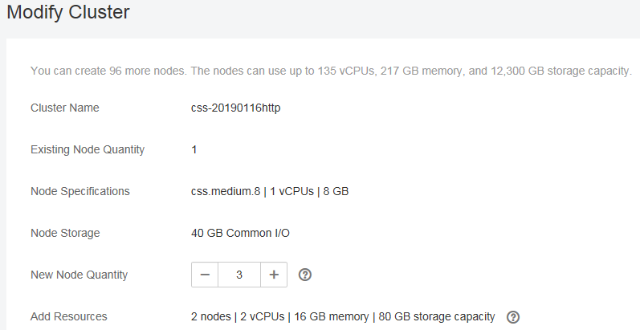

# Expanding the Cluster Capacity

If nodes do not meet service requirements, add new nodes to improve storage and usage efficiency.

## Procedure

1.  Log in to the CSS management console.
2.  Click  **Clusters**. Locate the row where the target cluster resides and click  **More \> Modify**  in the  **Operation**  column.
3.  On the displayed  **Modify Configuration**  page, set  **New Node Quantity**  as required. You must add at least one node and can add a maximum of 32 nodes. The  **Node Specifications**  and  **Node Storage**  settings of newly added nodes are the same as those specified during cluster creation. If  **Disk Encryption**  is selected during cluster creation, then the same  **Disk Encryption**  setting applies to newly added nodes and the key adopted during cluster creation applies.

    **Figure  1**  Changing specifications  
    

4.  Click  **Next**.
5.  On the displayed  **Details**  page, confirm the specifications and click  **Submit**.
6.  Click  **Back to Cluster List**  to switch to the  **Clusters**  page. If  **Expanding**  is displayed in the  **Task Status**  column, new nodes are being added to the cluster. If  **Cluster Status**  changes to  **Available**, the new nodes are added successfully.

