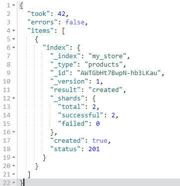

# Using Kibana or APIs to Import Data to Elasticsearch<a name="css_01_0024"></a>

You can import data in various formats, such as JSON and CSV, to Elasticsearch in CSS by using Kibana or APIs.

## Importing Data by Using Kibana<a name="section1430231820400"></a>

Before importing data, ensure that you can use Kibana to access the cluster. The following procedure illustrates how to use the  **POST**  command to import data.

1.  Log in to the  **Console**  page of Kibana. For details, see  [Accessing a Cluster Using Kibana on the Management Console](accessing-a-cluster.md#section9848115695612).

    If it is your first time visiting the  **Console**  page of Kibana, choose  **Dev Tools**  from the left navigation pane. Click  **Get to work**  to switch to the  **Console**  page of Kibana. If it is not your first time, click  **Dev Tools**  to directly access the  **Console**  page of Kibana.

2.  \(Optional\) On the  **Console**  page, run the related command to create an index for the data to be stored and specify a user-defined mapping to define the data type:

    If there is an available index in the cluster where you want to import data, skip this step. If there is no available index, create an index by referring to the following sample code.

    For example, on the  **Console**  page, run the following command to create index named  **my\_store**  and specify a user-defined mapping to define the data type:

    ```
    PUT /my_store
    {
      "settings": {
        "number_of_shards": 1
      },
      "mappings": {
        "products": {
          "properties": {
            "productName": {
              "type": "text"
              },
            "size": {
              "type": "keyword"
            }
          }
        }
      }
    }
    ```

3.  In the text box on the right of the  **Console**  page, enter the following  **POST**  command \(In this example, a data record is imported.\):

    ```
    POST /my_store/products/_bulk 
    {"index":{}} 
    {"productName":"Latest art shirts for women in 2017 autumn","size":"L"}
    ```

    The command output looks like that in  [Figure 1](#fig93061932172813). If the value of the  **errors**  field in the result is  **false**, the data is successfully imported.

    **Figure  1**  Response message<a name="fig93061932172813"></a>  
    


## Importing Data by Using APIs<a name="section239718062912"></a>

The following procedure illustrates how to import a JSON data file using bulk APIs through the cURL command.

1.  Log in to the ECS that you use to access the cluster.

    For details about how to access a cluster, see  [Accessing a Cluster by Calling Elasticsearch APIs on the ECS That Is Located in the Same VPC as the Cluster](accessing-a-cluster.md#section16223134914582).

2.  Run the following command to import JSON data:

    In the command, replace the value of  **\{_Private network address and port number of the node_\}**  with the private network address and port number of a node in the cluster. If the node fails to work, the command will fail to be executed. If the cluster contains multiple nodes, you can replace the value of  **\{_Private network address and port number of the node_\}**  with the private network address and port number of any available node in the cluster. If the cluster contains only one node, restore the node and execute the command again.  **test.json**  indicates the JSON file whose data is to be imported.

    ```
    curl -X PUT "http://{Private network address and port number of the node} /_bulk" -H 'Content-Type: application/json' --data-binary @test.json
    ```

    If communication encryption has been enabled on the cluster where you will import data, you need to send HTTPS requests and add  **-k**  to the cURL command.

    ```
    curl -X PUT -k "https://{Private network address and port number of the node} /_bulk" -H 'Content-Type: application/json' --data-binary @test.json
    ```

    > **NOTE:**   
    >The value of the  **-X**  parameter is a command and that of the  **-H**  parameter is a message header. In the preceding command,  **PUT**  is the value of the  **-X**  parameter and  **'Content-Type: application/json' --data-binary @test.json**  is the value of the  **-H**  parameter. Do not add  **-k**  between a parameter and its value.  

    **Example 1:**  In this example, assume that you need to import data in the  **testdata.json**  file to an Elasticsearch cluster, where communication encryption is disabled and the private network address and port number of one node are  **192.168.0.90**  and  **9200**  respectively. The data in the  **testdata.json**  file is as follows:

    ```
    {"index": {"_index":"my_store","_type":"products"}}
    {"productName":"Latest art shirts for women in autumn 2019","size":"M"}
    {"index": {"_index":"my_store","_type":"products"}}
    {"productName":"Latest art shirts for women in autumn 2019","size":"L"}
    ```

    Perform the following steps to import the data:

    1.  Run the following command to create an index named  **my\_store**:

        ```
        curl -X PUT http://192.168.0.90:9200/my_store -H 'Content-Type: application/json' -d '
         { 
           "settings": { 
             "number_of_shards": 1 
           }, 
           "mappings": { 
             "products": { 
               "properties": { 
                 "productName": { 
                   "type": "text" 
                   }, 
                 "size": { 
                   "type": "keyword" 
                 } 
               } 
             } 
           } 
         }'
        ```

    2.  Run the following command to import the data in the  **testdata.json**  file:

        ```
        curl -X PUT "http://192.168.0.90:9200/_bulk" -H 'Content-Type: application/json' --data-binary @testdata.json
        ```

    **Example 2:**  In this example, assume that you need to import data in the  **testdata.json**  file to an Elasticsearch cluster, where communication encryption has been enabled and the node access address and content in the  **testdata.json**  are the same as those in example 1. Perform the following steps to import the data:

    1.  Run the following command to create an index named  **my\_store**:

        ```
        curl -X PUT -k https://192.168.0.90:9200/my_store -H 'Content-Type: application/json' -d '
         { 
           "settings": { 
             "number_of_shards": 1 
           }, 
           "mappings": { 
             "products": { 
               "properties": { 
                 "productName": { 
                   "type": "text" 
                   }, 
                 "size": { 
                   "type": "keyword" 
                 } 
               } 
             } 
           } 
         }'
        ```

    2.  Run the following command to import the data in the  **testdata.json**  file:

        ```
        curl -X PUT -k "https://192.168.0.90:9200/_bulk" -H 'Content-Type: application/json' --data-binary @testdata.json
        ```


