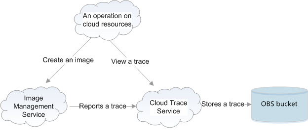

# How CTS Functions

CTS interconnects directly with other cloud services and records operations performed on cloud resources and operation results in real time. It delivers records in the form of trace files to OBS buckets.

Before enabling CTS, you need to enable OBS. After CTS is enabled, the associated tracker can track the trace files generated and store them in OBS buckets.

You can perform two types of operations on a trace file:

-   Trace file creation and storage
    -   When you perform adding, deleting, or modifying operations on services interconnected with CTS, such as Elastic Cloud Server \(ECS\), Elastic Volume Service \(EVS\), and Image Management Service \(IMS\), the target services will record the operations and their results automatically and deliver them in the form of trace files to CTS for archiving.
    -   CTS stores and displays the last seven days of operation records on its console and periodically synchronizes the records to the OBS bucket that you have specified for long-term storage.

-   Trace file query

    -   You can query operation records of the last seven days on the  **Trace List**  page by filter or time.
    -   To query operation records earlier than seven days, you can download the trace files stored in OBS buckets.
    -   You can enable, disable, delete, or modify a tracker on the  **Tracker**  page.

    For example, if you create an image using IMS, IMS will report the image creation \(a trace\) to CTS. Then, CTS will deliver the trace to an OBS bucket for storage. You can view trace files in the trace list.  [Figure 1](#fig26997332102357)  shows the working principle of CTS.

**Figure  1**  How CTS functions  

