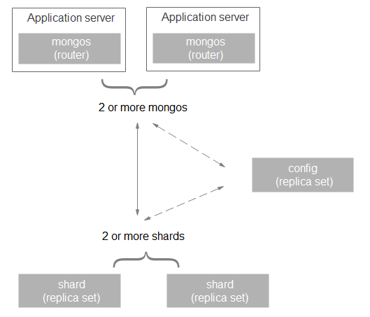

# Cluster

DDS cluster instances consist of mongos, config, and shard nodes. The following diagram shows the node relationships.

**Figure  1**  Diagram of node relationships  

## mongos

A mongos is a router for reading and writing data, providing a unified interface for accessing DB instances.

-   Each DB instance has 2 to 12 mongos. You can specify the quantity.
-   A mongos reads configuration settings from configs and allocates read and write requests to shards. You can connect to a mongos directly.

## config

A config stores configuration settings for DB instances and consists of one replica set.

-   The availability of a config is the prerequisite to deploying a DB instance or modifying the instance information.
-   You cannot connect to a config directly.

## shard

In the cluster instance, shards are used to store user data.

-   Each DB instance has 2 to 12 shards. You can specify the quantity.
-   Each shard is deployed as a replica set to ensure data redundancy and high reliability.
-   You cannot connect to a shard directly.

