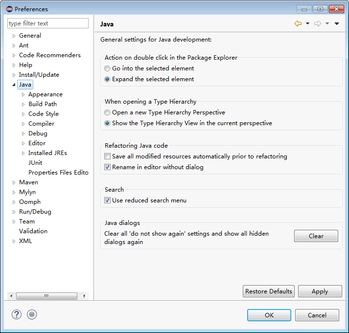
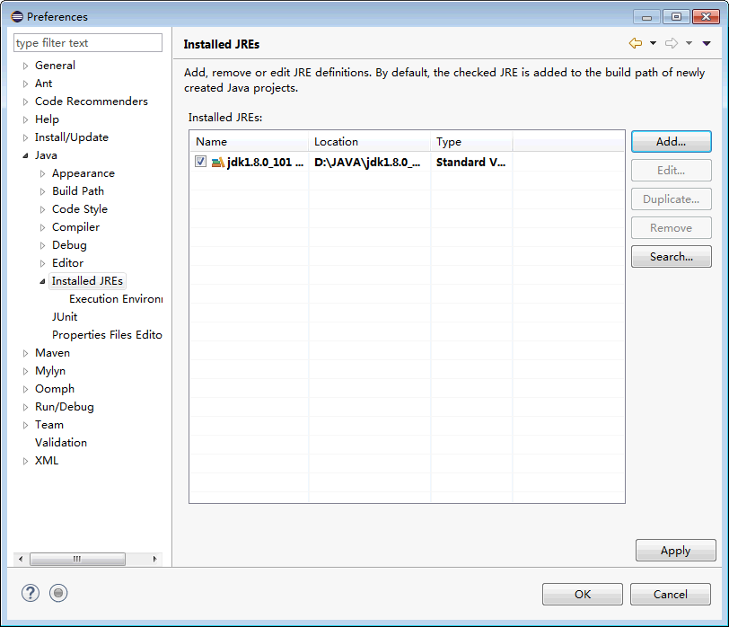
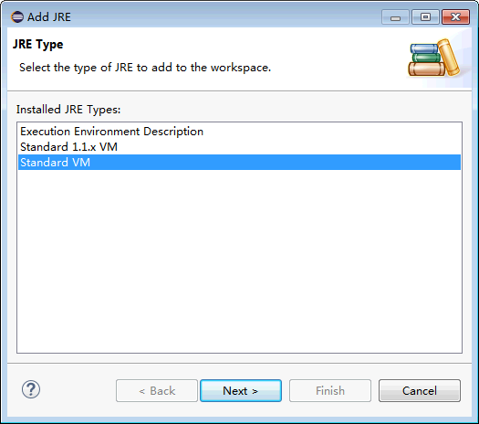
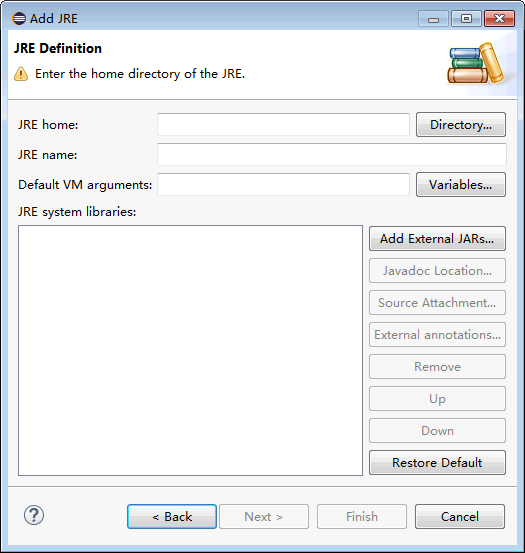
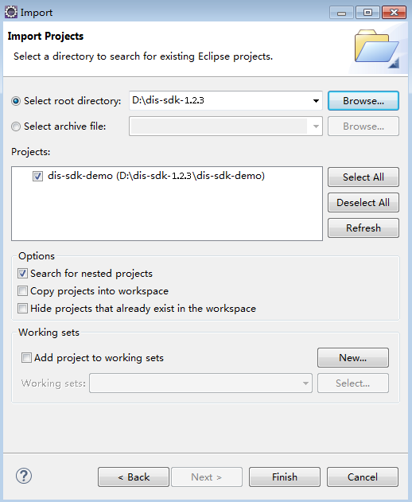
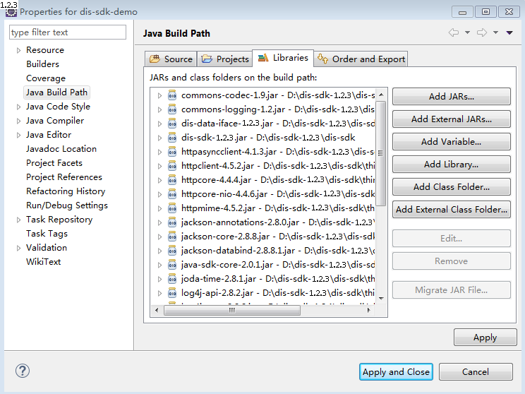

# Step 2: Preparing a DIS Application Development Environment

Before developing DIS applications, prepare an application development environment, and then obtain a software development kit \(SDK\) and sample project and import them to the development environment.

## Prerequisites

-   JDK 1.8 or later has been installed.
-   Eclipse has been installed.

## Procedure

1.  Configure a JDK using Eclipse.
    1.  Start Eclipse and choose  **Window**  \>  **Preferences**. The  **Preferences**  dialog box is displayed.
    2.  In the navigation tree, choose  **Java**. On the  **Java**  page, configure general settings for Java development and then click  **OK**. 

        **Figure  1**  Preferences  
        

    3.  In the navigation tree, choose  **Java**  \>  **Installed JREs**.

        -   Ensure that configured JDK environmental variables are displayed on the  **Installed JREs**  page. Then go to  [1.c.i](#li12377149194529).
        -   To configure different variables for different versions of JDK, perform  [1.c.ii](#li40268681153416)  to  [1.c.iv](#li6851708153416).

        **Figure  2**  Installed JREs  
        

        1.  Select the installed JDK and click  **OK**.
        2.  Click  **Add**. The  **Add JRE**  dialog box is displayed. 

            **Figure  3**  JRE Type  
            

        3.  Select a JRE type and click  **Next**.

            **Figure  4**  JRE Definition  
            

        4.  Configure the basic information about JDK and click  **Finish**.
            -   JRE home: JDK installation path.
            -   Default VM arguments: JDK running parameters.

2.  Obtain and decompress the DIS SDK package.

    After obtaining the software package, verify its integrity. For details about the verification method, see  [How Do I Check Software Package Integrity?](how-do-i-check-software-package-integrity.md).

    -   To obtain the DIS SDK software package, visit the following website:

        [https://dis.obs.eu-de.otc.t-systems.com/dis/download/dis-sdk-1.2.3.zip](https://dis.obs.eu-de.otc.t-systems.com/dis/download/dis-sdk-1.2.3.zip)

    -   To obtain the integrity check file of the DIS SDK software package, visit the following website:

        [https://dis.obs.eu-de.otctest.t-systems.com/dis/download/dis-sdk-1.2.3.zip.sha256sum](https://dis.obs.eu-de.otctest.t-systems.com/dis/download/dis-sdk-1.2.3.zip.sha256sum)

3.  Import the Eclipse project.
    1.  Start Eclipse. Choose  **File**  \>  **Import**. The  **Import**  dialog box is displayed.

    1.  Choose  **General**  \>  **Existing Projects into Workspace**  and click  **Next**. The  **Import**  dialog box is displayed.
    2.  Click  **Browse**  and select a save location for the  **dis-sdk-demo**  sample project. In the  **Projects**  area, select a sample project.

        **Figure  5**  Importing a project  
        

    3.  Click  **Finish**.

4.  Configure the demo project.
    1.  Set the project code to  **UTF-8**.
        1.  In the navigation tree, right-click the required project under  **Project Explorer**  and choose  **Properties**  from the shortcut menu. The  **Properties for dis-sdk-demo**  dialog box is displayed.
        2.  In the navigation tree, choose  **Resource**. The  **Resource**  page is displayed in the right pane.
        3.  In the  **Others**  drop-down list, select  **UTF-8**.
        4.  Click  **Apply and Close**.

    2.  Import a dependency package.

        1.  In the navigation pane, choose  **Project Explorer**. Right-click the chosen project and choose **Properties**  from the shortcut menu.
        2.  In the navigation tree, choose  **Java Build Path**. The  **Java Build Path**  page is displayed in the right pane.
        3.  Click the  **Libraries**  tab, and then click  **Add External JARs**. The  **JAR Selection**  dialog box is displayed.
        4.  Select the directory where the  **dis-sdk**  folder is located and click  **Open**.
        5.  On the  **Properties for dis-sdk-demo**  page, click  **Apply and Close**  to import all the  **.jar**  files in the current path and the  **third\_lib**  folder to the project.

        **Figure  6**  Java Build Path  
        

    3.  Add the JDK.
        1.  In the navigation pane, choose  **Project Explorer**. Right-click the chosen project and choose **Properties**  from the shortcut menu.
        2.  In the navigation tree, choose  **Java Build Path**. The  **Java Build Path**  page is displayed in the right pane.
        3.  Click the  **Libraries**  tab, and then click  **Add Library**. The  **Add Library**  dialog box is displayed.
        4.  Select  **JRE System Library**  and click  **Next**. Verify that the version of  **Workspace default JRE**  is  **jdk1.8**  or later.
        5.  Click  **Finish**  to exit the  **Add Library**  dialog box.
        6.  Click  **Apply and Close**.

5.  Initialize a DIS client sample. For details about  **endpoint**,  **ak**,  **sk**,  **region**, and  **projectId**, see  [Obtaining Authentication Information](obtaining-authentication-information.md).

