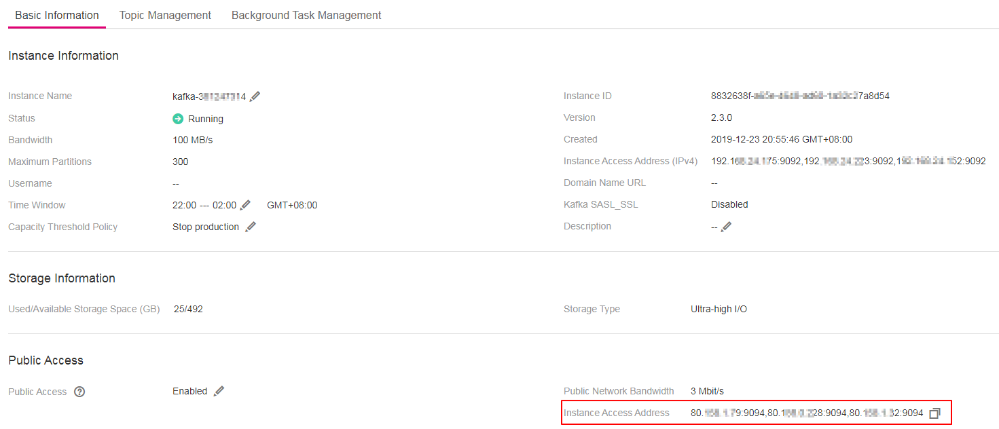

# Accessing a Kafka Premium Instance Without SASL<a name="EN-US_TOPIC_0143117094"></a>

DMS provides Kafka premium instances that are physically isolated for each tenant. After creating a Kafka premium instance, you can use an open-source Kafka client to create and retrieve messages in the instance.

This section describes how to use an open-source Kafka client to access a Kafka premium instance if SASL is not enabled for the instance.

For details on how to use Kafka clients in different programming languages, visit  [https://cwiki.apache.org/confluence/display/KAFKA/Clients](https://cwiki.apache.org/confluence/display/KAFKA/Clients).

## Prerequisites<a name="section17830048113810"></a>

1.  Security group rules have been correctly configured.

    A Kafka premium instance with SASL disabled can be accessed  **within a VPC**  or  **over public networks**.

    -   For intra-VPC access, ensure that the ECS and the Kafka premium instance are in the same VPC and that security group rules have been correctly configured for the instance. 
    -   For public access, there are no specific requirements on the VPC. However, you still need to ensure that security group rules have been correctly configured for the Kafka premium instance.

        To access the instance without SASL, allow inbound access through port 9094.

2.  <a name="li1422895833615"></a>The instance connection address has been obtained.
    -   For intra-VPC access, use port 9092. Obtain the instance connection address on the instance details page.

        **Figure  1**  Obtaining Kafka instance connection address for intra-VPC access<a name="fig1658484216284"></a>  
        

    -   For intra-VPC access, use port 9094. Obtain the instance access address on the instance details page.

        **Figure  2**  Obtaining Kafka instance access address for public access<a name="fig911112232330"></a>  
        

3.  At least one topic has been created for the Kafka premium instance.
4.  The ECS has been correctly configured and an open-source Kafka client has been installed. If the configuration or the installation has not been completed, perform the following procedure.
    1.  Log in to the ECS.

        The following uses a Linux ECS as an example. For more information on how to install JDK and configure the environment variables for a Windows ECS, please search the Internet.

    2.  Install JDK or JRE, and add the following lines to  **.bash\_profile**  in the home directory to configure the environment variables **JAVA\_HOME** and  **PATH**:

        ```
        export JAVA_HOME=/opt/java/jdk1.8.0_151 
        export PATH=$JAVA_HOME/bin:$PATH
        ```

        Run the  **source .bash\_profile**  command for the modification to take effect.

        > **NOTE:**   
        >Use Oracle JDK instead of ECS's default JDK \(for example, OpenJDK\), because ECS's default JDK may not be suitable for the sample project. Obtain Oracle JDK 1.8.111 or later from  [Oracle](https://www.oracle.com/technetwork/java/javase/downloads/index.html).  

    3.  Download an open-source Kafka client at  [https://archive.apache.org/dist/kafka/2.3.1/kafka\_2.11-2.3.1.tgz](http://mirror.bit.edu.cn/apache/kafka/2.3.1/kafka_2.12-2.3.1.tgz)  for an instance of Kafka 2.3.1.

        **wget https://archive.apache.org/dist/kafka/2.3.1/kafka\_2.11-2.3.1.tgz**

        If you use the Windows OS, the package contains a  **Windows**  folder which has the CLI for connecting to the Kafka client. The usage is similar to that in the Linux OS.

    4.  Run the following command to decompress the package:

        **tar -zxf  _\[kafka\_tar\]_**

        In the preceding command,  _\[kafka\_tar\]_  indicates the name of the client package.

        For example:

        **tar -zxf kafka\_2.11-2.3.1.tgz**


## Accessing the Instance Using CLI<a name="section189213202426"></a>

1.  Log in to the Linux ECS.
2.  Access the  **\[base\_dir\]/kafka\_2.11-2.3.1/bin**  directory.

    _\[base\_dir\]_  indicates the installation directory of the Kafka client.

3.  Run the following command to create messages:

    **_./kafka-console-producer.sh --broker-list \[connection-address\] --topic \[topic-name\]_**

    Parameter description:

    -   _\[connection-address\]_  is the address obtained in  [2](#li1422895833615).
    -   _\[topic-name\]_  is the name of the topic created for the Kafka instance.

    The following example uses connection addresses  **10.3.196.45:9094,10.78.42.127:9094,10.4.49.103:9094**. After running the preceding command, you can send a message to the Kafka instance by writing it and pressing  **Enter**. Each line of content is sent as a message.

    ```
    [root@ecs-heru bin]# ./kafka-console-producer.sh --broker-list 10.3.196.45:9094,10.78.42.127:9094,10.4.49.103:9094  --topic topic-heru
    >Hello
    >DMS
    >Kafka!
    >^C[root@ecs-heru bin]# 
    ```

    To stop creating messages, press  **Ctrl**+**C**  to exit.

4.  Run the following commands to retrieve messages:

    > **NOTE:**   
    >Messages do not need to be on the same ECS to be created and retrieved, as long as the client and the server are connected.  

    _**./kafka-console-consumer.sh --bootstrap-server \[connection-address\] --topic \[topic-name\] --from-beginning**_

    ```
    [root@ecs-heru bin]#  ./kafka-console-consumer.sh --bootstrap-server 10.3.196.45:9094,10.78.42.127:9094,10.4.49.103:9094 --topic topic-heru --from-beginning
    Kafka!
    DMS
    Hello
    ^CProcessed a total of 3 messages
    [root@ecs-heru bin]# 
    ```

    To stop retrieving messages, press  **Ctrl**+**C**  to exit.


