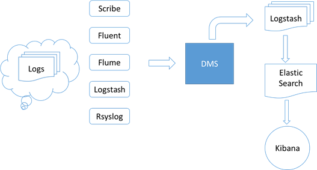

# Application Scenarios

DMS can be used in various fields, such as enterprise applications, online payments, telecommunications, e-commerce, logistics, marketing, social networking, instant messaging \(IM\), mobile gaming, video, Internet of Things \(IoT\), and Internet of Vehicles \(IoV\).

DMS is useful in the following scenarios:

-   Service decoupling

    DMS provides message notifications for supplementary services that are dependent on other systems. It decouples supplementary services from key services, allowing key services to proceed without waiting for other systems.

    For example, the order processing \(OP\) system of an e-commerce website puts order information in DMS message queues during promotional activities. The inventory and delivery management systems will read the order information from the queues later.

-   Eventual consistency

    In trading or payment systems, the transaction status \(success or failure\) must be consistent across subsystems or modules. Reliable message transmission is required between subsystems or modules to ensure service continuity. DMS provides highly reliable data transmission between subsystems or modules to ensure transaction statuses consistency at lower costs.

    For example, if a bank customer buys wealth management products by using the deposit, the gains of wealth management products may not be included in the customer's deposit account. This is because a wealth management system usually processes transactions at the end of each day. To avoid reconciliation inconsistency between the banking system and the wealth management system, purchasing and payment data of wealth management products can be stored in DMS, ensuring the eventual consistency between the deposit balance and the wealth management gains.

-   Off-peak traffic control

    In e-commerce systems or other large-scale websites, there is a processing capability gap between upstream and downstream systems. Traffic bursts from upstream systems with high processing capabilities may have a large impact on downstream systems with low processing capabilities. For example, online sales promotions involve a huge amount of traffic flooding into e-commerce systems. DMS can help to buffer orders and other information, relieving pressure on downstream systems. It provides a three-day buffer for hundreds of millions of messages, allowing message consumption systems to process them during off-peak periods.

-   Log synchronization

    Applications asynchronously send log messages to DMS over reliable transmission channels. Other components can read log messages from message queues for further analysis, either in real time or offline. In addition, DMS can collect required key log information to monitor applications. 

    DMS's log synchronization process includes the following steps:

    1.  The log collection client collects log data from a user application service and writes the log data to message queues.
    2.  Message queues receive, store, and forward the log data.
    3.  Log processing applications subscribe to and consume log messages stored in message queues.

    **Figure  1**  Log synchronization process  
    

    > **NOTE:**   
    >Scribe, Fluent, Flume, Logstash, and Rsyslog are mainstream open-source log collection tools. Logstash, ElasticSearch, and Kibana are open-source log analysis tools.  

