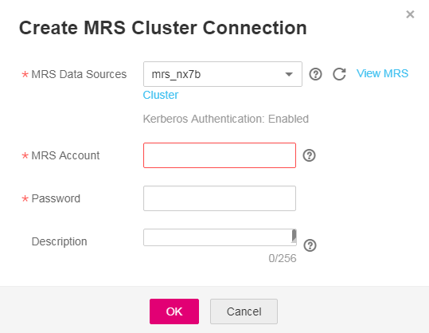

# Creating an MRS Data Source Connection

## Scenario

Before DWS reads data from MRS HDFS, you need to create an MRS data source connection that functions as a channel of transporting data warehouse cluster data and MRS cluster data.

## Impact on the System

-   You can create only one MRS data source connection in the data warehouse cluster at a time.
-   When an MRS data source connection is being created, the system automatically adds inbound and outbound rules to security groups of the data warehouse cluster and MRS cluster. Nodes in the same subnet can be accessed.
-   For the MRS cluster with Kerberos authentication enabled, the system automatically adds a  **Machine-Machine**  user that belongs to user group  **supergroup**  to the MRS cluster.

## Prerequisites

You have created a data warehouse cluster and recorded the AZ, VPC, and subnet where the cluster resides.

## Procedure

1.  Log in to the  [public cloud management console](https://console.otc.t-systems.com).
2.  Choose  **Service ListData Analysis \> MapReduce Service**  to enter the MRS management console and create an MRS cluster.

    Configure parameters as required. For details, see section  **Creating a Cluster**  in the  _MapReduce Service User Guide_.

    -   The AZ, VPC, and subnet of the MRS cluster must be the same as those of the data warehouse cluster.
    -   **Cluster Type**  must be  **Analysis Cluster**.
    -   MRS cluster versions are  **1.2**,  **1.3.0**,  **1.5.0**,  **1.5.1**,  **1.6.\***, and  **1.7.\***. The asterisk \(\*\) indicates a number.
    -   In the  **Select Components**  area, select  **Hive**  and  **Spark**  for  **Component**.

    > **NOTE:**   
    >If you want to enable Kerberos authentication for an MRS cluster, use MRS Manager to create a user for interconnecting DWS with the system after the MRS cluster is created. The user type must be  **Human-Machine**  and the user, user group  **hadoop**, and role  **Manager\_administrator**  must be bound together. The user password must be changed on the MRS Manager page after the user is created.  

    If you already have a qualified MRS cluster, skip this step.

3.  On the DWS management console, click  **Cluster Management**.
4.  In the cluster list, click the name of a cluster. On the page that is displayed, click  **MRS Data Sources**.

    **Figure  1**  MRS data sources  
    

5.  Click  **Create MRS Cluster Connection**  and configure parameters.

    **Figure  2**  Creating an MRS data source  
    

    **Table  1**  MRS cluster connection parameters

    
    <table><thead align="left"><tr id="row53231825142621"><th class="cellrowborder" valign="top" width="25%" id="mcps1.2.3.1.1">
<strong id="b84235270692541">Parameter</strong>

    </th>
    <th class="cellrowborder" valign="top" width="75%" id="mcps1.2.3.1.2">
<strong id="b842352706191716">Description</strong>

    </th>
    </tr>
    </thead>
    <tbody><tr id="row14104303142621"><td class="cellrowborder" valign="top" width="25%" headers="mcps1.2.3.1.1 ">
<strong id="b842352706142052">MRS Data Sources</strong>

    </td>
    <td class="cellrowborder" valign="top" width="75%" headers="mcps1.2.3.1.2 ">
Specifies the MRS cluster to which DWS can connect. By default, all available analytic MRS clusters that are in the same VPC and subnet as the current data warehouse cluster and in the <strong id="b84235270621816">Available</strong> state are displayed.

    
After you select an MRS cluster, the system automatically displays whether Kerberos authentication is enabled for the selected cluster.

    
This parameter is mandatory.

    </td>
    </tr>
    <tr id="row22977368142941"><td class="cellrowborder" valign="top" width="25%" headers="mcps1.2.3.1.1 ">
<strong id="b842352706142030">MRS Account</strong>

    </td>
    <td class="cellrowborder" valign="top" width="75%" headers="mcps1.2.3.1.2 ">
Specifies the account used when a data warehouse cluster connects to an MRS cluster. This parameter is available only for clusters with Kerberos authentication enabled.

    
This parameter is mandatory.

    </td>
    </tr>
    <tr id="row65192618142942"><td class="cellrowborder" valign="top" width="25%" headers="mcps1.2.3.1.1 ">
<strong id="b842352706142026">Password</strong>

    </td>
    <td class="cellrowborder" valign="top" width="75%" headers="mcps1.2.3.1.2 ">
Specifies the password of the connection user. If you change the password, you need to create a new connection. This parameter is available only for clusters with Kerberos authentication enabled.

    
This parameter is mandatory.

    </td>
    </tr>
    <tr id="row895856614324"><td class="cellrowborder" valign="top" width="25%" headers="mcps1.2.3.1.1 ">
<strong id="b842352706142022">Description</strong>

    </td>
    <td class="cellrowborder" valign="top" width="75%" headers="mcps1.2.3.1.2 ">
Describes the connection.

    
This parameter is optional.

    </td>
    </tr>
    </tbody>
    </table>

    > **NOTE:**   
    >-   If the  **MRS Data Source**  drop-down list is empty, click  **Create MRS Cluster**  to create an MRS cluster.  
    >-   After selecting an MRS cluster from the  **MRS Data Source**  drop-down list, click  **View MRS Cluster**  to view information about the MRS cluster.  

6.  Click  **OK**  to save the connection.

    **Configuration Status**  turns to  **Creating**. You can view the connection that is successfully created in the list and the connection status is  **Available**.

    > **NOTE:**   
    >-   In the  **Operation**  column, you can click  **Update Configurations**  to update  **MRS Cluster Status**  and  **Configuration Status**. During configuration update, you cannot create a new connection. The system checks whether the security group rule is correct. If the rule is incorrect, the system rectifies the fault. For details, see section  [Updating the MRS Data Source Configuration](updating-the-mrs-data-source-configuration.md).  
    >-   In the  **Operation**  column, you can click  **Delete**  to delete the unnecessary connection. When deleting a connection, you need to manually delete the security group rule.  

