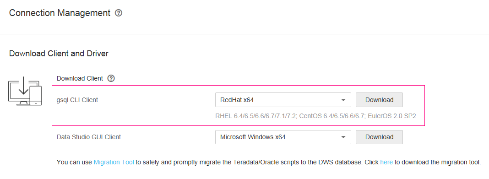

# Downloading the Client

DWS provides client tool packages that match the cluster versions. You can download the desired client tool package on the DWS management console.

The client tool package contains the following:

-   **Database connection tool gsql and the script for testing sample data**

    gsql is a command line client running on the Linux OS. It is used to connect to the database in a data warehouse cluster.

    The script for testing sample data is used when you start an example.

-   **GDS tool package**

    Gauss Data Service \(GDS\) is a data service tool. You can use the GDS tool to import a data file in a common file system to the DWS database. The GDS tool package must be installed on the server where the data source file is located. The server where the data source file is located is called a data server or GDS server.

## Downloading the Client

1.  Log in to the management console at  [https://console.otc.t-systems.com/dws/](https://console.otc.t-systems.com/dws/).
2.  In the navigation tree on the left, click  **Connection Management**.
3.  Select the DWS client of the corresponding version from the drop-down list of  **gsql CLI Client**.

    Choose  **RedHat x64**  or  **SUSE x64**  according to the OS of the client to be installed.

    -   The  **RedHat x64**  client can be used on the following OSs:
        -   RHEL 6.4/6.5/6.6/6.7/7.1/7.2
        -   CentOS 6.4/6.5/6.6/6.7
        -   EulerOS 2.0 SP2

    -   The  **SUSE x64**  client can be used on the following OSs:

        SLES11 SP1/SP2/SP3/SP4

    **Figure  1**  Downloading the client  
    

4.  Click  **Download**.

