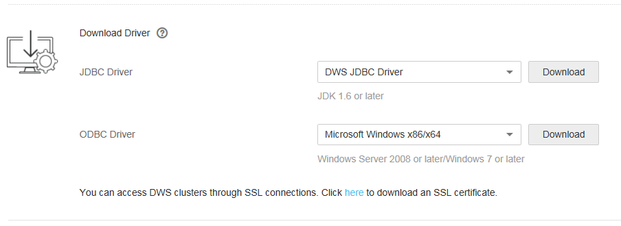

# Downloading the JDBC or ODBC Driver

The JDBC or ODBC driver is used to connect to data warehouse clusters. You can download the JDBC or ODBC driver provided by DWS from the management console or use open source JDBC or ODBC driver.

## Open Source JDBC or ODBC Driver

DWS also supports open source JDBC driver: PostgreSQL JDBC 9.3-1103 or later.

DWS also supports open source ODBC driver: PostgreSQL ODBC 09.01.0200 or later.

## Downloading the JDBC or ODBC Driver

1.  Log in to the DWS management console.
2.  In the navigation tree on the left, click  **Connection Management**.
3.  In the  **Download Driver**  area, choose a driver that you want to download.

    **Figure  1**  Downloading the driver  
    

    -   **JDBC Driver**

        Choose  **DWS JDBC Driver**  and click  **Download**.

        The JDBC driver can be used on all platforms and depends on JDK 1.6 or later.

    -   **ODBC Driver**

        Choose  **Microsoft Windows x86/x64**  or  **Linux x64**  and click  **Download**.

        The ODBC driver is applicable to the following OSs only:

        -   Windows Server 2008 or later or Windows 7 or later
        -   RHEL 6.4/6.5/6.6/6.7/7.1/7.2
        -   CentOS 6.4/6.5/6.6/6.7
        -   EulerOS 2.0 SP2
        -   SUSE 11 SP1/11 SP2/11 SP3/11 SP4

        > **NOTE:**   
        >Windows drivers can only be 32-bit and can be used in 32-bit or 64-bit OSs. However, the applications must be 32-bit.  

