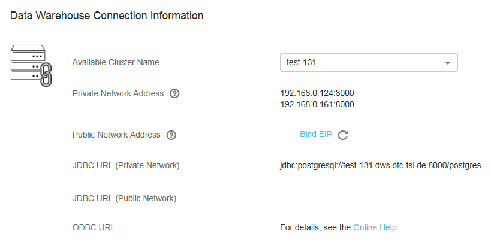
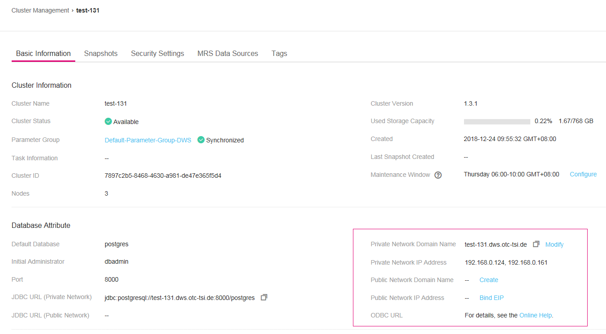

# Obtaining the Cluster Connection Address

## Scenario

You can access data warehouse clusters using different methods and the connection address of each connection method varies. This section describes how to view and obtain the private network address in the public cloud, public network address on the Internet, and JDBC connection strings.

To obtain the cluster connection address, use either of the following methods:

-   [Obtaining the Cluster Connection Address on the Connection Management Page](#section5539467151713)
-   [Obtaining the Cluster Access Addresses on the Basic Information Page](#section149501253104810)

## Obtaining the Cluster Connection Address on the Connection Management Page

1.  Log in to the DWS management console.
2.  In the navigation tree on the left, click  **Connection Management**.
3.  In the  **Data Warehouse Connection Information**  area, select an available cluster.

    You can only select clusters in the  **Available**  state.

    **Figure  1**  Connection information  
    

4.  View and obtain the cluster connection information.

    -   **Private Network Address**
    -   **Public Network Address**
    -   **JDBC URL \(Private Network\)**
    -   **JDBC URL \(Public Network\)**
    -   **ODBC URL**

    > **NOTE:**   
    >-   If no EIP is automatically assigned during cluster creation and  **Public Network Address**  is empty, click  **Bind EIP**  to bind an EIP to the cluster.   
    >-   If an EIP is bound during cluster creation, click  **Unbind EIP**  to unbind the EIP.   

## Obtaining the Cluster Access Addresses on the Basic Information Page

1.  Log in to the management console at  [https://console.otc.t-systems.com/dws/](https://console.otc.t-systems.com/dws/).
2.  In the navigation tree on the left, click  **Cluster Management**.
3.  In the cluster list, click the name of the cluster that you want to view. The  **Basic Information**  page is displayed.
4.  In the  **Database Attribute**  area, view and obtain the cluster's access address information, including the private network address and public network address.

    **Figure  2**  Access addresses  
    

    **Table  1**  Database attribute parameters

    
    <table><thead align="left"><tr id="row107835915393"><th class="cellrowborder" valign="top" width="24%" id="mcps1.2.3.1.1">
<strong id="b84235270692541">Parameter</strong>

    </th>
    <th class="cellrowborder" valign="top" width="76%" id="mcps1.2.3.1.2">
<strong id="b842352706181449">Description</strong>

    </th>
    </tr>
    </thead>
    <tbody><tr id="row11404121572"><td class="cellrowborder" valign="top" width="24%" headers="mcps1.2.3.1.1 ">
Default Database

    </td>
    <td class="cellrowborder" valign="top" width="76%" headers="mcps1.2.3.1.2 ">
Database that is automatically created during cluster creation. When you connect to the cluster for the first time, you need to connect to the default database.

    </td>
    </tr>
    <tr id="row1913311541965"><td class="cellrowborder" valign="top" width="24%" headers="mcps1.2.3.1.1 ">
Initial Administrator

    </td>
    <td class="cellrowborder" valign="top" width="76%" headers="mcps1.2.3.1.2 ">
Administrator user specified during cluster creation. When you connect to the cluster for the first time, you need to use the initial administrator and password to connect to the default database.

    </td>
    </tr>
    <tr id="row1083211501964"><td class="cellrowborder" valign="top" width="24%" headers="mcps1.2.3.1.1 ">
Port

    </td>
    <td class="cellrowborder" valign="top" width="76%" headers="mcps1.2.3.1.2 ">
Port for accessing the cluster database over the public network or private network. Database port specified during cluster creation. It is used to listen to client connections.

    </td>
    </tr>
    <tr id="row129517471462"><td class="cellrowborder" valign="top" width="24%" headers="mcps1.2.3.1.1 ">
JDBC URL (Private Network)

    </td>
    <td class="cellrowborder" valign="top" width="76%" headers="mcps1.2.3.1.2 ">
In the private network environment, you can use the JDBC URL (private network) to connect to the cluster when developing applications.

    </td>
    </tr>
    <tr id="row58581742162"><td class="cellrowborder" valign="top" width="24%" headers="mcps1.2.3.1.1 ">
JDBC URL (Public Network)

    </td>
    <td class="cellrowborder" valign="top" width="76%" headers="mcps1.2.3.1.2 ">
In the public network environment, you can use the JDBC URL (public network) to connect to the cluster when developing applications.

    </td>
    </tr>
    <tr id="row1278775864518"><td class="cellrowborder" valign="top" width="24%" headers="mcps1.2.3.1.1 ">
Private Network Domain Name

    </td>
    <td class="cellrowborder" valign="top" width="76%" headers="mcps1.2.3.1.2 ">
Name of the domain for accessing the database in the cluster through the private network. The private network domain address is automatically generated when you create a cluster. The default naming rule is as follows: cluster name.dws.otc-tsi.de

    
 NOTE: 

If the cluster name does not comply with the domain name standards, the prefix of the default access domain name will be adjusted accordingly.

    

    
Click <strong id="b84235270620162">Modify</strong> to change the private network access domain name. The access domain name contains 4 to 63 characters, which consist of letters, digits, and hyphens (-), and must start with a letter.

    
For more information, see section <a href="managing-access-domain-names.md">Managing Access Domain Names</a>.

    </td>
    </tr>
    <tr id="row197835916390"><td class="cellrowborder" valign="top" width="24%" headers="mcps1.2.3.1.1 ">
Private Network IP Address

    </td>
    <td class="cellrowborder" valign="top" width="76%" headers="mcps1.2.3.1.2 ">
IP address for accessing the database in the cluster through the private network. The private network address is automatically generated when you create a cluster.

    </td>
    </tr>
    <tr id="row16870618204610"><td class="cellrowborder" valign="top" width="24%" headers="mcps1.2.3.1.1 ">
Public Network Domain Name

    </td>
    <td class="cellrowborder" valign="top" width="76%" headers="mcps1.2.3.1.2 ">
Name of the domain for accessing the database in the cluster through the public network. 

    
 NOTE: 
<ul id="ul4787192618461"><li>If you have not bound an EIP to the cluster, <b>Public Network IP Address</b>, <b>Public Network Port</b>, and <b>Public Network Domain Name</b> are left blank.</li><li>If you bind an EIP during cluster creation, the public network domain name is automatically generated. The default naming rule is as follows: cluster name.dws.t-systems.com</li><li>Bind an EIP to the cluster before binding the public network domain name to the cluster. Click <b>Create</b> to bind the public network domain name to the cluster.</li><li>You can click <b>Modify</b> to modify the public network domain name bound to the cluster. The domain name contains 4 to 63 characters, which consist of letters, digits, and hyphens (-), and must start with a letter.</li><li>You can click <b>Release</b> to release the public network domain name bound to the cluster.</li></ul>
    

    
For more information, see section <a href="managing-access-domain-names.md">Managing Access Domain Names</a>.

    </td>
    </tr>
    <tr id="row16299125111411"><td class="cellrowborder" valign="top" width="24%" headers="mcps1.2.3.1.1 ">
Public Network IP Address

    </td>
    <td class="cellrowborder" valign="top" width="76%" headers="mcps1.2.3.1.2 ">
IP address for accessing the database in the cluster through the public network. 

    
 NOTE: 
<ul id="ul198032619509"><li>If no EIP is assigned during cluster creation and <b>Public Network IP Address</b> is empty, click <b>Bind EIP</b> to bind an EIP to the cluster. </li><li>If an EIP is bound during cluster creation, click <b>Unbind EIP</b> to unbind the EIP. </li></ul>
    

    </td>
    </tr>
    <tr id="row1816181020814"><td class="cellrowborder" valign="top" width="24%" headers="mcps1.2.3.1.1 ">
ODBC URL

    </td>
    <td class="cellrowborder" valign="top" width="76%" headers="mcps1.2.3.1.2 ">
In DWS, you can use an ODBC driver to connect to the database. The drivers can connect to the database through the ECS in the public cloud or over the Internet.

    </td>
    </tr>
    </tbody>
    </table>

