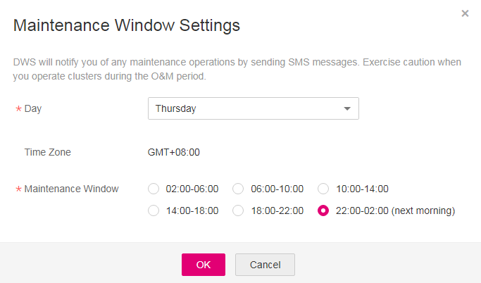

# Upgrading a Cluster

After you create a data warehouse cluster, the system automatically configures a random maintenance window for the cluster. Alternatively, you can customize a maintenance window as required. For details about how to view and configure the maintenance window, see  [Configuring the Maintenance Window](#section1583412504297).

The validity period of the maintenance window \(maximum maintenance duration\) is 4 hours. During this period, you can upgrade the cluster, install OS patches, and harden the system. If no maintenance tasks are performed within the planned maintenance window, the cluster continues to run properly until the next maintenance window. DWS will notify you about any maintenance operation by sending SMS messages. Exercise caution when you operate clusters during the maintenance period.

If the upgrade affects the current query request and service running, contact technical support engineers for emergency handling. 

A cluster is charged by the hour as long as it is in  **Available**  status. Since the data warehouse cluster is charged by the hour, you would not see any difference in the bill if a node failure or system upgrade only causes a brief interruption \(for example, 15 minutes\) for the cluster. If such events cause major system interruption \(very rare case\), you will not be charged for those downtime hours. 

## Upgrading a Cluster

You do not need to care about DWS cluster patching or upgrading because DWS will handle version upgrade automatically. After DWS is upgraded, the service automatically upgrades the clusters to the latest version within the maintenance window. During the upgrade, the cluster is automatically restarted and cannot provide services for a short period of time. Therefore, you are advised to set a suitable time range when the number of connected users and the number of active tasks are small.

> **NOTE:**   
>After the cluster is upgraded, it cannot be rolled back.  

The following figure describes the cluster version.

**Figure  1**  Version description  

-   **Service patch upgrade**: The last digit of cluster version  _X.X.X_  is changed. For example, the cluster is upgraded from 1.1.0 to 1.1.1.
    -   Duration: The whole process will take less than 10 minutes.
    -   Impact on services: During this period, services will be interrupted for 1 to 3 minutes.

-   **Service upgrade**: The first two digits of cluster version  _X.X.X_  are changed. For example, the cluster is upgraded from 1.1.0 to 1.2.0.
    -   Duration: The whole process will take less than 30 minutes.
    -   Impact on services: During this period, the database cannot be accessed.

## Configuring the Maintenance Window

1.  Log in to the management console at  [https://console.otc.t-systems.com/dws/](https://console.otc.t-systems.com/dws/).
2.  Click  **Cluster Management**.
3.  In the cluster list, click the name of the target cluster. The  **Basic Information**  page is displayed.

    In the  **Cluster Information**  area, you can view the  **Maintenance Window**.

4.  On the right of  **Maintenance Window**, click  **Configure**.
5.  In the dialog box that is displayed, configure the maintenance window.

    **Figure  2**  Configuring the maintenance window  
    

6.  Click  **OK**.

