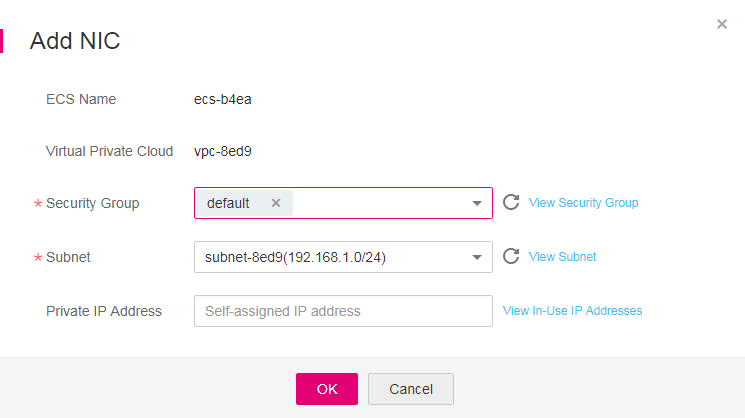

# Adding a NIC

## Scenarios

If multiple NICs are required by your ECS, you can add them to your ECS. To add a NIC to the ECS, perform the following operations:

## Procedure

1.  Log in to the management console.
2.  Click    in the upper left corner and select the desired region and project.
3.  Under  **Computing**, click  **Elastic Cloud Server**.
4.  In the search box above the upper right corner of the ECS list, enter the ECS name, IP address, or ID for search.
5.  Click the name of the target ECS.

    The page providing details about the ECS is displayed.

6.  Click the  **NICs**  tab. Then, click  **Add NIC**.
7.  Select the subnet and security group to be added.

    **Figure  1**  Selecting the security group and subnet  
    

    -   **Security Group**: You can select multiple security groups. In such a case, the access rules of all the selected security groups apply on the ECS.
    -   **Private IP Address**: If you want to add a NIC with a specified IP address, enter an IP address into the  **Private IP Address**  field.

8.  Click  **OK**.

## Follow-up Procedure

Some OSs cannot identify newly added NICs. In this case, you must manually activate the NICs. Ubuntu is used as an example in the following NIC activation procedure. Required operations may vary among systems. For additional information, see the documentation for your OS.

1.  Find the target ECS and click  **Remote Login**  in the  **Operation**  column.

    Log in to the ECS.

2.  Run the following command to view the NIC name:

    **ifconfig -a**

    In this example, the NIC name is  **eth2**.

3.  Run the following command to switch to the target directory:

    **cd /etc/network**

4.  Run the following command to open the  **interfaces**  file:

    **vi interfaces**

5.  Add the following information to the  **interfaces**  file:

    **auto** _eth2_

    **iface** _eth2_ **inet dhcp**

6.  Run the following command to save and exit the  **interfaces**  file:

    **:wq**

7.  Run either the  **ifup eth2**  command or the  **/etc/init.d/networking restart**  command to make the newly added NIC take effect.

    _X_  in the preceding command indicates the NIC name and SN, for example,  **ifup eth2**.

8.  Run the following command to check whether the NIC name obtained in step  [2](#li595089165210)  is displayed in the command output:

    **ifconfig**

    For example, check whether  **eth2**  is displayed in the command output.

    -   If yes, the newly added NIC has been activated, and no further action is required.
    -   If no, the newly added NIC failed to be activated. Go to step  [9](#li1695469165210).

9.  Log in to the management console. Find the target ECS, click  **More**  in the  **Operation**  column, and then click  **Restart**.
10. Run the following command to check whether the NIC name obtained in step  [2](#li595089165210)  is displayed in the command output:
    -   If the password can be obtained, no further action is required.
    -   If no, contact customer service.

