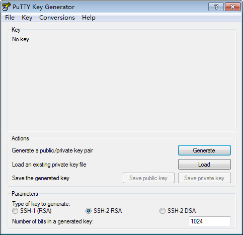
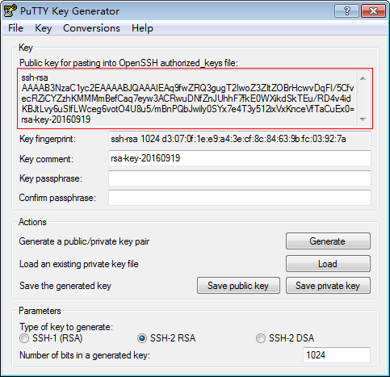

# Creating a Key Pair

## Overview

A key pair that consists of a public key and a private key is required for authentication when you log in to an ECS. Both the public and private keys are used for authentication. Therefore, you must use an existing key pair or create a new one for remote login authentication.

-   Creating a key pair

    If no key pair is available, create one, in which the private key is used for login authentication. You can use either of the following methods to create a key pair:

    -   \(Recommended\) Create a key pair through the management console. After the creation, the public key is automatically stored in the system, and the private key is manually stored in a local directory. For details, see  [Creating a Key Pair Through the Management Console](#section35336147204538).
    -   Create a key pair using  **puttygen.exe**. After the creation, both the public key and private key are stored locally. For details, see  [Creating a Key Pair Using puttygen.exe](#section38463609165715). After the creation, import the key pair by following the instructions provided in  [Importing a Key Pair](#section62005706143441). Then, the key pair can be used.

-   Using an existing key pair

    If a key pair is available locally, for example, generated using PuTTYgen, you can import the public key on the management console so that the system maintains the public key file. For details, see  [Importing a Key Pair](#section62005706143441).

    > **NOTE:**   
    >If the public key of the existing key pair is stored by clicking  **Save public key**  of  **puttygen.exe**, the public key cannot be imported to the management console. If this key pair must be used for remote authentication, see  [What Should I Do If a Key Pair Created Using puttygen.exe Cannot Be Imported to the Management Console?](what-should-i-do-if-a-key-pair-created-using-puttygen-exe-cannot-be-imported-to-the-management-conso.md)  

## Constraints

-   ECSs support the following encryption algorithms:
    -   SSH-2 \(RSA, 1024\)
    -   SSH-2 \(RSA, 2048\)
    -   SSH-2 \(RSA, 4096\)

-   The private key is one of the most important functions for protecting your ECS during remote login. To ensure ECS security, you are limited to downloading the private key only once.

## Creating a Key Pair Through the Management Console

1.  Log in to the management console.
2.  Click    in the upper left corner and select the desired region and project.
3.  Under  **Computing**, click  **Elastic Cloud Server**.
4.  In the navigation pane on the left, choose  **Key Pair**.
5.  On the right side of the page, click  **Create Key Pair**.
6.  Enter the key name and click  **OK**.

    An automatically allocated key name consists of  **KeyPair-**  and a 4-digit random number. Change it to an easy-to-remember one, for example,  **KeyPair-xxxx\_ecs**.

7.  Manually or automatically download the private key file. The file name is the specified key pair name with a suffix of .pem. Securely store the private key file. In the displayed dialog box, click  **OK**.

    > **NOTICE:**   
    >This is the only opportunity for you to save the private key file. Keep it secure. When creating an ECS, provide the name of your desired key pair. Each time you log in to the ECS using SSH, provide the private key.  

## Creating a Key Pair Using  **puttygen.exe**

1.  Obtain the public and private keys.
    1.  Double-click  **puttygen.exe**  to switch to the  **PuTTY Key Generator**  page.

        **Figure  1**  PuTTY Key Generator  
        

    2.  Click  **Generate**.

        The key generator automatically generates a key pair that consists of a public key and a private key. The public key is shown in the red box in  [Figure 2](#en-us_topic_0037960038_fig4678746517750).

        **Figure  2**  Obtaining the public and private keys  
        

2.  Copy the public key content to a .txt file and save the file in a local directory.

    > **NOTE:**   
    >Do not save the public key by clicking  **Save public key**. Storing a public key by clicking  **Save public key**  of  **puttygen.exe**  will change the format of the public key content. Such a key cannot be imported to the management console.  

3.  Save the private key.

    The format in which to save your private key varies depending on application scenarios:

    -   Saving the private key in .ppk format

        When you are required to log in to a Linux ECS using PuTTY, you must use the .ppk private key. To save the private key in .ppk format, perform the following operations:

        1.  On the  **PuTTY Key Generator**  page, choose  **File**  \>  **Save private key**.
        2.  Save the converted private key, for example,  **kp-123.ppk**, in a local directory.

    -   Saving the private key in .pem format

        When you are required to log in to a Linux ECS using Xshell or attempt to obtain the password for logging in to a Windows ECS, you must use the .pem private key for authentication. To save the private key in .pem format, perform the following operations:

        1.  Choose  **Conversions**  \>  **Export OpenSSH key**.

            > **NOTICE:**   
            >If you use this private file to obtain the password for logging in to a Windows ECS, when you choose  **Export OpenSSH key**, do not configure  **Key passphrase**. Otherwise, obtaining the password will fail.  

        2.  Save the private key, for example,  **kp-123.pem**, in a local directory.

4.  Import the public key to the system. For details, see "Copying the public key content" in  [Importing a Key Pair](#section62005706143441).

## Importing a Key Pair

If you store a public key by clicking  **Save public key**  of  **puttygen.exe**, the format of the public key content will change. Such a key cannot be imported to the management console. To resolve this issue, obtain the public key content in correct format and import the content to the management console. For details, see  [What Should I Do If a Key Pair Created Using puttygen.exe Cannot Be Imported to the Management Console?](what-should-i-do-if-a-key-pair-created-using-puttygen-exe-cannot-be-imported-to-the-management-conso.md)

1.  Log in to the management console.
2.  Click    in the upper left corner and select the desired region and project.
3.  Under  **Computing**, click  **Elastic Cloud Server**.
4.  In the navigation pane on the left, choose  **Key Pair**.
5.  On the right side of the page, click  **Import Key Pair**.

    **Figure  3**  Import Key Pair  
    

6.  Use either of the following methods to import the key pair:
    -   Selecting a file
        1.  On the  **Import Key Pair**  page of the management console, click  **Select File**  and select the local public key file, for example, the .txt file saved in  [2](#li24584709151818).

            > **NOTE:**   
            >When importing a key pair, ensure that the public key is imported. Otherwise, the importing will fail.  

        2.  Click  **OK**.

            After the public key is imported, you can change its name.

    -   Copying the public key content
        1.  Copy the content of the public key in .txt file into the  **Public Key Content**  text box.
        2.  Click  **OK**.

## Helpful Links

-   [What Should I Do If a Key Pair Cannot Be Imported?](what-should-i-do-if-a-key-pair-cannot-be-imported.md)
-   [What Should I Do If a Key Pair Created Using puttygen.exe Cannot Be Imported to the Management Console?](what-should-i-do-if-a-key-pair-created-using-puttygen-exe-cannot-be-imported-to-the-management-conso.md)

