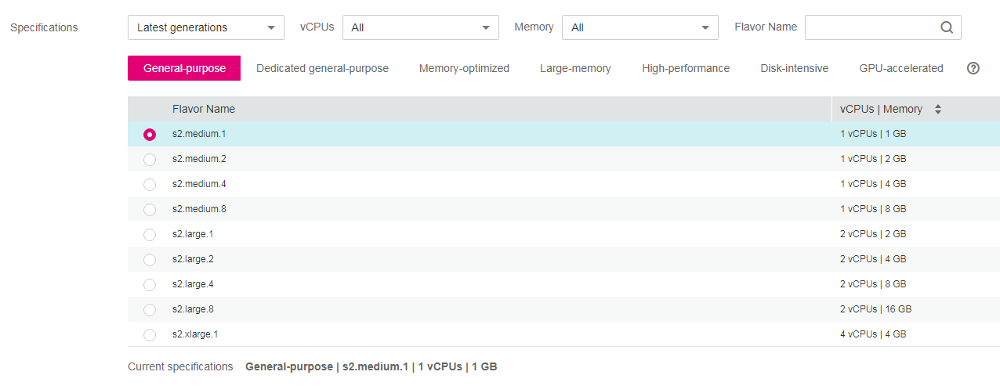

# ECS Types

The public cloud provides the following ECS types for different application scenarios:

-   General-purpose
-   Dedicated general-purpose
-   Memory-optimized
-   Large-memory
-   Disk-intensive
-   High-performance computing
-   GPU-accelerated

## ECS Flavor Naming Rules

ECS flavors are named using the format "AB.C.D".

The format is defined as follows:

-   **A**  specifies the ECS type. For example,  **s**  indicates a general-purpose ECS,  **c**  a computing ECS, and  **m**  a memory-optimized ECS.
-   **B**  specifies the type ID. For example, the  **1**  in  **s1**  indicates a general-purpose first-generation ECS, and the  **2**  in  **s2**  indicates a general-purpose second-generation ECS.
-   **C**  specifies the flavor size, such as medium, large, or xlarge.
-   **D**  specifies the ratio of vCPUs to memory expressed in a digit. For example, value  **4**  indicates that the ratio of vCPUs to memory is 4.

## Obtaining Specifications When Creating an ECS

Specifications for the ECS being created are located in the specifications list.

**Figure  1**  ECS specifications  

