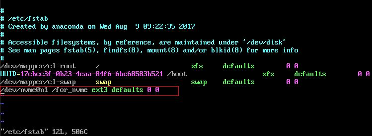
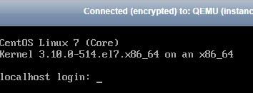

# How Can I Rectify the Fault That May Occur on a Linux ECS with an NVMe SSD Disk Attached?

## Symptom

When a Linux ECS with an NVMe SSD disk attached, such as a P1 ECS, becomes faulty, you must contact the administrator to remotely create the ECS again for reconstruction.

If automatic NVMe SSD disk attaching upon ECS startup is enabled in  **/etc/fstab**  on the faulty ECS, the system disk recovers after the ECS is created. However, the attached NVMe SSD disk does not have a file system, and automatic NVMe SSD disk attaching upon ECS startup fails to take effect. As a result, the ECS enters the emergency mode.

**Figure  1**  Emergency mode  

To ensure that the new ECS is functional, you must manually delete the attaching information in  **/etc/fstab**.

> **NOTE:**   
>If the NVMe SSD disk is faulty, data on it will be lost. The operations provided in this section are only used to restore automatic NVMe SSD disk attachment to an ECS, but not restoring the data on the disk.  

## Solution

1.  Log in to the ECS.
2.  Enter the password of user  **root**  to log in to the ECS.

    **Figure  2**  Logging in to the ECS  
    

3.  Run the following command to edit the  **/etc/fstab**  file:

    **vi /etc/fstab**

4.  Delete the attaching information of the NVMe SSD disk and save the file.

    **Figure  3**  Deleting the automatic attaching information  
    

5.  Run the following command to restart the ECS:

    **reboot**

6.  Verify that the ECS recovers and can be logged in.

    **Figure  4**  Logging in to the ECS  
    

