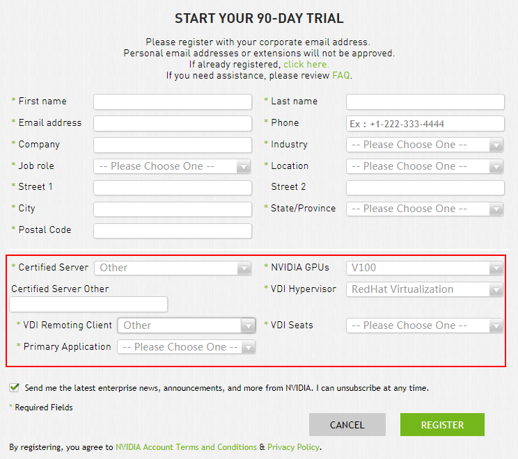
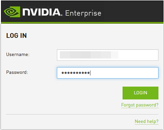
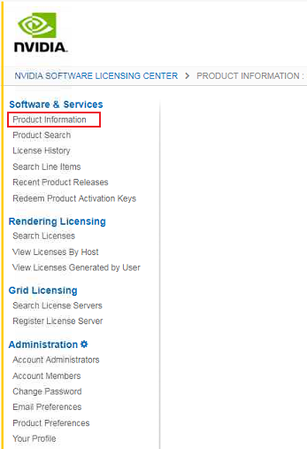
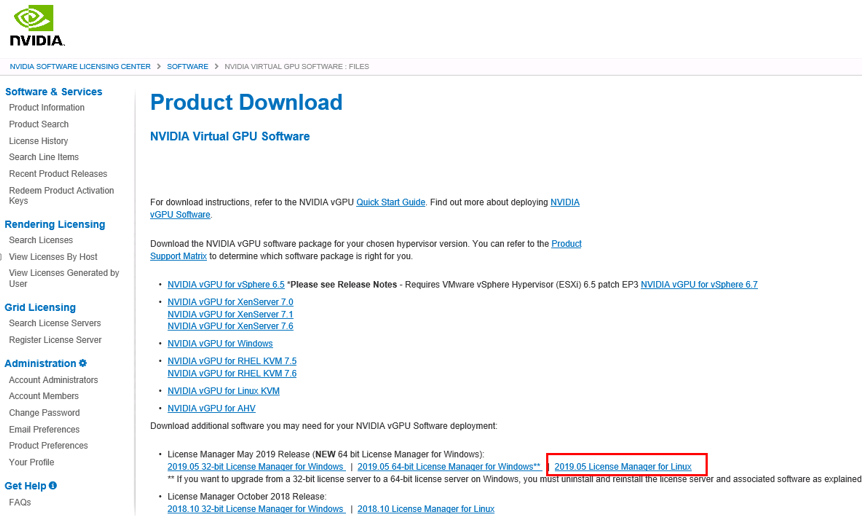
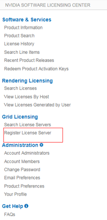
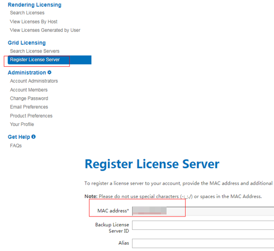
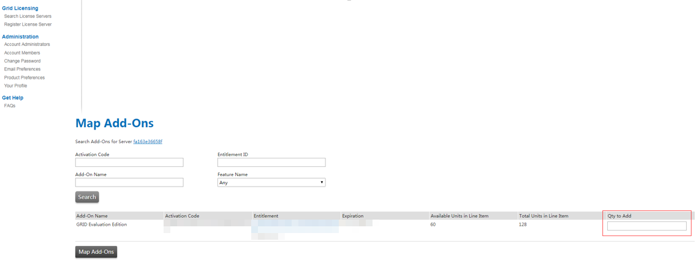

# Installing a GRID/vGPU Driver on a GPU-accelerated ECS

## Scenarios

Before using a GPU-accelerated ECS, install a proper GPU driver on it for GPU acceleration. There are two types of NVIDIA Tesla GPU drivers for GPU-accelerated ECSs, Tesla and GRID/vGPU drivers.

To use graphics acceleration, such as OpenGL, DirectX, or Vulcan, install the GRID/vGPU driver and separately purchase and configure a GRID license. The GRID/vGPU driver with a vDWS license also supports CUDA for both computing and graphics acceleration.

This section describes how to install a GRID/vGPU driver, purchase or apply for a GRID license, and configure the license server.

Process of installing a GRID/vGPU driver:

1.  [Purchasing a GRID License](#section1130184214229)
2.  [Download GRID driver and software license packages.](#section91244318407)
3.  [Deploy and configure the license server.](#section19229135113439)
4.  [Install the GRID driver and configure the license.](#section17545653184812)

> **NOTE:**   
>-   A graphics-accelerated \(G series\) ECS created using a public image has a GRID driver of a specified version installed by default, but the GRID license must be purchased and configured separately. Before using such an ECS, check whether the desired driver has been installed on it and whether the version of the installed driver meets service requirements.  
>-   A computing-accelerated \(P series\) ECS created using a public image has a Tesla driver of a specified version installed by default. Before using such an ECS, check whether the desired driver has been installed on it and whether the version of the installed driver meets service requirements.  
>-   NVIDIA allows you to apply for a 90-day trial license.  
>-   For details about GPU-accelerated ECSs with different specifications and application scenarios, see  [GPU-accelerated ECSs](gpu-accelerated-ecss.md).  

**Table  1**  Acceleration supported by GPU drivers

<table><thead align="left"><tr id="row991219704215"><th class="cellrowborder" valign="top" width="10.97%" id="mcps1.2.9.1.1">
Driver Type

</th>
<th class="cellrowborder" valign="top" width="12.53%" id="mcps1.2.9.1.2">
License

</th>
<th class="cellrowborder" valign="top" width="10.89%" id="mcps1.2.9.1.3">
CUDA

</th>
<th class="cellrowborder" valign="top" width="8.48%" id="mcps1.2.9.1.4">
OpenGL

</th>
<th class="cellrowborder" valign="top" width="9.4%" id="mcps1.2.9.1.5">
DirectX

</th>
<th class="cellrowborder" valign="top" width="11.29%" id="mcps1.2.9.1.6">
Vulcan

</th>
<th class="cellrowborder" valign="top" width="18.529999999999998%" id="mcps1.2.9.1.7">
Application Scenario

</th>
<th class="cellrowborder" valign="top" width="17.91%" id="mcps1.2.9.1.8">
Description

</th>
</tr>
</thead>
<tbody><tr id="row96781191420"><td class="cellrowborder" valign="top" width="10.97%" headers="mcps1.2.9.1.1 ">
GRID/vGPU driver

</td>
<td class="cellrowborder" valign="top" width="12.53%" headers="mcps1.2.9.1.2 ">
Required

</td>
<td class="cellrowborder" valign="top" width="10.89%" headers="mcps1.2.9.1.3 ">
Supported

</td>
<td class="cellrowborder" valign="top" width="8.48%" headers="mcps1.2.9.1.4 ">
Supported

</td>
<td class="cellrowborder" valign="top" width="9.4%" headers="mcps1.2.9.1.5 ">
Supported

</td>
<td class="cellrowborder" valign="top" width="11.29%" headers="mcps1.2.9.1.6 ">
Supported

</td>
<td class="cellrowborder" valign="top" width="18.529999999999998%" headers="mcps1.2.9.1.7 ">
3D rendering, graphics workstation, and game acceleration

</td>
<td class="cellrowborder" valign="top" width="17.91%" headers="mcps1.2.9.1.8 ">
The GRID/vGPU driver must be paid and requires a license to accelerate graphics and image applications.

</td>
</tr>
<tr id="row9914147204218"><td class="cellrowborder" valign="top" width="10.97%" headers="mcps1.2.9.1.1 ">
Tesla driver

</td>
<td class="cellrowborder" valign="top" width="12.53%" headers="mcps1.2.9.1.2 ">
Not required

</td>
<td class="cellrowborder" valign="top" width="10.89%" headers="mcps1.2.9.1.3 ">
Supported

</td>
<td class="cellrowborder" valign="top" width="8.48%" headers="mcps1.2.9.1.4 ">
Not supported

</td>
<td class="cellrowborder" valign="top" width="9.4%" headers="mcps1.2.9.1.5 ">
Not supported

</td>
<td class="cellrowborder" valign="top" width="11.29%" headers="mcps1.2.9.1.6 ">
Not supported

</td>
<td class="cellrowborder" valign="top" width="18.529999999999998%" headers="mcps1.2.9.1.7 ">
Scientific computing, deep learning training, and inference

</td>
<td class="cellrowborder" valign="top" width="17.91%" headers="mcps1.2.9.1.8 ">
The Tesla driver is downloaded free of charge and usually used with NVIDIA CUDA SDK to accelerate general computing applications.

</td>
</tr>
</tbody>
</table>

## Purchasing a GRID License

-   Purchase a license.

    To obtain an official license, contact NVIDIA or their NVIDIA agent in your local country or region.

-   Apply for a trial license.

    Log in at the  [official NVIDIA website](https://www.nvidia.com/object/nvidia-enterprise-account.html)  and enter desired information.

    For details about how to register an account and apply for a trial license, see  [official NVIDIA help page](https://nvid.nvidia.com/NvidiaUtilities/#/needHelp).

    > **NOTE:**   
    >The method of using a trial license is the same as that of using an official license. You can use an official license to activate an account with a trial license to prevent repetitive registration. The trial license has a validity period of 90 days. After the trial license expires, it cannot be used any more. Purchase an official license then.  

    **Figure  1**  Applying for a trial license  
    

## Downloading GRID Driver and Software License Packages

1.  [Obtain the driver installation package](https://www.nvidia.com/grid-eval)  required for an OS. For details, see  [Table 2](#table230940145218).

    > **NOTE:**   
    >For a GPU passthrough ECS, select a GRID driver version as required.  
    >For a GPU virtualization ECS, select a driver version based on  [Table 2](#table230940145218).  

    **Table  2**  GRID/vGPU driver versions supported by GPU-accelerated ECSs

    
    <table><thead align="left"><tr id="row1230860145216"><th class="cellrowborder" valign="top" width="10.891089108910892%" id="mcps1.2.6.1.1">
ECS Type

    </th>
    <th class="cellrowborder" valign="top" width="17.82178217821782%" id="mcps1.2.6.1.2">
GPU Attachment

    </th>
    <th class="cellrowborder" valign="top" width="28.71287128712871%" id="mcps1.2.6.1.3">
OS

    </th>
    <th class="cellrowborder" valign="top" width="23.762376237623762%" id="mcps1.2.6.1.4">
Driver Version

    </th>
    <th class="cellrowborder" valign="top" width="18.81188118811881%" id="mcps1.2.6.1.5">
CPU Architecture

    </th>
    </tr>
    </thead>
    <tbody><tr id="row1443710550468"><td class="cellrowborder" valign="top" width="10.891089108910892%" headers="mcps1.2.6.1.1 ">
G6

    </td>
    <td class="cellrowborder" valign="top" width="17.82178217821782%" headers="mcps1.2.6.1.2 ">
GPU virtualization

    </td>
    <td class="cellrowborder" valign="top" width="28.71287128712871%" headers="mcps1.2.6.1.3 "><ul id="ul1341917351493"><li>Windows Server 2016 Standard 64bit</li></ul>
    </td>
    <td class="cellrowborder" valign="top" width="23.762376237623762%" headers="mcps1.2.6.1.4 ">
GRID 7.1: NVIDIA vGPU for Linux KVM

    
Verify other driver versions.

    </td>
    <td class="cellrowborder" valign="top" width="18.81188118811881%" headers="mcps1.2.6.1.5 ">
x86_64

    </td>
    </tr>
    <tr id="row2017804416017"><td class="cellrowborder" valign="top" width="10.891089108910892%" headers="mcps1.2.6.1.1 ">
G2

    </td>
    <td class="cellrowborder" valign="top" width="17.82178217821782%" headers="mcps1.2.6.1.2 ">
GPU passthrough

    </td>
    <td class="cellrowborder" valign="top" width="28.71287128712871%" headers="mcps1.2.6.1.3 "><ul id="ul1535413327215"><li>Windows Server 2012</li><li>Windows Server 2008</li></ul>
    </td>
    <td class="cellrowborder" valign="top" width="23.762376237623762%" headers="mcps1.2.6.1.4 ">
Select a version as required.

    </td>
    <td class="cellrowborder" valign="top" width="18.81188118811881%" headers="mcps1.2.6.1.5 ">
x86_64

    </td>
    </tr>
    <tr id="row53092007529"><td class="cellrowborder" valign="top" width="10.891089108910892%" headers="mcps1.2.6.1.1 ">
G1

    </td>
    <td class="cellrowborder" valign="top" width="17.82178217821782%" headers="mcps1.2.6.1.2 ">
GPU virtualization

    </td>
    <td class="cellrowborder" valign="top" width="28.71287128712871%" headers="mcps1.2.6.1.3 "><ul id="ul1854703165713"><li>Windows Server 2016</li><li>Windows Server 2012</li><li>Windows Server 2008</li></ul>
    </td>
    <td class="cellrowborder" valign="top" width="23.762376237623762%" headers="mcps1.2.6.1.4 ">
vGPU 4.1: GRID for UVP

    </td>
    <td class="cellrowborder" valign="top" width="18.81188118811881%" headers="mcps1.2.6.1.5 ">
x86_64

    </td>
    </tr>
    <tr id="row1383513813532"><td class="cellrowborder" valign="top" width="10.891089108910892%" headers="mcps1.2.6.1.1 ">
P2v

    </td>
    <td class="cellrowborder" valign="top" width="17.82178217821782%" headers="mcps1.2.6.1.2 ">
GPU passthrough

    </td>
    <td class="cellrowborder" valign="top" width="28.71287128712871%" headers="mcps1.2.6.1.3 "><ul id="ul94948412537"><li>Windows Server 2016 Standard 64bit</li><li>Windows Server 2012 R2 Standard 64bit</li><li>Ubuntu Server 16.04 64bit</li><li>CentOS 7.4 64bit</li><li>EulerOS 2.2 64bit</li></ul>
    </td>
    <td class="cellrowborder" valign="top" width="23.762376237623762%" headers="mcps1.2.6.1.4 ">
Select a version as required.

    </td>
    <td class="cellrowborder" valign="top" width="18.81188118811881%" headers="mcps1.2.6.1.5 ">
x86_64

    </td>
    </tr>
    <tr id="row8919171710547"><td class="cellrowborder" valign="top" width="10.891089108910892%" headers="mcps1.2.6.1.1 ">
P2

    </td>
    <td class="cellrowborder" valign="top" width="17.82178217821782%" headers="mcps1.2.6.1.2 ">
GPU passthrough

    </td>
    <td class="cellrowborder" valign="top" width="28.71287128712871%" headers="mcps1.2.6.1.3 ">
Ubuntu Server 16.04 64bit

    </td>
    <td class="cellrowborder" valign="top" width="23.762376237623762%" headers="mcps1.2.6.1.4 ">
Select a version as required.

    </td>
    <td class="cellrowborder" valign="top" width="18.81188118811881%" headers="mcps1.2.6.1.5 ">
x86_64

    </td>
    </tr>
    <tr id="row1452816207544"><td class="cellrowborder" valign="top" width="10.891089108910892%" headers="mcps1.2.6.1.1 ">
P1

    </td>
    <td class="cellrowborder" valign="top" width="17.82178217821782%" headers="mcps1.2.6.1.2 ">
GPU passthrough

    </td>
    <td class="cellrowborder" valign="top" width="28.71287128712871%" headers="mcps1.2.6.1.3 "><ul id="ul1740013273448"><li>Windows Server 2012 R2 Standard 64bit</li><li>Ubuntu Server 16.04 64bit</li><li>CentOS 7.4 64bit</li><li>Debian 9.0 64bit</li></ul>
    </td>
    <td class="cellrowborder" valign="top" width="23.762376237623762%" headers="mcps1.2.6.1.4 ">
Select a version as required.

    </td>
    <td class="cellrowborder" valign="top" width="18.81188118811881%" headers="mcps1.2.6.1.5 ">
x86_64

    </td>
    </tr>
    </tbody>
    </table>

2.  After the registration, log in at the  [official NVIDIA website](https://nvid.nvidia.com/dashboard/)  and enter the account.
3.  Check whether NVIDIA is used for the first time.
    1.  If yes, go to step  [4](#li1859773663819).
    2.  If no, go to step  [6](#li0791101412396).

4.  Obtain the Product Activation Key \(PAK\) from the email indicating successful registration with NVIDIA.

    **Figure  2**  PAK  
    

5.  Enter the PAK obtained in step  [4](#li1859773663819)  on the  **Redeem Product Activation Keys**  page and click  **Redeem**.

    **Figure  3**  Redeem Product Activation Keys  
    

6.  Specify  **Username**  and  **Password**  and click  **LOGIN**.

    **Figure  4**  Logging in to the official NVIDIA website  
    

7.  Log in at the official NVIDIA website as prompted and choose  **Software & Services**  \>  **Product Information**.

    **Figure  5**  Product Information  
    

8.  Click the  **Archived Versions**  tab.
9.  Download the NVIDIA or vGPU driver of the required version. For details, see  [Table 2](#table230940145218).
10. Decompress the vGPU driver installation package and install the driver that matches your ECS OS.
11. On the  **Product Download**  page, click  **2019.05 License Manager for Linux**  to download the software license package.

    **Figure  6**  Selecting product information  
    

## Deploying and Configuring the License Server

The following uses an ECS running CentOS 7.5 as an example to describe how to deploy and configure the license server on the ECS.

> **NOTE:**   
>-   The target ECS must have at least 2 vCPUs and 4 GB of memory.  
>-   Ensure that the MAC address of the target ECS has been recorded.  
>-   If the license server is used in the production environment, deploy it in high availability mode. For details, see  [official NVIDIA documentation for license server high availability](https://docs.nvidia.com/grid/ls/2019.05/grid-license-server-user-guide/index.html#license-server-high-availability).  

1.  Configure the network.
    -   If the license server is to be accessed using the VPC, ensure that the license server and the GPU-accelerated ECS with the GRID driver installed are in the same VPC subnet.
    -   If the license server is to be accessed using a public IP address, configure the security group to which license server belongs and add inbound rules for TCP 7070 and TCP 8080.

1.  Install the license server.

    For details, see the  [official NVIDIA documentation for installing the license server](https://docs.nvidia.com/grid/ls/latest/grid-license-server-user-guide/index.html#installing-nvidia-grid-license-server).

2.  Obtain the license file.
    1.  Log in at  [http://nvid.nvidia.com/dashboard/](http://nvid.nvidia.com/dashboard/)  again and select  **Register License Server**.

        **Figure  7**  Selecting Register License Server  
        

    2.  Enter the MAC address \(no colons are allowed in the MAC address\) of the license server in the  **MAC address**  text box and click  **Create**. If two ECSs are deployed to work in active/standby mode, enter the MAC addresses of the two ECSs in the table.

        **Figure  8**  Entering the MAC addresses of the ECSs on which the license server is deployed  
        

    3.  On the  **View Server**  page, click  **Map Add-Ons**.

        **Figure  9**  Map Add-Ons  
        

    4.  On the  **Map Add-Ons**  page, set  **Qty to Add**  and click  **Map Add-Ons**.

        **Figure  10**  Setting  **Qty to Add**  
        

    5.  Download the license file.

        **Figure  11**  Downloading the license file  
        

3.  In the web browser, access the homepage of the license server management page using the link configured during the installation.

    Default URL: http://_IP address of the ECS_:8080/licserver

4.  Choose  **License Server**  \>  **License Management**, select the .bin license file to be uploaded, and click  **Upload**.

    **Figure  12**  Qty to Add  
    

## Installing the GRID Driver and Configuring the License

1.  Install the GRID/vGPU driver of a desired version, for example, on a GPU-accelerated Windows ECS.

    > **NOTE:**   
    >Microsoft remote login protocols do not support GPU 3D hardware acceleration. To use this function, install third-party desktop protocol software, such as VNC, PCoIP, TeamViewer, or NICE DCV, and access the ECS through the client.  

2.  Open the NVIDIA control panel on the Windows control panel.
3.  Enter the IP address and port number of the deployed license server in the level-1 license server, and then click  **Apply**. If the message indicating that you have obtained a GRID/vGPU license, the installation is successful. Additionally, the MAC address of the GPU-accelerated ECS with the GRID driver installed is displayed on the  **Licensed Clients**  page of the license server management console.

    **Figure  13**  License server management console  
    

