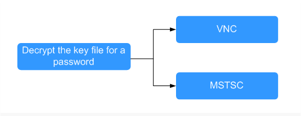
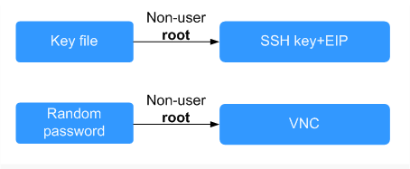

# Logging In to an ECS

## Logging In to a Windows ECS 

You can log in to a Windows ECS using either VNC or MSTSC provided on the management console.

**Figure  1**  Windows ECS login modes  

1.  Obtain the password.

    Use the password obtaining function provided by the management console to decrypt the key file to obtain a password.

    For details, see  [Obtaining the Password for Logging In to a Windows ECS](obtaining-the-password-for-logging-in-to-a-windows-ecs.md).

2.  Select a login method and log in to the ECS.
    -   Management console \(VNC\)

        For details, see  [Login Using VNC](login-using-vnc-(windows).md).

    -   Remote desktop connection \(MSTSC\)

        For details, see  [Login Using MSTSC](login-using-mstsc.md).

## Logging In to a Linux ECS 

You can log in to a Linux ECS using either VNC or SSH key provided on the management console.

**Figure  2**  Linux ECS login modes  

1.  Log in to the management console.
2.  Under  **Computing**, click  **Elastic Cloud Server**.
3.  Select the ECS you want to log in to.
4.  Select a login method and log in to the ECS.
    -   VNC

        For details, see  [Login Using VNC](login-using-vnc-(linux).md).

    -   SSH key

        When you log in to the ECS using the SSH key, you need to bind an EIP to the ECS.

        For details, see  [Login Using an SSH Key](login-using-an-ssh-key.md).

## Follow-up Procedure

-   If you have added a data disk during ECS creation, you must initialize the data disk after logging in to the ECS.

    For details, see  [Scenarios and Disk Partitions](scenarios-and-disk-partitions.md).

-   Certain ECSs require the installation of a driver after you log in to them. For details about available ECS types as well as their functions and usage, see "Notes" in  [ECS Types](ecs-types.md).

