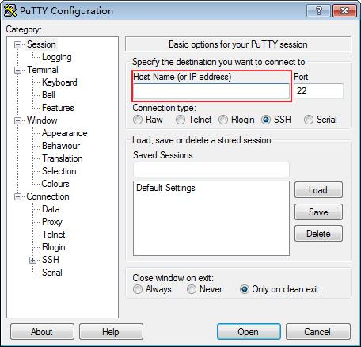

# Login Using an SSH Key

## Scenarios

This section describes how to remotely log in to a Linux ECS using an SSH key pair from Windows and Linux, respectively.

## Prerequisites

-   You have obtained the private key file used during ECS creation.
-   You have bound an EIP to the ECS. For details, see  [Viewing Details About an ECS](viewing-details-about-an-ecs.md).

-   You have configured the inbound rules of the security group. For details, see  [Configuring Security Group Rules](configuring-security-group-rules.md).
-   The network connection between the login tool \(PuTTY\) and the target ECS is normal. For example, the default port 22 is not blocked by the firewall.

## Logging In to the Linux ECS from Local Windows

To log in to the Linux ECS from local Windows, perform the operations described in this section.

**Method 1: Use PuTTY to log in to the ECS.**

The following operations use PuTTY as an example. Before logging in to the ECS using PuTTY, make sure that the private key file has been converted to .ppk format.

1.  Check whether the private key file has been converted to .ppk format.
    -   If yes, go to step  [7](#li40879966111724).
    -   If no, go to step  [2](#li8851985111724).

2.  Visit the following website and download PuTTY and PuTTYgen:

    [https://www.chiark.greenend.org.uk/\~sgtatham/putty/latest.html](https://www.chiark.greenend.org.uk/~sgtatham/putty/latest.html)

    > **NOTE:**   
    >PuTTYgen is a private key generator, which is used to create a key pair that consists of a public key and a private key for PuTTY.  

3.  Run PuTTYgen.
4.  In the  **Actions**  pane, click  **Load**  and import the private key file that you stored during ECS creation.

    Ensure that the format of  **All files \(\*.\*\)**  is selected.

5.  Click  **Save private key**.
6.  Save the converted private key, for example,  **kp-123.ppk**, to the local computer.
7.  Double-click  **PUTTY.EXE**. The  **PuTTY Configuration**  page is displayed.
8.  Choose  **Connection**  \>  **Data**. Enter the image username in  **Auto-login username**.

    > **NOTE:**   
    >-   If a public image is used, see  _[Public Images Introduction](https://docs.otc.t-systems.com/en-us/ims/index.html)_  for the image username.  
    >-   If a private image is used, use the username of the private image.  

9.  Choose  **Connection**  \>  **SSH**  \>  **Auth**. In the last configuration item  **Private key file for authentication**, click  **Browse**  and select the private key converted in step  [6](#li56738001111724).
10. Choose  **Session**  and enter the EIP of the ECS under  **Host Name \(or IP address\)**.

    **Figure  1**  Configuring the EIP  
    

11. Click  **Open**.

    Log in to the ECS.

**Method 2: Use Xshell to log in to the ECS.**

1.  Start the Xshell tool.
2.  Run the following command using the EIP to remotely log in to the ECS through SSH:

    **ssh** _Username_**@**_EIP_

    An example is provided as follows:

    **ssh root@192.168.0.1**

3.  \(Optional\) If the system displays the  **SSH Security Warning**  dialog box, click  **Accept & Save**.

    **Figure  2**  SSH Security Warning  
    

4.  Select  **Public Key**  and click  **Browse**  beside the user key text box.
5.  In the user key dialog box, click  **Import**.
6.  Select the locally stored key file and click  **Open**.
7.  Click  **OK**  to log in to the ECS.

## Logging In to the Linux ECS from Local Linux

To log in to the Linux ECS from local Linux, perform the operations described in this section. The following operations use private key file  **kp-123.pem**  as an example to log in to the ECS. The name of your private key file may differ.

1.  On the Linux CLI, run the following command to change operation permissions:

    **chmod 400 /**_path_**/kp-123.pem**

    > **NOTE:**   
    >In the preceding command,  _path_  refers to the path where the key file is saved.  

2.  Run the following command to log in to the ECS:

    **ssh -i /**_path_**/kp-123.pem** _Default username_**@**_EIP_

    For example, if the default username is  **linux**  and the EIP is  **123.123.123.123**, run the following command:

    **ssh -i /_path_/kp-123.pem linux@123.123.123.123**

    > **NOTE:**   
    >In the preceding command:  
    >-   _path_  is the path where the key file is saved.  
    >-   _EIP_  is the EIP bound to the ECS.  

