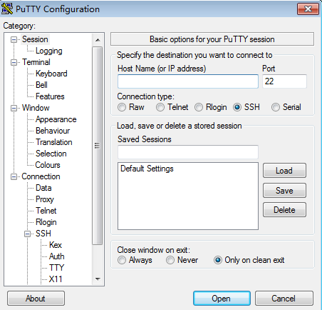

# Login Using an SSH Password<a name="EN-US_TOPIC_0017955633"></a>

## Scenarios<a name="section193261132111117"></a>

This section describes how to remotely log in to a Linux ECS using an SSH password from Windows and Linux, respectively.

> **NOTICE:**   
>Logging in to a Linux ECS using SSH password authentication is disabled by default. If you require password authentication, configure it after logging in to the ECS. To ensure system security, reset the common user password for logging in to the Linux ECS after configuring SSH password authentication.  

## Prerequisites<a name="section58260650112020"></a>

-   The target ECS must be in  **Running**  state.
-   You have bound an EIP to the ECS. For details, see  [Binding an EIP](binding-an-eip.md).

-   Access to port 22 is allowed in the inbound direction of the security group to which the ECS belongs. For details, see  [Configuring Security Group Rules](configuring-security-group-rules.md).
-   The network connection between the login tool \(PuTTY\) and the target ECS is normal. For example, the default port 22 is not blocked by the firewall.
-   You have obtained the SSH login permission and reset the common user password for logging in to the Linux ECS. For details, see  [Configuring the Login Permission Using SSH Password Authentication](#section6207684794951).

## Configuring the Login Permission Using SSH Password Authentication<a name="section6207684794951"></a>

**Assigning the remote login permission using SSH key authentication**

1.  Use the SSH key to log in to the Linux ECS. For details, see  [Login Using an SSH Key](login-using-an-ssh-key.md).
2.  Run the following command to change the value of  **PasswordAuthentication**  in  **/etc/ssh/sshd\_config**  to  **yes**:

    **sudo vi /etc/ssh/sshd\_config**

    > **NOTE:**   
    >For the ECSs running the SUSE or openSUSE OSs, ensure that the values of  **PasswordAuthentication**,  **ChallengeResponseAuthentication**, and  **UsePAM**  in  **/etc/ssh/sshd\_config**  are all  **yes**.  

3.  Run the following command to change the  **ssh\_pwauth**  value to  **1**  or  **true**  in  **/etc/cloud/cloud.cfg**:

    **sudo vi /etc/cloud/cloud.cfg**

4.  Run the following command to reload the sshd service:

    **sudo service sshd reload**


**To ensure system security, reset the common user password for logging in to the Linux ECS.**

1.  Run the following command to reset the ECS password:

    If the ECS username is  **linux**, run the following command:

    **sudo passwd linux**

    > **NOTE:**   
    >To remotely log in to an ECS as user  **root**, perform the following operations:  
    >1.  Run the following command to change the  **disable\_root**  value to  **0**  or  **false**  and the  **ssh\_pwauth**  value to  **1**  or  **true**  in  **/etc/cloud/cloud.cfg**:  
    >    **sudo vi /etc/cloud/cloud.cfg**  
    >2.  Run the following command to set the user  **root**  password:  
    >    **sudo passwd root**  

2.  Enter the new password as prompted and press  **Enter**.
3.  Confirm the password and press  **Enter**.
4.  Verify that the information displayed is similar to the following, indicating that the password has been reset:

    ```
    passwd: all authentication tokens updated successfully.
    ```


## Logging In to the Linux ECS from Local Windows<a name="section62068112020"></a>

To log in to the Linux ECS from local Windows, perform the operations described in this section.

The following operations use PuTTY as an example to log in to the ECS.

1.  Visit the following website and download PuTTY and PuTTYgen:

    [https://www.chiark.greenend.org.uk/\~sgtatham/putty/latest.html](https://www.chiark.greenend.org.uk/~sgtatham/putty/latest.html)

2.  Run PuTTY.
3.  Click  **Session**.
    1.  **Host Name \(or IP address\)**: EIP bound to the ECS
    2.  **Port**:  **22**
    3.  **Connection type**:  **SSH**
    4.  **Saved Sessions**: Task name, which can be clicked for remote connection when you use PuTTY next time

        **Figure  1**  Session<a name="fig74247114018"></a>  
        

4.  Click  **Window**. Then, select  **UTF-8**  for  **Received data assumed to be in which character set:**  in  **Translation**.
5.  Click  **Open**.

    If you log in to the ECS for the first time, PuTTY displays a security warning dialog box, asking you whether to accept the ECS security certificate. Click  **Yes**  to save the certificate to your local registry.

6.  After the SSH connection to the ECS is set up, enter the username and password as prompted to log in to the ECS.

## Logging In to the Linux ECS from Local Linux<a name="section20811823174313"></a>

To log in to the Linux ECS from local Linux, run the following command:  **ssh** _EIP bound to the ECS_

