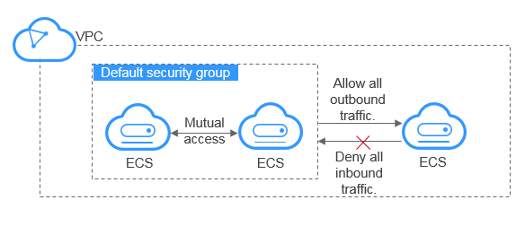
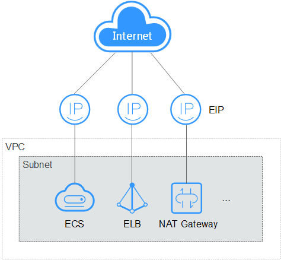

# Network

## VPC

Virtual Private Cloud \(VPC\) allows you to create customized virtual networks in your logically isolated AZ. Such networks are dedicated zones that are logically isolated for your ECSs. You can define security groups, virtual private networks \(VPNs\), IP address segments, and bandwidth for a VPC. This facilitates internal network configuration and management as well as secure and convenient network modification. You can also customize the ECS access rules within a security group and between security groups to improve ECS security.

For more information about VPC, see  _Virtual Private Cloud User Guide_.

## Subnet

A subnet is a range of IP addresses in your VPC and provides IP address management and DNS resolution functions for ECSs in it. The IP addresses of all ECSs in a subnet belong to the subnet.

By default, ECSs in all subnets of the same VPC can communicate with each other, while ECSs in different VPCs cannot.

## Security Group

A security group is a collection of access control rules for ECSs that have the same security protection requirements and that are mutually trusted within a VPC. After a security group is created, you can create different access rules for the security group to protect the ECSs that are added to this security group.

Your account automatically comes with a default security group. The default security group allows all outbound data, denies all inbound data, and allows all data between ECSs in the group. Your ECSs in the security group can communicate with each other without the need to add rules.

**Figure  1**  Default security group  

[Table 1](#table1580115155277)  describes default security group rules.

**Table  1**  Default security group rules

<table><thead align="left"><tr id="en-us_topic_0118534003_row15801415182713"><th class="cellrowborder" valign="top" width="14.26%" id="mcps1.2.6.1.1">
<strong id="en-us_topic_0118534003_b842352706194648">Direction</strong>

</th>
<th class="cellrowborder" valign="top" width="13.459999999999999%" id="mcps1.2.6.1.2">
<strong id="en-us_topic_0118534003_b842352706194658">Protocol</strong>

</th>
<th class="cellrowborder" valign="top" width="16.71%" id="mcps1.2.6.1.3">
<strong id="en-us_topic_0118534003_b842352706194415">Port/Range</strong>

</th>
<th class="cellrowborder" valign="top" width="26.1%" id="mcps1.2.6.1.4">
<strong id="en-us_topic_0118534003_b842352706204628">Source/Destination</strong>

</th>
<th class="cellrowborder" valign="top" width="29.470000000000002%" id="mcps1.2.6.1.5">
<strong id="en-us_topic_0118534003_b84235270694155">Description</strong>

</th>
</tr>
</thead>
<tbody><tr id="en-us_topic_0118534003_row1280251562712"><td class="cellrowborder" valign="top" width="14.26%" headers="mcps1.2.6.1.1 ">
Outbound

</td>
<td class="cellrowborder" valign="top" width="13.459999999999999%" headers="mcps1.2.6.1.2 ">
All

</td>
<td class="cellrowborder" valign="top" width="16.71%" headers="mcps1.2.6.1.3 ">
All

</td>
<td class="cellrowborder" valign="top" width="26.1%" headers="mcps1.2.6.1.4 ">
Destination: 0.0.0.0/0

</td>
<td class="cellrowborder" valign="top" width="29.470000000000002%" headers="mcps1.2.6.1.5 ">
Allow all outbound traffic.

</td>
</tr>
<tr id="en-us_topic_0118534003_row1980261512714"><td class="cellrowborder" valign="top" width="14.26%" headers="mcps1.2.6.1.1 ">
Inbound

</td>
<td class="cellrowborder" valign="top" width="13.459999999999999%" headers="mcps1.2.6.1.2 ">
All

</td>
<td class="cellrowborder" valign="top" width="16.71%" headers="mcps1.2.6.1.3 ">
All

</td>
<td class="cellrowborder" valign="top" width="26.1%" headers="mcps1.2.6.1.4 ">
Source: ID of the current security group (for example, sg-<em id="en-us_topic_0118534003_i2138146127154428">xxxxx</em>)

</td>
<td class="cellrowborder" valign="top" width="29.470000000000002%" headers="mcps1.2.6.1.5 ">
Allow communication among ECSs within the security group and deny all inbound traffic (incoming data packets).

</td>
</tr>
</tbody>
</table>

## EIP

An EIP is a public IP address that can be directly accessed over the Internet. An EIP consists of the public IP address and public network egress bandwidth. EIPs can be bound to or unbound from ECSs, virtual IP addresses, NAT gateways, and load balancers. 

Each EIP can be used by only one cloud resource at a time.

**Figure  2**  Accessing the Internet using an EIP  

