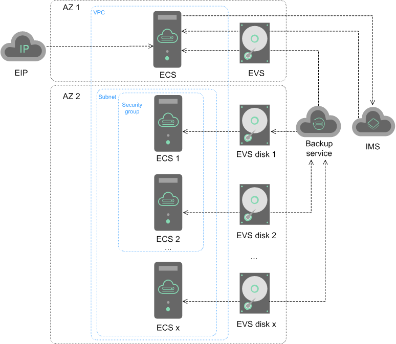

# What Is ECS?

An Elastic Cloud Server \(ECS\) is a basic computing unit that consists of vCPUs, memory, OS, and Elastic Volume Service \(EVS\) disks. After creating an ECS, you can use it like using your local computer or physical server.

ECSs support self-service creation, modification, and operation. You can create an ECS by specifying its vCPUs, memory, OS, and login authentication. After the ECS is created, you can modify its specifications as required. This ensures an efficient, reliable, secure computing environment.

## System Architecture

ECS works with other products and services to provide computing, storage, network, and image installation functions.

-   ECSs are deployed in multiple availability zones \(AZs\) connected with each other through an internal network. If an AZ becomes faulty, other AZs in the same region will not be affected.
-   With the Virtual Private Cloud \(VPC\) service, you can build a dedicated network, set the subnet and security group, and allow the VPC to communicate with the external network through an EIP \(bandwidth support required\).
-   With the Image Management Service \(IMS\), you can install images on ECSs, or create ECSs using private images and deploy services quickly.
-   The Elastic Volume Service \(EVS\) provides storage and Volume Backup Service \(VBS\) provides data backup and recovery functions.
-   Cloud Eye is a key measure to ensure ECS performance, reliability, and availability. Using Cloud Eye, you can determine ECS resource usage.
-   Volume Backup Service \(VBS\) allows you to create data backups for EVS disks and use the backups to restore the EVS disks. This maximizes user data correctness and security.
-   Cloud Server Backup Service \(CSBS\) backs up all EVS disks of an ECS, including the system disk and data disks, and uses the backup to restore the ECS.

**Figure  1**  System architecture  

## Access Methods

The public cloud provides a web-based service management platform. You can access ECSs through HTTPS-compliant application programming interfaces \(APIs\) or the management console. These two access methods differ as follows:

-   Accessing ECSs through APIs

    Use this method if you are required to integrate the ECSs on the public cloud platform into a third-party system for secondary development. For detailed operations, see  _Elastic Cloud Server API Reference_.

-   Accessing ECSs through the management console

    Use this method if you are not required to integrate ECSs with a third-party system.

    After registering on the public cloud, log in to the management console and click  **Elastic Cloud Server**  under  **Computing**  on the homepage. 

