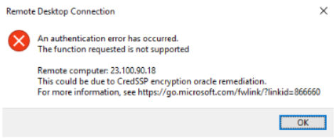
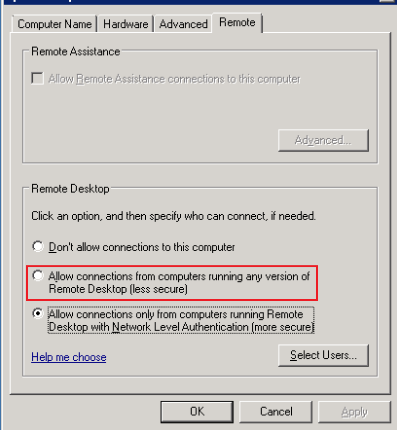

# What Should I Do If an Authentication Failure Occurs After I Attempt to Remotely Log In to a Windows ECS?

## Symptom

When a local computer running Windows attempts to access a Windows ECS using RDP \(for example, MSTSC\), an identity authentication failure occurs and the desired function is not supported.

-   If the error message contains only the information that an identity authentication failure occurs and that the desired function is not supported, rectify the fault by following the instructions provided in  [Solution](#section9947102411203).
-   If the error message shows that the fault was caused by "CredSSP Encryption Oracle Remediation", as shown in  [Figure 1](#fig18932134871212), the fault may be caused by a security patch released by Microsoft in March 2018. This patch may affect RDP-based CredSSP connections. As a result, setting up RDP-based connections to ECSs failed. For details, see  [Unable to RDP to Virtual Machine: CredSSP Encryption Oracle Remediation](https://blogs.technet.microsoft.com/mckittrick/unable-to-rdp-to-virtual-machine-credssp-encryption-oracle-remediation/). Rectify the fault by following the instructions provided in  [official Microsoft document](https://support.microsoft.com/en-us/help/4093492/credssp-updates-for-cve-2018-0886-march-13-2018).

    **Figure  1**  Failed to set up a remote desktop connection  
    

## Solution

Modify the remote desktop connection settings on the Windows ECS. To do so, perform the following operations:

1.  Log in to the ECS.
2.  Click  **Start**  in the lower left corner, right-click  **Computer**, and choose  **Properties**  from the shortcut menu.
3.  In the navigation pane on the left, choose  **Remote settings**.
4.  Click the  **Remote**  tab. In the  **Remote Desktop**  pane, select  **Allow connections from computers running any version of Remote Desktop \(less secure\)**.

    **Figure  2**  Modifying remote desktop connection settings  
    

5.  Click  **OK**.

