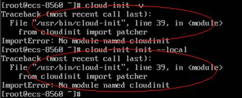

# What Should I Do If Cloud-Init Does Not Work After Python Is Upgraded?

## Symptom

Take an ECS running CentOS 6.8 as an example. After Python was upgraded from 2.6 to 2.7, Cloud-Init did not work. Data, such as the login password, key, and hostname could not be imported to the ECS using Cloud-Init.

After the  **cloud-init -v**  command was executed to view the Cloud-Init version, the system displayed errors, as shown in  [Figure 1](#fig311825713493).

**Figure  1**  Errors in Cloud-Init  

## Possible Causes

The Python version used by Cloud-Init was incorrect.

## Solution

Change the Python version used by Cloud-Init to the source version. To do so, change the environment variable value of  **/usr/bin/cloud-init**  from the default value  **\#!/usr/bin/python**  to  **\#!/usr/bin/python2.6**.

**Figure  2**  Changing the Python version  

