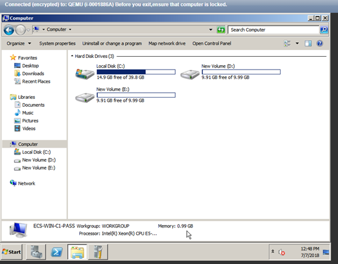
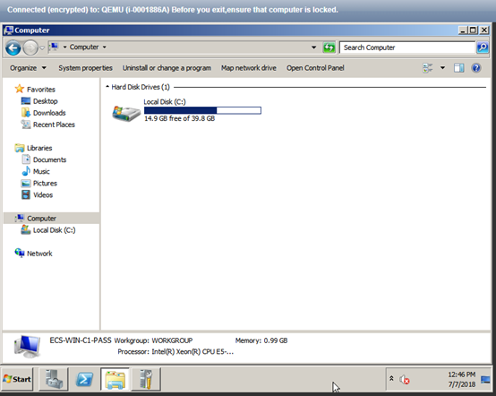
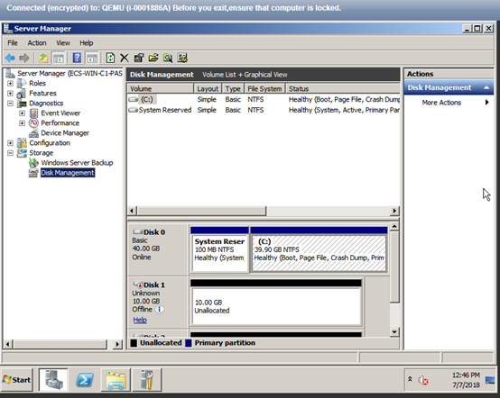

# What Should I Do If the Data Disk of a Windows ECS Becomes Offline After the ECS Specifications Are Modified?

## Scenarios

After the specifications of a Windows ECS were modified, disk attachment may fail. Therefore, check disk attachment after specifications modification. This section describes how to check disk attachment after ECS specifications are modified.

## Procedure

1.  Check whether the number of disks displayed on the  **Computer**  page after specifications modification is the same as that before specifications modification.

    -   If yes, the disks are properly attached. No further action is required.
    -   If no, an error has occurred in disk attachment. In such a case, go to step  [2](#en-us_topic_0100593628_li1476865113179).

    For example:

    An ECS running Windows Server 2008 has one system disk and two data disks attached before specifications modification.

    **Figure  1**  Disk attachment before specifications modification  
    

    After the specifications are modified, check disk attachment.

    **Figure  2**  Disk attachment after specifications modification  
    

    Only one system disk is displayed. Data disks failed to attach after the specifications modification.

2.  Set the affected disks to be online.
    1.  Click  **Start**  in the task bar. In the displayed  **Start**  menu, right-click  **Computer**  and choose  **Manage**  from the shortcut menu.

        The  **Server Manager**  page is displayed.

    2.  In the navigation pane on the left, choose  **Storage**  \>  **Disk Management**.

        The  **Disk Management**  page is displayed.

    3.  In the left pane, the disk list is displayed. Right-click the affected disk and choose  **Online**  from the shortcut menu to make it online.

        **Figure  3**  Making the disk online  
        

3.  On the  **Computer**  page, check whether the number of disks is the same as that before the specifications modification.

    -   If the numbers are the same, no further action is required.
    -   If the numbers are different, contact customer service.

    **Figure  4**  Disk attachment after disk online  
    

