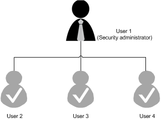

# Who Can Use the Encryption Feature?

The rights of users in a user group to use the encryption feature are as follows:

-   The user having security administrator rights can grant KMS access rights to EVS for using the encryption feature.
-   When a common user who does not have security administrator rights attempts to use the encryption feature, the condition varies depending on whether the user is the first one in the user group to use this feature.
    -   If the common user is the first one in the user group to use the encryption feature, the user must contact the user having security administrator rights for rights granting. Then, the common user can use the encryption feature.
    -   If the common user is not the first one in the user group to use the encryption feature, the user has permission to use the encryption feature.

The following section uses a user group as an example to describe how to grant KMS access rights to EVS for using the encryption feature.

For example, a user group shown in  [Figure 1](#fig10921739155249)  consists of four users, user 1 to user 4. User 1 has security administrator rights. Users 2, 3, and 4 are common users who do not have security administrator rights.

**Figure  1**  User group  

## Scenario 1: User 1 Uses the Encryption Feature

In this user group, if user 1 uses the encryption feature for the first time, the procedure is as follows:

1.  User 1 creates Xrole to grant KMS access rights to EVS.

    After rights granting, the system automatically creates CMK  **evs/default**  for encrypting EVS disks.

    > **NOTE:**   
    >Encrypting EVS disks relies on KMS. When user 1 uses the encryption feature for the first time, the user must grant the KMS access rights to EVS. Then, all users in the user group can use the encryption feature, without requiring the rights granting any more.  

2.  User 1 selects a key.

    One of the following keys can be used:

    -   Default CMK,  **evs/default**
    -   CMK, the key that you have created before using the EVS disk encryption feature
    -   Newly created key \(For instructions about how to create a key, see "Creating a Key Pair" in  _Key Management Service User Guide_.\)

After user 1 uses the encryption feature, all other users in the user group can use this feature, without requiring to contact user 1 for rights granting.

## Scenario 2: Common User Uses the Encryption Feature

In this user group, if user 3 uses the encryption feature for the first time, the procedure is as follows:

1.  When user 3 uses the encryption feature, the system displays a message indicating that the user has no rights.
2.  User 3 asks user 1 to create Xrole to grant KMS access rights to EVS.

After the rights are granted, user 3 and all other users in the user group can use the encryption feature, without requiring to contact user 1 for rights granting.

