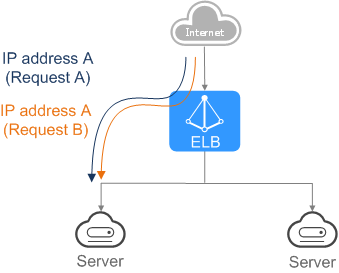
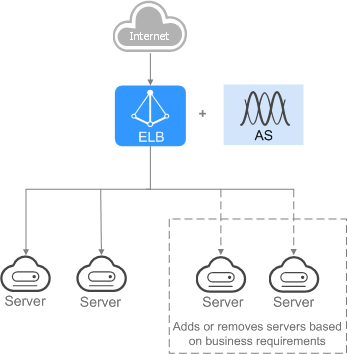
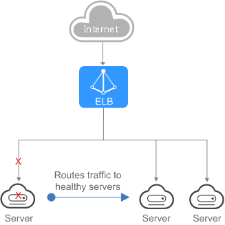
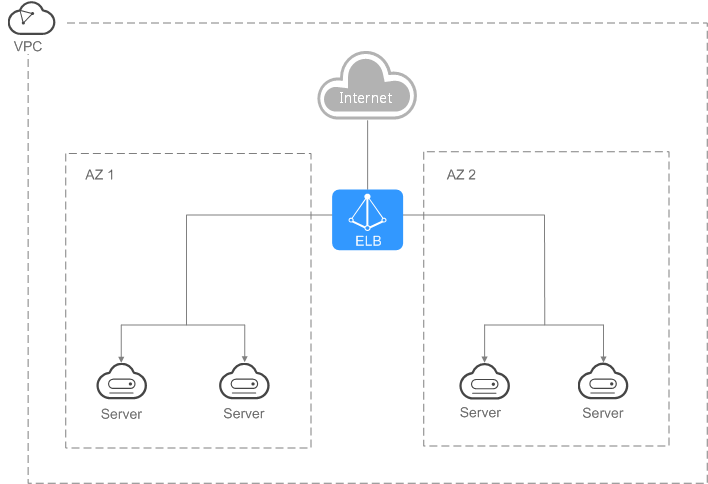

# Application Scenarios

## High-Traffic Business

For business with high volume of traffic, ELB evenly distributes incoming traffic to multiple backend servers, for example, large portals and mobile app stores.

You can also enable sticky sessions to ensure that requests from the same client are routed to the same backend server during a session. This improves the access efficiency.

**Figure  1**  Session stickiness  

## Business with Significant Traffic Peaks

For business that has significant traffic peaks, integration with AS enables backend servers can be added or removed to keep up with business needs, improving resource utilization. An example is flash sale, which usually lasts for only a few days or even several hours and during which demand on your applications increases rapidly in a short period. To handle the demand, you may need additional servers, which will cost a lot. By combining ELB with AS, you can always run desired number of backend servers.

**Figure  2**  Flexible expansion  

## SPOF Elimination

ELB periodically performs health checks on backend servers to monitor their health status. If a backend server is considered unhealthy, ELB routes incoming traffic to other healthy ones, ensuring service continuity.

This makes ELB a good choice for services that require high reliability, such as official websites, toll collection systems, and web services.

**Figure  3**  Eliminating SPOFs  

## Cross-AZ Load Balancing

Cross-AZ Load Balancing

ELB can distribute traffic across AZs. When an AZ becomes faulty, ELB distributes traffic to backend servers in other AZs that are running properly.

Banking, policing, and large application systems that require high availability can use ELB to achieve this.

**Figure  4**  Traffic distribution to servers in one or more AZs  

