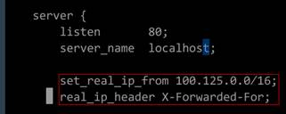

# How Can I Obtain the Real IP Address of a Client?<a name="EN-US_TOPIC_0091131396"></a>

## Layer 7 Load Balancing<a name="section12598161410315"></a>

You need to configure the application server and obtain the real IP address of a client from the HTTP header.

The real IP address is placed in the X-Forwarded-For header by the load balancer in the following format:

```
X-Forwarded-For: Real IP address of the client,Proxy server 1-IP address,Proxy server 2-IP address,...
```

When this method is used, the first IP address obtained is the real IP address of the client.

**Apache Server**

1.  Install Apache 2.4.

    For example, if CentOS 7.5 is used as the OS, you can run the following command to perform the installation:

    ```
    yum install httpd
    ```

2.  Add the following information to the end of Apache configuration file  **/etc/httpd/conf/httpd.conf**:

    ```
    LoadModule remoteip_module modules/mod_remoteip.so
    RemoteIPHeader X-Forwarded-For
    RemoteIPInternalProxy 100.125.0.0/16
    ```

    **Figure  1**  Information to be added<a name="fig1553761545210"></a>  
    

    > **NOTE:**   
    >Set the value of  **RemoteIPInternalProxy**  to IP address ranges of the proxy servers, for example, the AAD service IP address range and 100.125.0.0/16 \(which is reserved for ELB\). Use a comma \(,\) to separate every two entries.  

3.  Change the log output format in the Apache configuration file to the following \(**%a**  indicates the source IP address\):

    ```
    LogFormat "%a %l %u %t \"%r\" %>s %b \"%{Referer}i\" \"%{User-Agent}i\"" combined
    ```

4.  Restart Apache.

    ```
    service httpd restart
    ```

5.  Obtain the actual IP address of the client from the httpd access logs.

**Nginx Server**

1.  Run the following commands to install  **http\_realip\_module**:

    ```
    wget http://nginx.org/download/nginx-1.17.0.tar.gz
    tar zxvf nginx-1.17.0.tar.gz
    cd nginx-1.17.0
    ./configure --user=www --group=www --prefix=/path/server/nginx --with-http_stub_status_module --without-http-cache --with-http_ssl_module --with-http_realip_module
    make
    make install
    kill -USR2 `cat /path/server/nginx/logs/nginx.pid`
    kill -QUIT `cat /path/server/nginx/logs/ nginx.pid.oldbin`
    ```

2.  Run the following command to open the  **nginx.conf**  file:

    ```
    vi /path/server/nginx/conf/nginx.conf
    ```

3.  Add the following information under  **http**  or  **server**:

    ```
    ;100.125.0.0/16set_real_ip_from 
    real_ip_header X-Forwarded-For;
    ```

    **Figure  2**  Adding information<a name="fig5645153575820"></a>  
    

    > **NOTE:**   
    >Set the value of  **set\_real\_ip\_from**  to IP address ranges of the proxy servers, for example, the AAD service IP address range and 100.125.0.0/16 \(which is reserved for ELB\). Use a comma \(,\) to separate every two entries.  

4.  Restart Nginx.

    ```
    /path/server/nginx/sbin/nginx -s reload
    ```

5.  Obtain the actual IP address of the client from the Nginx access logs.

## Layer 4 Load Balancing<a name="section867518427319"></a>

TCP load balancers require the TOA kernel module to obtain real IP addresses. For details, see  [Configuring the TOA Plug-in](configuring-the-toa-plug-in.md).

