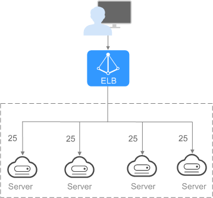

# How ELB Works

To balance your application workloads, you first need to create a load balancer to receive requests from clients and route the requests to backend servers in one or more AZs. After the load balancer is created, you must add a listener and at least a backend server to it. The load balancing algorithm you select when adding the listener determines how requests are distributed.

You can select one of the following load balancing algorithms for an enhanced load balancer:

-   Weighted round robin: Requests are distributed across backend servers in sequence based on their weights. Backend servers with higher weights receive proportionately more requests, whereas equal-weighted servers receive the same number of requests. This algorithm is often used for short connections, such as HTTP services.
-   Weighted least connections: This algorithm is designed based on the least connections algorithm that uses the number of active connections to each backend server to make its load balancing decision. In addition to the number of connections, each server is assigned with a weight based on their processing capability. Requests are routed to the server with the lowest connections-to-weight ratio. This algorithm is often used for persistent connections, such as database connections.
-   Source IP hash: The source IP address of each request is calculated using the hash algorithm to obtain a unique hash key, and all backend servers are numbered. The generated key allocates the client to a particular server. This enables requests from different clients to be routed and ensures that a client is directed to the same server that it was using previously. This algorithm applies to TCP connections of load balancers that do not use cookies.

You can select one of the following load balancing algorithms for a classic load balancer:

-   Round robin: New requests are distributed sequentially across all servers, so that the workloads are evenly shared. This algorithm is often used for short connections, such as HTTP services.
-   Least connections: A dynamic scheduling algorithm that estimates backend server load based on the number of active connections. New requests are routed to servers with the minimum number of connections. This algorithm is often used for persistent connections, such as database connections.
-   Source IP hash: The source IP address of each request is calculated using the hash algorithm to obtain a unique hash key, and all backend servers are numbered. The generated key allocates the client to a particular server. This enables requests from different clients to be routed and ensures that a client is directed to the same server that it was using previously. This algorithm applies to TCP connections without cookies.

The following figure shows an example of how requests are distributed using the weighted round robin algorithm. Four backend servers have the same weight, and each server receives the same proportion of requests.

**Figure  1**  Traffic distribution using the weighted round robin algorithm  

