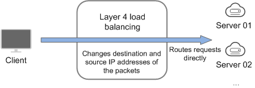
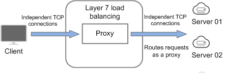

# Preparing for Creation

Before creating a load balancer, you must plan its region, network type, protocol, and backend servers.

## Region

When selecting a region, pay attention to the following:

-   The region must be close to your customers to reduce network latency and improve the download speed.
-   The region must be the same as that of backend servers. Currently, ELB cannot be deployed across regions.

## Network Type

Load balancers are classified as public network load balancers or private network load balancers by network type.

-   To distribute requests over the Internet, you need to create a public network load balancer.
-   If you want to distribute requests from the VPC, create a private network load balancer.

## Protocol

ELB provides load balancing at both Layer 4 and Layer 7. Choose an appropriate protocol when adding a listener.

-   When you choose TCP or UDP, the load balancer routes requests directly to backend servers. In this process, the destination IP address in the packets is changed to the IP address of the backend server, and the source IP address to the private IP address of the load balancer. A connection is established after a three-way handshake between the client and the backend server, and the load balancer only forwards the data.

    

-   Load balancing at Layer 7 is also called "content exchange". After receiving a request, the load balancer identifies and forwards the data based on the fields in the HTTP/HTTPS request header. The load balancer works as a proxy of backend servers to establish a connection \(three-way handshake\) with the client and receive requests from the client. After receiving a request, the load balancer determines to which backend server the request is to be routed based on the fields in the packets and the load balancing algorithm you selected when adding the listener. In this process, the load balancer functions as a proxy server that connects to both the client and backend server. 

    

## Backend Server

Before you use ELB, you need to create ECSs or BMSs, deploy required applications on these servers, and add the servers to one or more backend server groups. When creating ECSs or BMSs, observe the following rules:

-   The region of ECSs or BMSs must be the same as that of the load balancer.
-   ECSs or BMSs that run the same OS are recommended so that you can manage them more easily.

