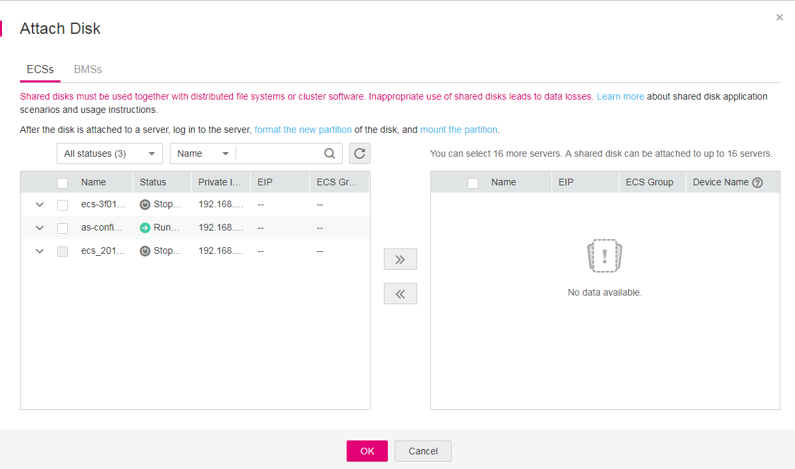

# Attaching a Shared Disk

## Scenarios

Independently created EVS disks are data disks. In the disk list, the function of such disks is displayed as  **Data disk**, and the status is displayed as  **Available**. In this case, you need to attach the data disks to servers for use.

This topic describes how to attach a shared disk.

## Constraints

-   A shared disk can be attached to a maximum of 16 servers. These servers and the shared disk must be in the same AZ.
-   If a shared disk is in the  **In-use**  state, ensure that the maximum number of servers that the disk can be attached to has not been reached.
-   All the servers of a shared disk must run either Windows or Linux no matter the disk is attached to them in a batch or one by one. 

    For example, if you attach a shared disk to multiple Windows servers in a batch and then detach it from all its servers, the disk cannot be attached to Linux servers later. This is because Windows and Linux support different file systems and cannot identify the original file system on the disk. Improper operations may damage the original file system.

-   A shared disk can only be used as a data disk. It cannot be used as a system disk.

## Procedure

1.  Log in to the management console.
2.  Click    in the upper left corner and select the desired region and project.
3.  Under  **Storage**, click  **Elastic Volume Service**.

    The disk list page is displayed.

4.  Locate the target disk in the list and click  **Attach**.

    The  **Attach Disk**  dialog box is displayed, as shown in  [Figure 1](#fig24573759111041).

    Shared EVS disks support batch attachment so that you can attach a shared EVS disk to multiple servers at a time. The left area in the  **Attach Disk**  dialog box shows the server list. After you select the target servers, the selected servers will be displayed in the right area.

    **Figure  1**  Attach Disk  
    

5.  Select the target servers and then select a device name from the drop-down list for each server you selected. Ensure that the EVS disk and servers are in the same AZ.
6.  Click  **OK**  to return to the disk list page. The status of the disk is  **Attaching**, indicating that the disk is being attached to the servers. When the disk status changes to  **In-use**, the disk is successfully attached.

    > **NOTICE:**   
    >If you simply attach a shared EVS disk to multiple servers, files cannot be shared between the servers as shared EVS disks do not have the cluster capability. Therefore, build a shared file system or deploy a cluster management system to share files between servers.  

