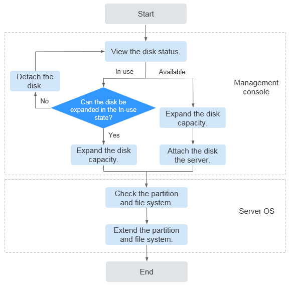

# Expansion Overview

## What Is Capacity Expansion?

If the capacity of an existing disk is insufficient, you can expand the disk capacity to increase the storage space.

Both system disks and data disks can be expanded. Currently, disk capacities can be expanded only. Capacity reduction is not supported.

## How to Expand the Disk Capacity?

A capacity expansion operation includes the following steps:

1.  [Expand the disk capacity on the management console.](#section87622024418)
2.  [Log in to the server and extend the disk partition and file system.](#section487311389414)

**Figure  1**  Capacity expansion procedure  

## Expand the Disk Capacity on the Management Console

Choose a proper expansion method based on the disk status. 

-   If the disk status is  **In-use**, the disk has been attached to a server. Check whether your disk can be expanded in the  **In-use**  state. For details, see  [Constraints](expanding-capacity-for-an-in-use-evs-disk.md#section158147122515).
    -   If yes, expand the disk capacity according to  [Expanding Capacity for an In-use EVS Disk](expanding-capacity-for-an-in-use-evs-disk.md).
    -   If no, detach the disk. Then, expand the capacity according to  [Expanding Capacity for an Available EVS Disk](expanding-capacity-for-an-available-evs-disk.md).

-   If the disk status is  **Available**, the disk is not attached to any server and can be expanded directly. For details, see  [Expanding Capacity for an Available EVS Disk](expanding-capacity-for-an-available-evs-disk.md).

## Log In to the Server and Extend the Disk Partition and File System

After the disk has been expanded on the management console, only the disk storage capacity is enlarged, but its additional space cannot be used directly. You must log in to the server and extend the disk partition and file system. For details, see  [Table 1](#table458383431811).

**Table  1**  Extending the disk partition and file system

<table><thead align="left"><tr id="row3584153411812"><th class="cellrowborder" valign="top" width="50%" id="mcps1.2.3.1.1">
Capacity After Expansion

</th>
<th class="cellrowborder" valign="top" width="50%" id="mcps1.2.3.1.2">
Extend Disk Partition and File System

</th>
</tr>
</thead>
<tbody><tr id="row15584133410181"><td class="cellrowborder" valign="top" width="50%" headers="mcps1.2.3.1.1 ">
Disk capacity ≤2 TB

</td>
<td class="cellrowborder" valign="top" width="50%" headers="mcps1.2.3.1.2 "><ul id="ul1792564894112"><li>Windows: <a href="extending-disk-partitions-and-file-systems-(windows).md">Extending Disk Partitions and File Systems (Windows)</a></li><li>Linux: <a href="partition-and-file-system-extension-preparations-(linux).md">Partition and File System Extension Preparations (Linux)</a></li></ul>
</td>
</tr>
<tr id="row35841834121815"><td class="cellrowborder" valign="top" width="50%" headers="mcps1.2.3.1.1 ">
Disk capacity &gt;2 TB

</td>
<td class="cellrowborder" valign="top" width="50%" headers="mcps1.2.3.1.2 "><ul id="ul15171154910427"><li>GPT partition style: <a href="extending-disk-partitions-and-file-systems-(windows).md">Extending Disk Partitions and File Systems (Windows)</a> or <a href="partition-and-file-system-extension-preparations-(linux).md">Partition and File System Extension Preparations (Linux)</a></li><li>MBR partition style: Not supported
The maximum disk capacity that MBR supports is 2 TB, and the disk space exceeding 2 TB cannot be used. If your disk uses MBR and you need to expand the disk capacity to over 2 TB, change the partition style from MBR to GPT. Ensure that the disk data has been backed up before changing the partition style because services will be interrupted and data on the disk will be cleared during this change.

</li></ul>
</td>
</tr>
</tbody>
</table>

## Related Operations

For more expansion FAQs, see  [Disk Capacity Expansion FAQs](disk_capacity_expansion_faqs).

