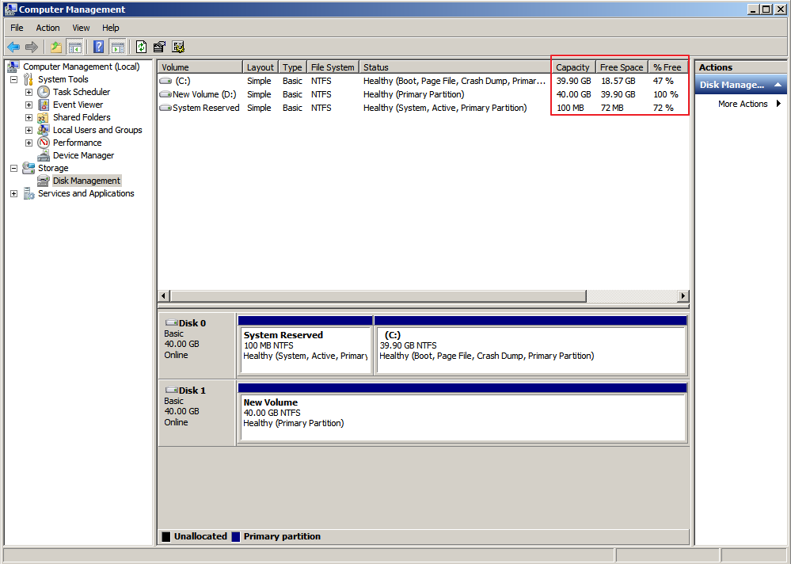
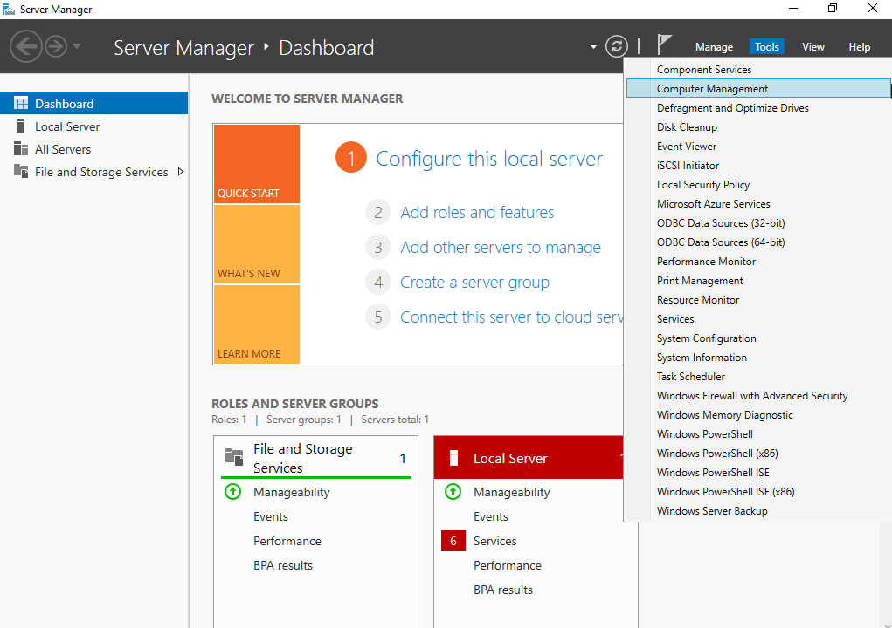
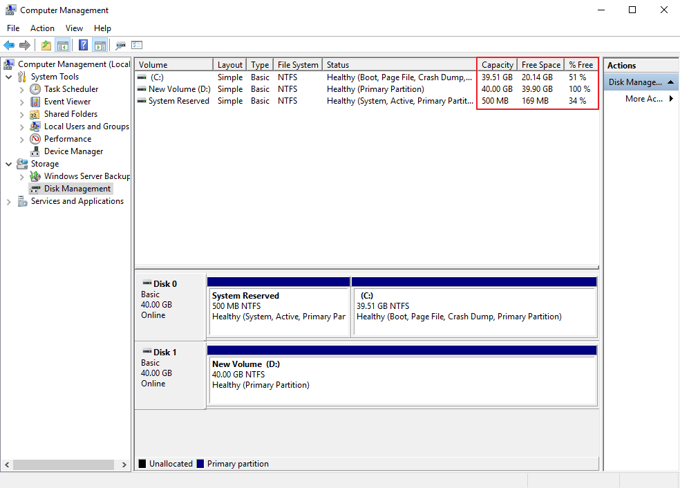

# How Do I View the Space on My Disk?<a name="evs_faq_0053"></a>

The method of viewing the disk space varies depending on the OS in use. This FAQ uses Windows Server 2008, Windows Server 2016, and Linux as the sample OSs to describe how to view the disk space.

## Windows Server 2008<a name="section171726918570"></a>

The version of the sample OS is Windows Server 2008 R2 Enterprise 64bit.

1.  On the desktop of the server, right-click  **Computer**  and choose  **Manage**  from the shortcut menu.

    The  **Server Manager**  window is displayed.

2.  In the navigation tree on the left, choose  **Storage**  \>  **Disk Management**.

    The sizes and available spaces of the volumes on the current disk are displayed in the right pane.

    **Figure  1**  Disk Management page<a name="fig174673391438"></a>  
    


## Windows Server 2016<a name="section112851921192418"></a>

The version of the sample OS is Windows Server 2016 Standard 64bit.

1.  On the desktop of the server, click the start icon in the lower left corner.

    The  **Windows Server**  window is displayed.

2.  Click  **Server Manager**.

    The  **Server Manager**  window is displayed.

    **Figure  2**  Server Manager page<a name="fig0450125511307"></a>  
    

3.  In the upper right corner, choose  **Tools**  \>  **Computer Management**.
4.  Choose  **Storage**  \>  **Disk Management**.

    In the right pane, you can view the sizes and available spaces of the volumes on the disk.

    **Figure  3**  Disk list page<a name="fig11761034193212"></a>  
    


## Linux<a name="section193332219345"></a>

The version of the sample OS is CentOS 7.4 64bit. The operation varies depending on whether you want to view the available space.

-   To query the total capacity only, run the  **lsblk**  command.

    Information similar to the following is displayed:

    ```
    [root@ecs-test-0001 ~]# lsblk
    NAME   MAJ:MIN RM  SIZE RO TYPE MOUNTPOINT
    vda    253:0    0   40G  0 disk
    └─vda1 253:1    0   40G  0 part /
    vdb    253:16   0   40G  0 disk
    └─vdb1 253:17   0   40G  0 part
    ```

    In the command output, the server has two disks,  **/dev/vda**  and  **/dev/vdb**. Disk  **/dev/vda**  has 40 GB and serves as the system disk, and disk  **/dev/vdb**  has 40 GB and serves as a data disk.

-   To query the total capacity and available space, run the  **df -TH**  command. Ensure that the disk has been attached and initialized before running this command.

    Information similar to the following is displayed:

    ```
    [root@ecs-0001 ~]# df -TH
    Filesystem     Type      Size  Used Avail Use% Mounted on
    /dev/vda1      ext4       43G  2.0G   39G   5% /
    devtmpfs       devtmpfs  509M     0  509M   0% /dev
    tmpfs          tmpfs     520M     0  520M   0% /dev/shm
    tmpfs          tmpfs     520M  7.2M  513M   2% /run
    tmpfs          tmpfs     520M     0  520M   0% /sys/fs/cgroup
    tmpfs          tmpfs     104M     0  104M   0% /run/user/0
    /dev/vdb1      ext4       43G   51M   40G   1% /mnt/sdc
    ```

    In the command output, the server has two partitions,  **/dev/vda1**  and  **/dev/vdb1**. Partition  **/dev/vda1**  is used to deploy the OS, and its total capacity, used capacity, and available capacity are 43 GB, 2 GB, and 39 GB, respectively. Partition  **/dev/vdb1**'s total capacity, used capacity, and available capacity are 43 GB, 51 MB, and 40 GB, respectively.


