# Initializing a Windows Data Disk \(Windows Server 2008\)

## Scenarios

This topic uses Windows Server 2008 R2 Enterprise 64bit to describe how to initialize a data disk attached to a server running Windows.

The maximum disk capacity supported by MBR is 2 TB, and that supported by GPT is 18 EB. Therefore, use the GPT partition style if your disk capacity is larger than 2 TB. For details about disk partition styles, see  [Introduction to Data Disk Initialization Scenarios and Partition Styles](introduction-to-data-disk-initialization-scenarios-and-partition-styles.md).

The method for initializing a disk varies depending on the OS running on the server. This document is used for reference only. For the detailed operations and differences, see the product documents of the corresponding OS.

## Prerequisites

-   A data disk has been attached to a server and has not been initialized.
-   You have logged in to the server.
    -   For how to log in to an ECS, see the  _Elastic Cloud Server User Guide_.
    -   For how to log in to a BMS, see the  _Bare Metal Server User Guide_.

## Procedure

1.  On the desktop of the server, right-click  **Computer**  and choose  **Manage**  from the shortcut menu.

    The  **Server Manager**  window is displayed.

2.  In the navigation tree, choose  **Storage**  \>  **Disk Management**.

    The  **Disk Management**  window is displayed.

    -   If  [Figure 1](#fig40496387105554)  is displayed, the new disk is offline. Go to  [3](#li33296033102625).
    -   If  [Figure 4](#fig68332918241)  is displayed, the  **Initialize Disk**  window is prompted. Go to  [5](#li34991214122212).

    **Figure  1**  Disk Management  
    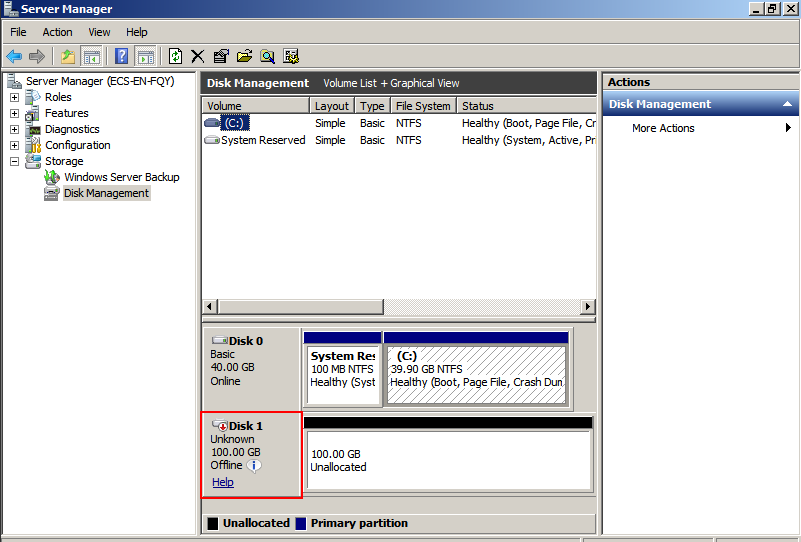

3.  Disks are displayed in the right pane. In the  **Disk 1**  area, right-click  **Offline**  and choose  **Online**  from the shortcut menu to online the disk.

    **Figure  2**  Online the disk  
    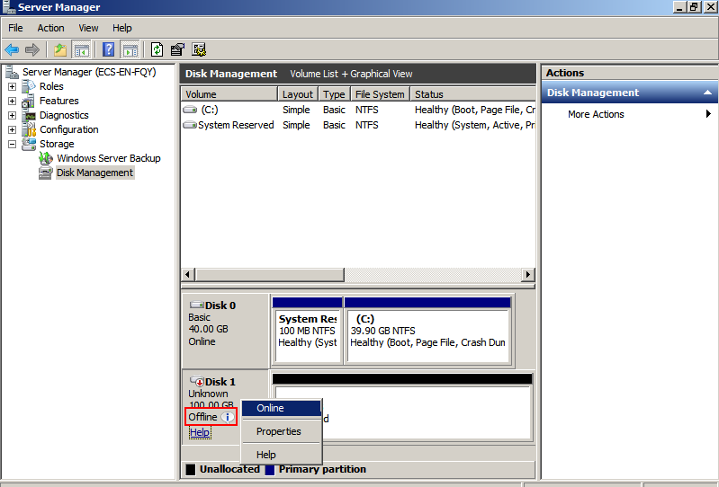

    > **NOTE:**   
    >If the disk is offline, you need to online the disk before initializing it.  

4.  After making the disk online, the disk status changes from  **Offline**  to  **Not Initialized**. Right-click the disk status and choose  **Initialize Disk**  from the shortcut menu, as shown in  [Figure 3](#fig409808111224).

    **Figure  3**  Initialize Disk  
    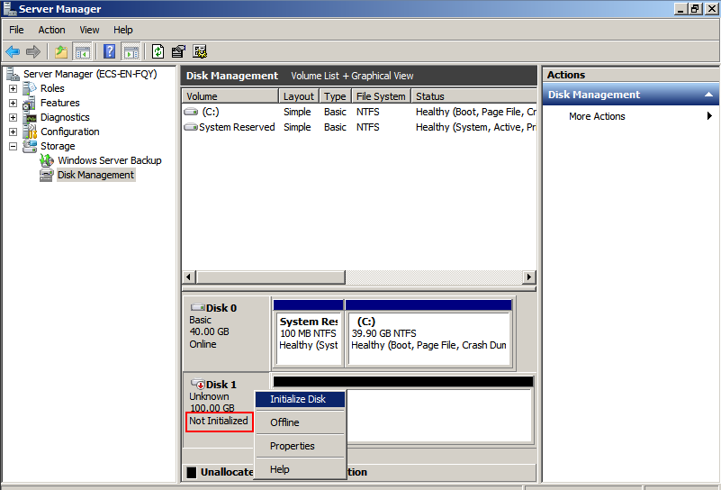

5.  In the  **Initialize Disk**  dialog box, select the target disk, click  **MBR \(Master Boot Record\)**  or  **GPT \(GUID Partition Table\)**, and click  **OK**, as shown in  [Figure 4](#fig68332918241).

    **Figure  4**  Unallocated space  
    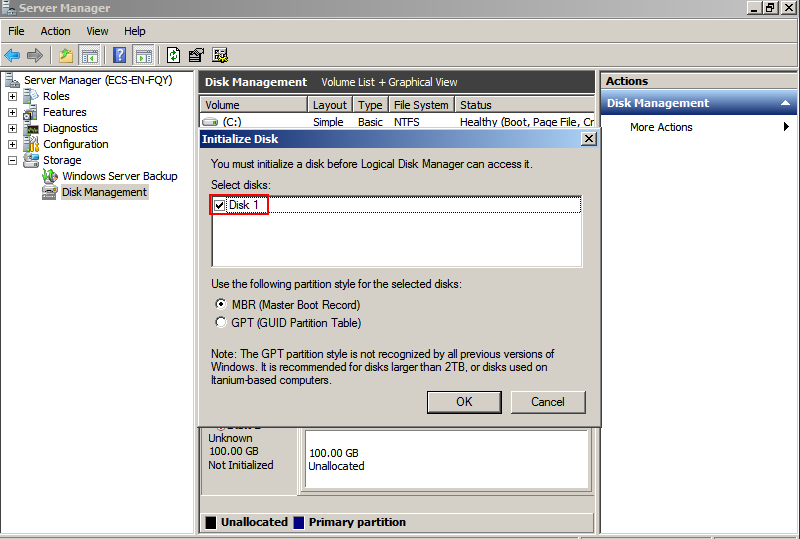

    > **NOTICE:**   
    >The maximum disk capacity supported by MBR is 2 TB, and that supported by GPT is 18 EB. Because a data disk currently supports up to 32 TB, use the GPT partition style if your disk capacity is larger than 2 TB.  
    >If you change the disk partition style after the disk has been used, the data on the disk will be cleared. Therefore, select a proper disk partition style when initializing the disk.  

6.  Right-click at the unallocated space and choose  **New Simple Volume**  from the shortcut menu, as shown in  [Figure 5](#fig1945583522619).

    **Figure  5**  New Simple Volume  
    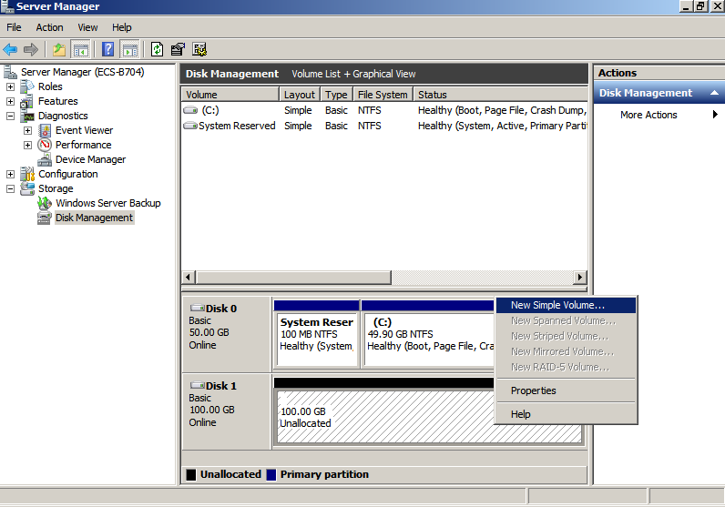

7.  On the displayed  **New Simple Volume Wizard**  window, click  **Next**.

    **Figure  6**  New Simple Volume Wizard  
    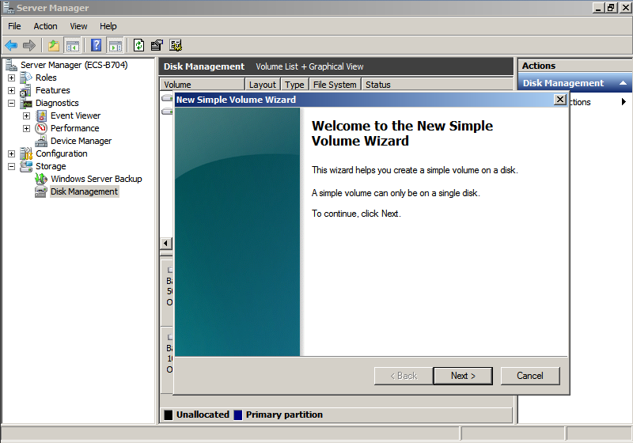

8.  Specify the volume size and click  **Next**. The default value is the maximum size.

    **Figure  7**  Specify Volume Size  
    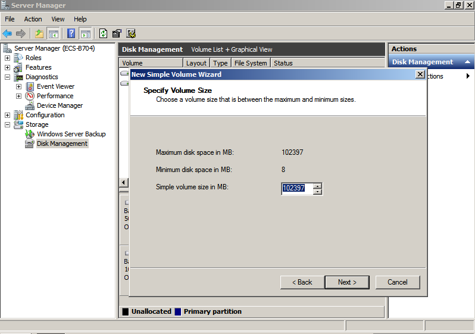

9.  Assign the driver letter and click  **Next**.

    **Figure  8**  Assign Driver Letter or Path  
    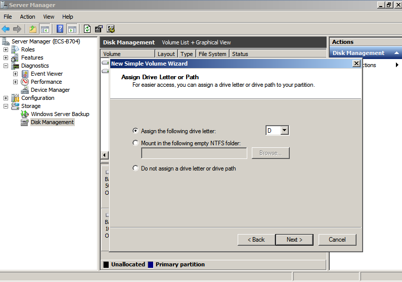

10. Select  **Format this volume with the following settings**, set parameters based on the actual requirements, and select  **Perform a quick format**. Then, click  **Next**.

    **Figure  9**  Format Partition  
    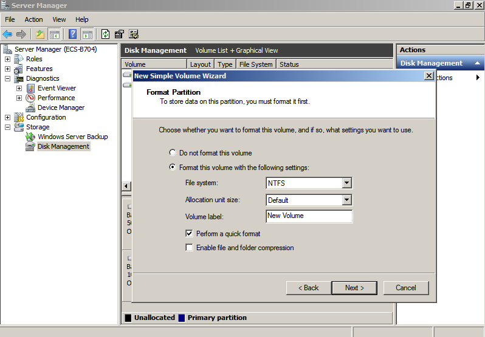

    **Figure  10**  Completing the partition creation  
    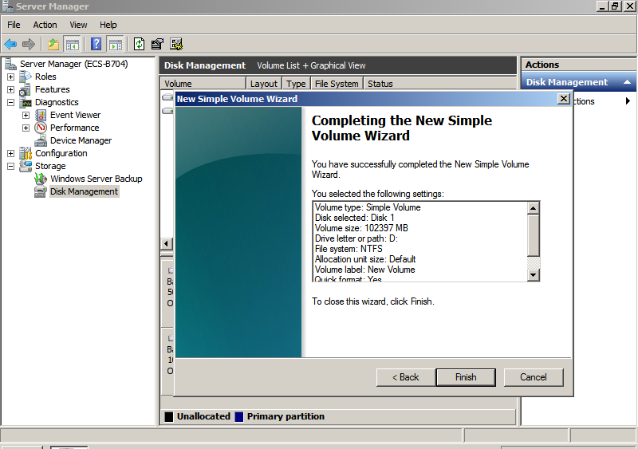

    > **NOTICE:**   
    >The partition sizes supported by file systems vary. Therefore, you are advised to choose an appropriate file system based on your service requirements.  

11. Click  **Finish**. Wait for the initialization to complete. When the volume status changes to  **Healthy**, the initialization has finished successfully, as shown in  [Figure 11](#fig14464150329).

    **Figure  11**  Disk initialization succeeded  
    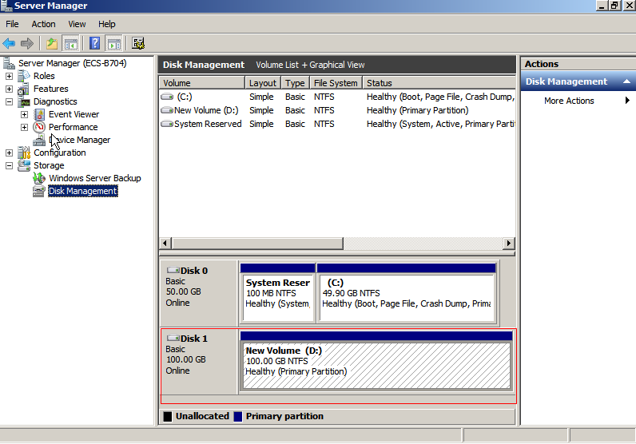

